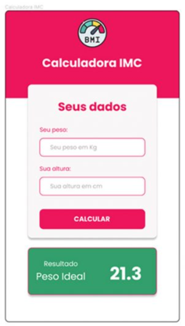
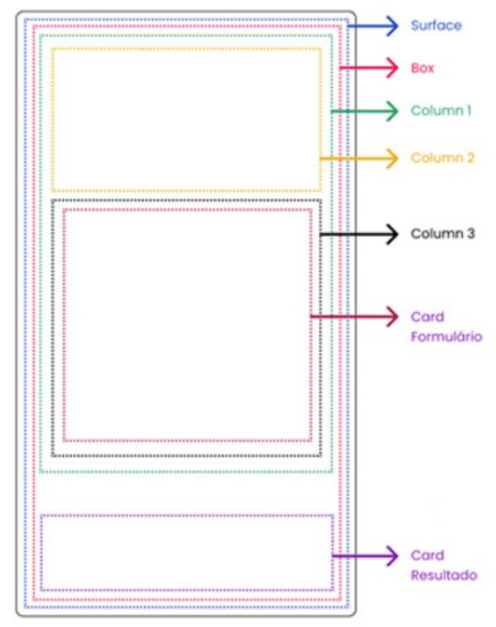

<h1>FASE 1 - APP WORLD</h1>
<h2>Capítulo 7A: Uso de Cards e Imagens.</h2>

<h2>1. USO DE CARDS E IMAGENS </h2>

## 1.1 Apresentação do projeto

- aplicação para cálculo de IMC.

 
<em>Layout da Aplicação.</em> 

 
<em>Estrutura do projeto.</em> 

- Surface: envolverá toda a Activity.
- Box: ocupará todo o tamanho da Activity; escolhida para facilitar o posicionamento do Card com o resultado na parte inferior.
- Column1: organizará verticalmente a Column2, que será o cabeçalho, e a Column3, que será ocupado pelo formulário.
- Column2: cabeçalho da Activity.
- Column3: Formulário.
- Card Formulário: componente Card, usado para estilizar o formulário.
- Card Resultado: resultado do cálculo de IMC.

> Criado projeto [IMC App]() no Android Studio.

- estrutura inicial:

~~~kotlin
class MainActivity : ComponentActivity() {
  override fun onCreate(savedInstanceState: Bundle?) {
    super.onCreate(savedInstanceState)
    setContent {
      IMCAppTheme { 
        Surface(
          modifier = Modifier.fillMaxSize(),
          color = MaterialTheme.colorScheme.background
        ) {
          IMCScreen()
        }
      }
    }
  }
}

@Composable
fun IMCScreen() {
  Box(
    modifier = Modifier.fillMaxSize()
  ) {
    Column(
      modifier = Modifier
        .fillMaxWidth()
    ) {
      // ---- header ---------
      Column(
        horizontalAlignment = Alignment.CenterHorizontally,
        modifier = Modifier
          .fillMaxWidth()
          .height(160.dp)
      ) {

      }
      // --- formulário
      Column(
        modifier = Modifier
          .fillMaxWidth()
          .padding(horizontal = 32.dp)
      ) {

      }
    }
    // -- Card Resultado
  }
}
~~~

## 1.2 Inserindo imagens no aplicativo

- as imagens utilizadas nos aplicativos Android podem estar disponíveis no pacote da aplicação na forma de recursos, ou obtê-las através de um repositório na Internet.
- no projeto:
  - trabalhar com as imagens como recursos da aplicação, ou seja, armazenar as imagens que utilizaremos na pasta "drawable" do projeto. Esta pasta se encontra na pasta "res". 
  - o layout do projeto sugere [esta imagem](https://www.flaticon.com/free-icon/bmi_10476452?term=bmi&page=1&position=6&origin=search&related_id=10476452), encontrada no site [Flaticon](https://www.flaticon.com/).

--- 

[Voltar ao início!](https://github.com/monicaquintal/smart_cities)