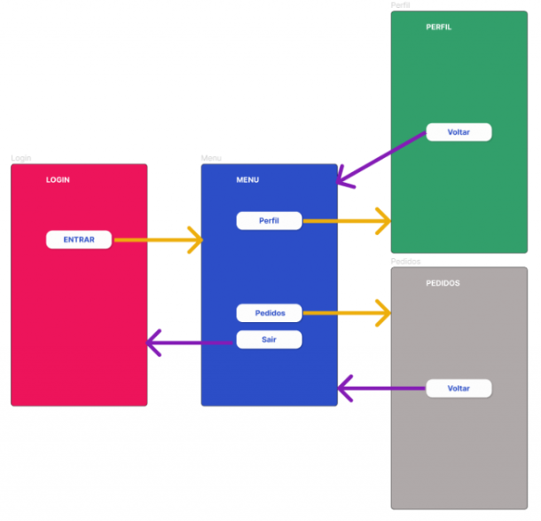

<h1>FASE 1 - APP WORLD</h1>
<h2>Capítulo 8A: Navegação e Fluxo entre telas.</h2>

<h2>1. NAVEGAÇÃO E FLUXO ENTRE TELAS </h2>

- nas abordagens anteriores ao Jetpack Compose, a construção de uma aplicação Android consistia na elaboração de diversas telas, que chamamos de `Activity`: cada uma dessas telas era responsável por uma funcionalidade do sistema, como uma tela para login, outra para listar os produtos, outra para ver os detalhes de um produto etc.
- outro recurso bastante utilizado na construção de IU Android tradicional é o uso de `Fragment`, que consiste em criar na Activity fragmentos de tela, que podem ser reutilizadas em outras telas, tornando o desenvolvimento da aplicação mais flexível. Esses fragmentos podem ser atualizados ou até substituídos de acordo com a interação do usuário.
- com a utilização do Jetpack Compose, a abordagem que utilizamos é chamada de `Single Activity`, em que temos apenas uma Activity que será responsável por renderizar as diferentes telas ou destinos. A navegação entre as diferentes telas é feita através da criação de rotas!

## 1.1 Navegação

- o Jetpack Compose possui uma biblioteca chamada `Navigation`, que fornece os recursos necessários para navegação entre telas em uma aplicação Android. 
- essa navegação ocorre através da configuração de rotas, que indicam quais funções devem ser compostas de acordo com algum evento do usuário ou da própria aplicação.
- através do Navigation é possível transportarmos dados de uma tela para outra, além de criarmos efeitos visuais durante a transição entre telas.

### 1.1.1 Adicionandoa biblioteca do Navigation
- criar um projeto no Android Studio chamado [Navegando entre telas]().
- apagar todas as funções, mantendo apenas a classe MainActivity e a função onCreate().
- para utilizar a biblioteca Navigation é necessário adicionar uma dependência ao `arquivo build.gradle`. 

~~~kotlin
dependencies {
    implementation 'androidx.core:core-ktx:1.8.0'
    implementation 'androidx.lifecycle:lifecycle-runtime-ktx:2.3.1'
    implementation 'androidx.activity:activity-compose:1.5.1'
    implementation platform('androidx.compose:compose-bom:2022.10.00')
    implementation 'androidx.compose.ui:ui'
    implementation 'androidx.compose.ui:ui-graphics'
    implementation 'androidx.compose.ui:ui-tooling-preview'
    implementation 'androidx.compose.material3:material3'
    testImplementation 'junit:junit:4.13.2'
    androidTestImplementation 'androidx.test.ext:junit:1.1.5'
    androidTestImplementation 'androidx.test.espresso:espresso-core:3.5.1'
    androidTestImplementation platform('androidx.compose:compose-bom:2022.10.00')
    androidTestImplementation 'androidx.compose.ui:ui-test-junit4'
    debugImplementation 'androidx.compose.ui:ui-tooling'
    debugImplementation 'androidx.compose.ui:ui-test-manifest'
  
    // Dependência do Navigation
    𝗶𝗺𝗽𝗹𝗲𝗺𝗲𝗻𝘁𝗮𝘁𝗶𝗼𝗻 '𝗮𝗻𝗱𝗿𝗼𝗶𝗱𝘅.𝗻𝗮𝘃𝗶𝗴𝗮𝘁𝗶𝗼𝗻:𝗻𝗮𝘃𝗶𝗴𝗮𝘁𝗶𝗼𝗻-𝗰𝗼𝗺𝗽𝗼𝘀𝗲:𝟮.𝟲.𝟬'
}
~~~

- após a alteração, clicar em sync now, para que o Gradle faça o download e a configuração do Navigation no projeto.

### 1.1.2 Telas do projeto
- com a biblioteca do Navigation configurada, criar diferentes telas para testar a navegação. Ao final, o projeto deverá conter 4 telas que terão o seguinte fluxo de navegação:

 
<em>Esquema de navegação do aplicativo.</em> 

 

- vale lembrar que ***na abordagem tradicional de construção de aplicativos Android***, precisávamos criar uma Activity para cada tela. 
- ***com Jetpack Compose***, aplicamos o conceito de `Single Activity`, então, a aplicação terá apenas uma Activity, que é a MainActivity, e teremos os composables que implementam toda a IU de cada tela.
  - o papel do Navigation será implementar o fluxo de navegação entre as telas, além de permitir efeitos de transição entre elas. 
  - por uma questão de organização e padronização, criar cada um dos composables que implementam as telas em arquivos diferentes, melhorando a componentização e reuso.

### 1.1.2.1 Passo a passo:
- clicar com o botão direito do mouse no pacote br.com.fiap.navegandoentretelas, apontar para New e clicar na opção Package.
- na janela NewPackage, adicionar a palavra "screens", e pressionar Enter.
- criar a primeira tela no arquivo LoginScreen; clicar com o botão direito do mouse no pacote screens, apontar para New e clicar na opção Kotlin Class/File. Digitar o nome do arquivo e selecionr a opção File.
- construir uma tela simples, pois o foco é entender como funciona a navegação entre telas no Jetpack Compose.

~~~kotlin
package br.com.fiap.navegandoentretelas.sreens

import androidx.compose.foundation.background
import androidx.compose.foundation.layout.Box
import androidx.compose.foundation.layout.fillMaxSize
import androidx.compose.foundation.layout.padding
import androidx.compose.material3.Button
import androidx.compose.material3.ButtonDefaults
import androidx.compose.material3.Text
import androidx.compose.runtime.Composable
import androidx.compose.ui.Alignment
import androidx.compose.ui.Modifier
import androidx.compose.ui.graphics.Color
import androidx.compose.ui.text.font.FontWeight
import androidx.compose.ui.tooling.preview.Preview
import androidx.compose.ui.unit.dp
import androidx.compose.ui.unit.sp

@Composable
fun LoginScreen() {
  Box(modifier = Modifier
    .fillMaxSize()
    .background(Color(0xFFED145B))
    .padding(32.dp)
  ){
    Text(
      text = "LOGIN",
      fontSize = 24.sp,
      fontWeight = FontWeight.Bold,
      color = Color.White
    )
    Button(
      onClick = { /*TODO*/ },
      colors = ButtonDefaults.buttonColors(Color.White),
      modifier = Modifier.align(Alignment.Center)
    ) {
      Text(text = "ENTRAR", fontSize = 20.sp, color = Color.Blue)
    }
  }
}
~~~

- para executar a aplicação no emulador e ver o resultado da tela que acabamos de descrever, abrir o arquivo “MainActivity.kt” e adicionar a chamada para a função LoginScreen.

~~~kotlin
package br.com.fiap.navegandoentretelas

import android.os.Bundle
import androidx.activity.ComponentActivity
import androidx.activity.compose.setContent
import androidx.compose.foundation.layout.fillMaxSize
import androidx.compose.material3.MaterialTheme
import androidx.compose.material3.Surface
import androidx.compose.ui.Modifier
import br.com.fiap.navegandoentretelas.sreens.LoginScreen
import br.com.fiap.navegandoentretelas.ui.theme.NavegandoEntreTelasTheme

class MainActivity : ComponentActivity() {
  override fun onCreate(savedInstanceState: Bundle?) {
    super.onCreate(savedInstanceState)
    setContent {
      NavegandoEntreTelasTheme {
        Surface(
          modifier = Modifier.fillMaxSize(),
          color = MaterialTheme.colorScheme.background
        ) {
          LoginScreen()
        }
      }
    }
  }
}
~~~

- criar os outros arquivos da aplicação. 
- na pasta screens do projeto, criar três arquivos:

### a) arquivo MenuScreen.kt:

~~~kotlin
@Composable
fun MenuScreen() {
  Box(modifier = Modifier
    .fillMaxSize()
    .background(Color(0xFF2C4EC7))
    .padding(32.dp)
  ){
    Text(
      text = "MENU",
      fontSize = 24.sp,
      fontWeight = FontWeight.Bold,
      color = Color.White
    )
    Column(
      horizontalAlignment = Alignment.CenterHorizontally,
      modifier = Modifier
      .fillMaxWidth()
      .align(Alignment.Center)
    ) {
      Button(
        onClick = { /*TODO*/ },
        colors = ButtonDefaults.buttonColors(Color.White),
        modifier = Modifier.size(width = 200.dp, height = 48.dp)
      ) {
        Text(text = "Perfil", fontSize = 20.sp, color = Color.Blue)
      }
      Spacer(modifier = Modifier.height(16.dp))
      Button(
        onClick = { /*TODO*/ },
        colors = ButtonDefaults.buttonColors(Color.White),
        modifier = Modifier.size(width = 200.dp, height = 48.dp)
      ) {
        Text(text = "Pedidos", fontSize = 20.sp, color = Color.Blue)
      }
      Spacer(modifier = Modifier.height(16.dp))
      Button(
        onClick = { /*TODO*/ },
        colors = ButtonDefaults.buttonColors(Color.White),
        modifier = Modifier.size(width = 200.dp, height = 48.dp)
      ) {
        Text(text = "Sair", fontSize = 20.sp, color = Color.Blue)
      }
    }
  }
}
~~~

### b) arquivo PerfilScreen.kt:

~~~kotlin
@Composable
fun PerfilScreen() {
  Box(modifier = Modifier
    .fillMaxSize()
    .background(Color(0xFF329F6B))
    .padding(32.dp)
  ){
    Text(
      text = "PERFIL",
      fontSize = 24.sp,
      fontWeight = FontWeight.Bold,
      color = Color.White
    )
    Button(
      onClick = { /*TODO*/ },
      colors = ButtonDefaults.buttonColors(Color.White),
      modifier = Modifier.align(Alignment.Center)
    ) {
      Text(text = "Voltar", fontSize = 20.sp, color = Color.Blue)
    }
  }
}
~~~

### c) arquido PedidosScreen.kt:

~~~kotlin
@Composable
fun PedidosScreen() {
  Box(modifier = Modifier
    .fillMaxSize()
    .background(Color(0xFFAFA9A9))
    .padding(32.dp)
  ){
    Text(
      text = "PEDIDOS",
      fontSize = 24.sp,
      fontWeight = FontWeight.Bold,
      color = Color.White
    )
    Button(
      onClick = { /*TODO*/ },
      colors = ButtonDefaults.buttonColors(Color.White),
      modifier = Modifier.align(Alignment.Center)
    ) {
      Text(text = "Voltar", fontSize = 20.sp, color = Color.Blue)
    }
  }
}
~~~

### 1.1.3 Configurando o Navigation
- com as telas criadas, configurar a navegação entre elas. 
- para isso, utilizar a NavController, responsável por controlar o fluxo de navegação em uma aplicação Android. 
  - é uma função com estado que observa a pilha de composables que criam as telas (essa pilha é chamada de `backstack` - nessa "pilha", o cartão que está no topo é o cartão visível, ou seja, aquele que está sendo utilizado. Os outros estão em segundo plano e não estão visíveis.).
  - em nosso aplicativo, pensar na MainActivity como sendo a mesa onde os cartões estão sendo manipulados. O composable que está visível ao usuário é o que está no topo da pilha. Os outros composables estão em segundo plano esperando para serem chamados.
  - a navegação consiste em trazer para a frente da pilha o composable com o qual se deseja trabalhar. Também é possível utilizar o botão "voltar" do dispositivo, para retornar ao último composable acessado.

- a configuração da NavController será na MainActivity, ponto de partida da aplicação.
- implementar no método onCreate da MainActivity:

~~~kotlin
class MainActivity : ComponentActivity() {
    override fun onCreate(savedInstanceState: Bundle?) {
    super.onCreate(savedInstanceState)
    setContent {
        NavegandoEntreTelasTheme {
        Surface(
            modifier = Modifier.fillMaxSize(),
            color = MaterialTheme.colorScheme.background
        ) {
            // criando uma instancia do NavController através da função rememberNavController
            𝘃𝗮𝗹 𝗻𝗮𝘃𝗖𝗼𝗻𝘁𝗿𝗼𝗹𝗹𝗲𝗿 = 𝗿𝗲𝗺𝗲𝗺𝗯𝗲𝗿𝗡𝗮𝘃𝗖𝗼𝗻𝘁𝗿𝗼𝗹𝗹𝗲𝗿()

            // utilizando a função NavHost, responsável por gerenciar as rotas para as telas que devem ser exibidas 
            𝗡𝗮𝘃𝗛𝗼𝘀𝘁(
            𝗻𝗮𝘃𝗖𝗼𝗻𝘁𝗿𝗼𝗹𝗹𝗲𝗿 = 𝗻𝗮𝘃𝗖𝗼𝗻𝘁𝗿𝗼𝗹𝗹𝗲𝗿,
            𝘀𝘁𝗮𝗿𝘁𝗗𝗲𝘀𝘁𝗶𝗻𝗮𝘁𝗶𝗼𝗻 = "𝗹𝗼𝗴𝗶𝗻"
            ){
            // indicando quais são os destinos navegáveis pelo NavHost:
            𝙘𝙤𝙢𝙥𝙤𝙨𝙖𝙗𝙡𝙚(𝗿𝗼𝘂𝘁𝗲 = "𝗹𝗼𝗴𝗶𝗻"){ 𝗟𝗼𝗴𝗶𝗻𝗦𝗰𝗿𝗲𝗲𝗻() }
            𝙘𝙤𝙢𝙥𝙤𝙨𝙖𝙗𝙡𝙚(𝗿𝗼𝘂𝘁𝗲 = "𝗺𝗲𝗻𝘂") { 𝗠𝗲𝗻𝘂𝗦𝗰𝗿𝗲𝗲𝗻() }
            𝙘𝙤𝙢𝙥𝙤𝙨𝙖𝙗𝙡𝙚(𝗿𝗼𝘂𝘁𝗲 = "𝗽𝗲𝗱𝗶𝗱𝗼𝘀"){ 𝗣𝗲𝗱𝗶𝗱𝗼𝘀𝗦𝗰𝗿𝗲𝗲𝗻() }
            𝙘𝙤𝙢𝙥𝙤𝙨𝙖𝙗𝙡𝙚(𝗿𝗼𝘂𝘁𝗲 = "𝗽𝗲𝗿𝗳𝗶𝗹"){ 𝗣𝗲𝗿𝗳𝗶𝗹𝗦𝗰𝗿𝗲𝗲𝗻() }
          }
        }
      }
    }
  }
}
~~~

- o NavHost utiliza o navController, que possui a backstack e o startDestination, que é utilizado para indicar qual será a tela que deverá ser exibida quando o aplicativo for aberto pela primeira vez, que neste caso é a tela de login.
- nas linhas 15 a 18, indicados quais são os destinos navegáveis pelo NavHost”; essa função recebe dois parâmetros:
  - Route: utiliza um identificador único para cada destino que será acessado. Esse identificador é criado pelo desenvolvedor.
  - Função lambda: onde informamos qual será a tela que deverá ser renderizada.
- para acessar a tela do Menu ao pressionar o botão 'ENTRAR' na tela de Login, é necessário ter acesso ao NavController. Portanto, alterar a função 'LoginScreen' para que possamos enviar o 'NavController' e implementar a navegação corretamente. 

~~~kotlin
@Composable
fun LoginScreen(navController: NavController) {
  Box(modifier = Modifier
    .fillMaxSize()
    .background(Color(0xFFED145B))
    .padding(32.dp)
  ){
    Text(
      text = "LOGIN",
      fontSize = 24.sp,
      fontWeight = FontWeight.Bold,
      color = Color.White
    )
    Button(
      onClick = { navController.navigate("menu") },
      colors = ButtonDefaults.buttonColors(Color.White),
      modifier = Modifier.align(Alignment.Center)
    ) {
      Text(text = "ENTRAR", fontSize = 20.sp, color = Color.Blue)
    }
  }
}
~~~

- no código foi adicionado um novo parâmetro à função "LoginScreen", chamado navController, que é do tipo "NavController".
  - significa que, ao chamar a função "LoginScreen", é necessário fornecer um objeto "NavController". Dessa forma, a "LoginScreen" terá acesso à backstack e poderá realizar a navegação corretamente.
- no clique do botão foi adicionado uma instrução que utiliza o método navigate do NavController, para informar o identificador da tela que deverá ser acessada.
- antes de executar a aplicação, ajustar a chamada da função LoginScreen, devendo passar o NavController na MainActivity.

~~~kotlin
class MainActivity : ComponentActivity() {
    override fun onCreate(savedInstanceState: Bundle?) {
      super.onCreate(savedInstanceState)
      setContent {
        NavegandoEntreTelasTheme {
          Surface(
            modifier = Modifier.fillMaxSize(),
            color = MaterialTheme.colorScheme.background
          ) {
            val navController = rememberNavController()
            NavHost(
              navController = navController,
              startDestination = "login"
            ) {
              composable(route = "login") { LoginScreen(navController) }
              composable(route = "menu") { MenuScreen() }
              composable(route = "pedidos") { PedidosScreen() }
              composable(route = "perfil") { PerfilScreen() }
            }
          }
        }
      }
    }
  }
~~~

- ´para que a funcionalidade de navegação seja possível em todas as telas da aplicação, adicionar o mesmo parâmetro em todas as outras funções de tela da aplicação e implementar o clique de todos os botões para que a navegação ocorra corretamente.

### a) arquivo MenuScreen.kt:

~~~kotlin
@Composable
fun MenuScreen(navController: NavController) {
  Box(modifier = Modifier
    .fillMaxSize()
    .background(Color(0xFF2C4EC7))
    .padding(32.dp)
  ){
    Text(
      text = "MENU",
      fontSize = 24.sp,
      fontWeight = FontWeight.Bold,
      color = Color.White
    )
    Column(
      horizontalAlignment = Alignment.CenterHorizontally,
      modifier = Modifier
      .fillMaxWidth()
      .align(Alignment.Center)
    ) {
      Button(
        onClick = { navController.navigate("perfil") },
        colors = ButtonDefaults.buttonColors(Color.White),
        modifier = Modifier.size(width = 200.dp, height = 48.dp)
      ) {
        Text(text = "Perfil", fontSize = 20.sp, color = Color.Blue)
      }
      Spacer(modifier = Modifier.height(16.dp))
      Button(
        onClick = { navController.navigate("pedidos") },
        colors = ButtonDefaults.buttonColors(Color.White),
        modifier = Modifier.size(width = 200.dp, height = 48.dp)
      ) {
        Text(text = "Pedidos", fontSize = 20.sp, color = Color.Blue)
      }
      Spacer(modifier = Modifier.height(16.dp))
      Button(
        onClick = { navController.navigate("login") },
        colors = ButtonDefaults.buttonColors(Color.White),
        modifier = Modifier.size(width = 200.dp, height = 48.dp)
      ) {
        Text(text = "Sair", fontSize = 20.sp, color = Color.Blue)
      }
    }
  }
}
~~~

### b) arquivo PerfilScreen.kt:

~~~kotlin
@Composable
fun PerfilScreen(navController: NavController) {
  Box(modifier = Modifier
    .fillMaxSize()
    .background(Color(0xFF329F6B))
    .padding(32.dp)
  ){
    Text(
      text = "PERFIL",
      fontSize = 24.sp,
      fontWeight = FontWeight.Bold,
      color = Color.White
    )
    Button(
      onClick = { navController.navigate("menu") },
      colors = ButtonDefaults.buttonColors(Color.White),
      modifier = Modifier.align(Alignment.Center)
    ) {
      Text(text = "Voltar", fontSize = 20.sp, color = Color.Blue)
    }
  }
}
~~~

### c) arquivo PedidosScreen.kt:

~~~kotlin
@Composable
fun PedidosScreen(navController: NavController) {
  Box(modifier = Modifier
    .fillMaxSize()
    .background(Color(0xFFAFA9A9))
    .padding(32.dp)
  ){
    Text(
      text = "PEDIDOS",
      fontSize = 24.sp,
      fontWeight = FontWeight.Bold,
      color = Color.White
    )
    Button(
      onClick = { navController.navigate("menu") },
      colors = ButtonDefaults.buttonColors(Color.White),
      modifier = Modifier.align(Alignment.Center)
    ) {
      Text(text = "Voltar", fontSize = 20.sp, color = Color.Blue)
    }
  }
}
~~~

### d) arquivo MainActivity.kt:

~~~kotlin
class MainActivity : ComponentActivity() {
    override fun onCreate(savedInstanceState: Bundle?) {
      super.onCreate(savedInstanceState)
      setContent {
        NavegandoEntreTelasTheme {
          Surface(
            modifier = Modifier.fillMaxSize(),
            color = MaterialTheme.colorScheme.background
          ) {
            val navController = rememberNavController()
            NavHost(
              navController = navController,
              startDestination = "login"
            ) {
              composable(route = "login") { LoginScreen(navController) }
              composable(route = "menu") { MenuScreen(navController) }
              composable(route = "pedidos") { PedidosScreen(navController) }
              composable(route = "perfil") { PerfilScreen(navController) }
            }
          }
        }
      }
    }
  }
~~~

## 1.2 Passagem de parâmetros entre telas

- ao trabalhar com diversas telas, é comum precisarmos transportar dados de uma tela para outra. 
- quando utilizamos a biblioteca Navigation, isso pode ser feito de maneira simples.

### 1.2.1 Parâmetros obrigatórios
- vamos enviar uma String para a tela PerfilScreen quando o botão "Perfil" da tela Menu for pressionado. 
- logo, acrescentar um parâmetro do tipo String na função PerfilScreen.

--- 

[Voltar ao início!](https://github.com/monicaquintal/smart_cities)