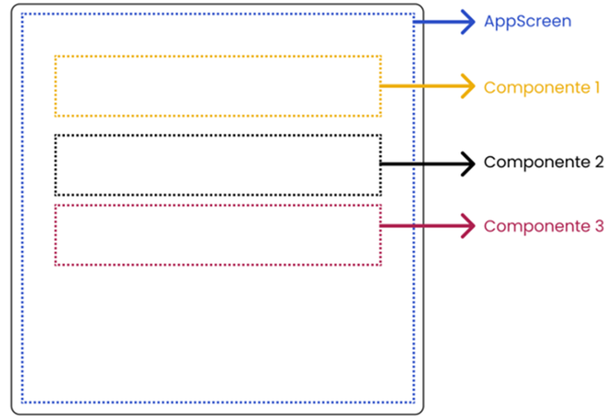

<h1>FASE 1 - APP WORLD</h1>
<h2>Capítulo 9A: Gestão de estado no Jetpack Compose.</h2>

<h2>1. GESTÃO DE ESTADO NO JETPACK COMPOSE</h2>

- a Interface do Usuário (IU) em uma aplicação Android é formada por diversos elementos. Para que possamos organizar o código, é necessário quebrar a interface em diversos componentes, que depois serão combinados para criar a tela como um todo, técnica que permite a reutilização de componentes.
- outro fator bastante importante quando trabalhamos com componentização é podermos manter o estado da aplicação em seus diversos componentes. Para isso, podemos utilizar o `State Hoisting`, que significa manter o estado em um componente de hierarquia mais alta, ou podemos utilizar uma arquitetura de projeto chamada `Model-View-ViewModel` (MVVM).

## 1.1 State Hoisting - Elevação de estado

- é um design pattern que orienta a implementação de componentes "stateless", ou seja, que não gerenciam o próprio estado.
- o estado deverá ser mantido no menor ancestral comum entre todos os componentes combináveis.
- no Jetpack Compose, cada composable é uma função independente que descreve a aparência e o comportamento de um componente; logo, podemos reutilizar este componente em diversas partes da aplicação, o que poderia causar duplicidade de estado.
- o ***State Hoisting garante que o estado será gerenciado de forma centralizada***, garantindo que compartilhem o mesmo estado atualizado.
- exemplo:

 
<em>Estrutura hierárquica da Aplicação.</em> 

  

- no exemplo acima:
  - o componente AppScreen é o de hierarquia mais alta.
  - os componentes filhos (Componente 1, Componente 2 e Componente 3) são os componentes de hierarquia mais baixa.
  - portanto, quem deve manter o estado da tela é o AppScreen: as variáveis de estado devem ser declaradas neste componente e os componentes filhos recebem o estado e comportamento do componente AppScreen!

### 1.1.1 Aplicativo para cálculo de juros simples
- para praticar o State Hoisting, criar uma aplicação para cálculo de juros simples. 
- começar criando uma única função com todos os componentes e estados. Depois, aplicaremos o conceito de elevação de estado e modularização da aplicação. 
- criar um projeto no Android Studio com o nome [Cálculo de Juros](). 
- substituir o código do arquivo MainActivity.kt que foi gerado automaticamente,pelo código:

~~~kotlin
package br.com.fiap.calculodejuros

import android.os.Bundle
import androidx.activity.ComponentActivity
import androidx.activity.compose.setContent
import androidx.compose.foundation.layout.Box
import androidx.compose.foundation.layout.Column
import androidx.compose.foundation.layout.Row
import androidx.compose.foundation.layout.Spacer
import androidx.compose.foundation.layout.fillMaxSize
import androidx.compose.foundation.layout.fillMaxWidth
import androidx.compose.foundation.layout.height
import androidx.compose.foundation.layout.padding
import androidx.compose.foundation.text.KeyboardOptions
import androidx.compose.material3.Button
import androidx.compose.material3.Card
import androidx.compose.material3.CardDefaults
import androidx.compose.material3.MaterialTheme
import androidx.compose.material3.OutlinedTextField
import androidx.compose.material3.Surface
import androidx.compose.material3.Text
import androidx.compose.runtime.Composable
import androidx.compose.runtime.getValue
import androidx.compose.runtime.mutableStateOf
import androidx.compose.runtime.remember
import androidx.compose.runtime.setValue
import androidx.compose.ui.Alignment
import androidx.compose.ui.Modifier
import androidx.compose.ui.graphics.Color
import androidx.compose.ui.text.font.FontWeight
import androidx.compose.ui.text.input.KeyboardType
import androidx.compose.ui.text.style.TextAlign
import androidx.compose.ui.unit.dp
import androidx.compose.ui.unit.sp
import br.com.fiap.calculodejuros.calculos.calcularJuros
import br.com.fiap.calculodejuros.calculos.calcularMontante
import br.com.fiap.calculodejuros.ui.theme.CalculoDeJurosTheme

class MainActivity : ComponentActivity() {
  override fun onCreate(savedInstanceState: Bundle?) {
    super.onCreate(savedInstanceState)
    setContent {
      CalculoDeJurosTheme {
        // A surface container using the 'background' color from the theme
        Surface(
          modifier = Modifier.fillMaxSize(),
          color = MaterialTheme.colorScheme.background
        ) {
          JurosScreen()
        }
      }
    }
  }
}

@Composable
fun JurosScreen() {

  var capital by remember { mutableStateOf("") }
  var taxa by remember { mutableStateOf("") }
  var tempo by remember { mutableStateOf("") }
  var juros by remember { mutableStateOf(0.0) }
  var montante by remember { mutableStateOf(0.0) }

  Box(
    modifier = Modifier.padding(16.dp),
    contentAlignment = Alignment.Center
  ) {
    Column() {
      Text(
        text = "Cálculo de Juros Simples",
        modifier = Modifier.fillMaxWidth(),
        fontSize = 20.sp,
        color = Color.Red,
        fontWeight = FontWeight.Bold,
        textAlign = TextAlign.Center
      )
      Spacer(modifier = Modifier.height(32.dp))
      // Formulário para entrada de dados
      Card(
        modifier = Modifier
          .fillMaxWidth()
      ) {
        Column(modifier = Modifier.padding(16.dp)) {
          Text(
              text = "Dados do Investimento",
              fontWeight = FontWeight.Bold
          )
          // Caixas de entrada da aplicação
          OutlinedTextField(
            value = capital,
            onValueChange = { capital = it },
            modifier = Modifier
                .fillMaxWidth()
                .padding(top = 16.dp),
            placeholder = {
              Text(text = "Quanto deseja investir?")
            },
            label = {
              Text(text = "Valor do investimento")
            },
            keyboardOptions = KeyboardOptions(
                keyboardType = KeyboardType.Decimal
            )
          )
          OutlinedTextField(
            value = taxa,
            onValueChange = { taxa = it },
            modifier = Modifier
                .fillMaxWidth()
                .padding(top = 16.dp),
            placeholder = {
              Text(text = "Qual a taxa de juros mensal?")
            },
            label = {
              Text(text = "Taxa de juros mensal")
            },
            keyboardOptions = KeyboardOptions(
                keyboardType = KeyboardType.Decimal
            )
          )
          OutlinedTextField(
            value = tempo,
            onValueChange = { tempo = it },
            modifier = Modifier
                .fillMaxWidth()
                .padding(top = 16.dp),
            placeholder = {
              Text(text = "Qual o tempo em meses?")
            },
            label = {
              Text(text = "Período em meses")
            },
            keyboardOptions = KeyboardOptions(
                keyboardType = KeyboardType.Decimal
            )
          )
          Button(
            onClick = {
              juros = calcularJuros(
                capital = capital.toDouble(),
                taxa = taxa.toDouble(),
                tempo = tempo.toDouble()
              )
              montante = calcularMontante(
                capital = capital.toDouble(),
                juros = juros
              )
            },
            modifier = Modifier
                .fillMaxWidth()
                .padding(top = 32.dp)
          ) {
            Text(text = "CALCULAR")
          }
        }
      }
      Spacer(modifier = Modifier.height(16.dp))
      // Resultado da aplicação
      Card(
        modifier = Modifier
          .fillMaxWidth(),
        colors = CardDefaults.cardColors(
            containerColor = Color(0xFF4CAF50)
        )
      ) {
        Column(
          modifier = Modifier
            //.fillMaxSize()
            .padding(16.dp)
        ) {
          Text(
            text = "Resultado",
            fontSize = 18.sp,
            fontWeight = FontWeight.Bold,
            color = Color.White
          )
          Spacer(modifier = Modifier.height(16.dp))
          Row(modifier = Modifier.fillMaxWidth()) {
            Text(
              text = "Juros",
              modifier = Modifier.padding(end = 8.dp),
              fontSize = 16.sp,
              fontWeight = FontWeight.Bold
            )
            Text(
              text = juros.toString(),
              modifier = Modifier.padding(end = 8.dp),
              fontSize = 16.sp,
              fontWeight = FontWeight.Bold,
              color = Color.White
            )
          }
          Spacer(modifier = Modifier.height(8.dp))
          Row(modifier = Modifier.fillMaxWidth()) {
            Text(
              text = "Montante",
              modifier = Modifier.padding(end = 8.dp),
              fontSize = 16.sp,
              fontWeight = FontWeight.Bold
            )
            Text(
              text = montante.toString(),
              modifier = Modifier.padding(end = 8.dp),
              fontSize = 16.sp,
              fontWeight = FontWeight.Bold,
              color = Color.White
            )
          }
        }
      }
    }
  }
}
~~~

- criar um pacote na aplicação com o nome "calculos", e criar neste pacote um arquivo com o nome "CalcularJuros".
- o arquivo CalcularJuros.kt será responsável por efetuar os cálculos de juros e montantes; implementar as funções necessárias:

~~~kotlin
package br.com.fiap.calculodejuros.calculos

fun calcularJuros(capital: Double, taxa: Double, tempo: Double): Double {
  return capital * taxa / 100 * tempo
}

fun calcularMontante(capital: Double, juros: Double): Double {
  return capital + juros
}
~~~

### 1.1.2 Modularizando a aplicação
- modularizar a aplicação evita que fique muito extensa e facilita manutenção.
- além disso, a modularização permite dividir a interface do usuário em componentes menores, como botões, listas, cartões etc: cada componente pode ser projetado de forma independente, com sua própria lógica e aparência.
- iniciar produzindo uma função responsável por criar caixas de entrada personalizadas.
  - criar um pacote no projeto chamado "components". 
  - criar um arquivo chamado CaixaDeEntrada.kt no pacote components e, neste arquivo, criar um OutlinedTextField.

~~~kotlin
package br.com.fiap.calculodejuros.components

import androidx.compose.foundation.layout.fillMaxWidth
import androidx.compose.foundation.layout.padding
import androidx.compose.foundation.text.KeyboardOptions
import androidx.compose.material3.OutlinedTextField
import androidx.compose.material3.Text
import androidx.compose.runtime.Composable
import androidx.compose.ui.Modifier
import androidx.compose.ui.text.input.KeyboardType
import androidx.compose.ui.unit.dp

@Composable
fun CaixaDeEntrada(
  value: String,
  placeholder: String,
  label: String,
  modifier: Modifier,
  keyboardType: KeyboardType
) {
  OutlinedTextField(
    value = value,
    onValueChange = {},
    modifier = modifier
      .fillMaxWidth()
      .padding(top = 16.dp),
    placeholder = {
      Text(text = placeholder)
    },
    label = {
      Text(text = label)
    },
    keyboardOptions = KeyboardOptions(keyboardType = keyboardType)
  )
}
~~~

--- 

[Voltar ao início!](https://github.com/monicaquintal/smart_cities)