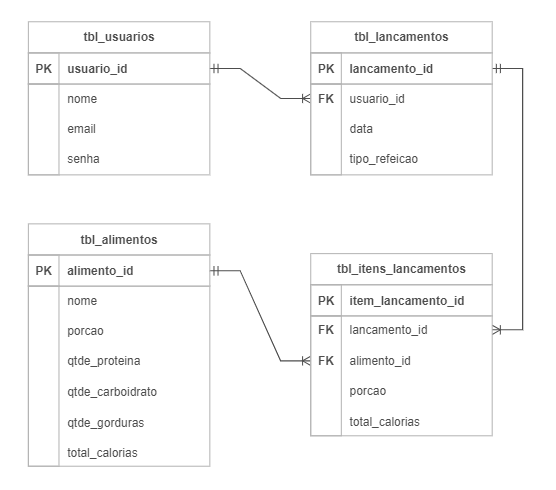

<div align="center">
<a href="https://github.com/monicaquintal" target="_blank"></a>
<h1>FASE 3 - FRAMEWORKS JAVA</h1>
<h2>Capítulo 03: O REST com Spring Boot<./h2>
</div>

<div align="center">
<h2>1. O REST COM SPRING BOOT</h2> 
</div>

- `webservice` (serviço web):
  - utiliza um conjunto de protocolos e padrões que permitem a comunicação entre diversos sistemas distribuídos através de uma rede local ou Internet, de modo que um sistema possa realizar uma chamada para outro sistema.
  - nessa arquitetura é possível que diversos sistemas se comuniquem trocando dados entre si, além de compartilhar funcionalidades relacionadas às regras de negócios e persistência de dados, não importando em quais linguagens foram desenvolvidos, pois a comunicação ocorre através da transferência de textos que utilizam padrões bem definidos.
- para construção de um Webservice utilizamos a `arquitetura cliente-servidor`, onde o servidor é responsável por toda lógica que envolve a persistência de dados e regras de negócio. Por outro lado, o cliente é responsável por enviar ou recuperar os dados que são gerados pelo servidor e exibi-los da forma como seja necessário.
- o protocolo utilizado para a transferência de dados entre o cliente e o servidor se dá através do `protocolo HTTP/HTTPS`, que é bastante simples e disponível para qualquer dispositivo conectado a uma rede.

## 1.1 Application Program Interface - API

- para que a comunicação possa ocorrer entre o cliente e o servidor é necessário a ***implementação das APIs***, que definem os métodos e formatos da comunicação que utilizamos para permitir a interação entre as aplicações cliente e as aplicações servidoras. 
- é como se fosse uma ponte ou uma interface utilizada para conectar diferentes aplicações sem que os detalhes internos das implementações sejam expostos. 
- exemplo: quando efetuamosuma compra com cartão de crédito/débito, a aplicação da loja envia os dados do cartão do cliente utilizando uma API disponibilizada pela empresa de pagamento.
- são responsáveis por disponibilizar as operações no servidor através dos `endpoints` (portas de entrada e saída para acessar os diferentes recursos disponibilizados pelo webservice). 
  - exemplo: uma API pode disponibilizar um endpoint responsável por efetuar o cadastro de um novo cliente e outro endpoint responsável por recuperar a lista de clientes da loja.
  - endpoints são acessados através de uma URL.
- através do uso das APIs garantimos a reutilização de código, comunicação entre aplicações de terceiros, autenticação e autorização, definição do formato dos dados que serão trocados entre cliente e servidor e muito mais.

## 1.2 Arquitetura REST (Representational State Transfer ou Transferência de Estado Representacional)

- é um estilo de desenvolvimento de software.
- proposto em 2000 por Roy Fielding em sua tese de doutorado.
- neste modelo arquitetural, ***busca-se o desenvolvimento de aplicações utilizando padrões que facilitem a comunicação entre sistemas utilizando-se, fundamentalmente, dos protocolos já existentes na web, especialmente o protocolo HTTP que aproveita os verbos ou métodos HTTP para identificar o tipo de operação que se deseja realizar***.
- utiliza o modelo cliente-servidor, para que as responsabilidades entre interface do usuário e regras de negócio fiquem bem definidas.
- nesta arquitetura, o cliente realiza uma chamada para um recurso no servidor através de uma URL que contém o protocolo HTTP, o verbo que identifica a operação a ser realizada e o recurso que deve ser acessado. O servidor processa a requisição e devolve uma resposta com o volume de dados, geralmente em `formato JSON`. O cliente define qual será a melhor estratégia para exibir os dados na interface gráfica.

### 1.2.1 Modelo de Maturidade de Richardson
- para que uma API seja considerada REST, é necessário que atenda algumas regras (que nem sempre são seguidas).
- em 2008, Leonard Richardson notou que havia uma falta de padronização na forma como os desenvolvedores implementavam o REST e propôs um modelo de maturidade que categoriza as APIs REST em quatro (4) níveis:
  - `Nível 0`: conhecido como ***o Pântano de XML*** (Extensible Markup Language). Neste nível, o desenvolvedor não utiliza os verbos HTTP corretamente, assim como tornar apenas um endpoint responsável por várias funcionalidades, como inserir e consultar alunos. Geralmente utiliza XML para representar os objetos.
  - `Nível 1`: conhecido como ***Recursos***, onde busca-se a utilização de um endpoint para cada funcionalidade, mas ainda não se aplicam os verbos HTTP corretamente. Geralmente são utilizados apenas os verbos GET e POST.
  - `Nível 2`: chamado de ***Verbos HTTP***, pois considera o uso eficiente dos endpoints (nível 1) e dos verbos HTTP (nível 2). Neste nível também se considera o retorno correto dos status codes de cada endpoint.
  - `Nível 3`: conhecido como ***Controle de Hipermídia***, além de aplicar o nível 1 e 2, haverá algo novo, que fornece aos clientes os links para a navegação entre os recursos da API. Por exemplo, em uma consulta com paginação, o resultado atual poderá conter o link para as páginas anterior e seguinte, além de dados como quantidade de páginas, recursos etc.
  
> Se chegarmos à implementação do nível 3 de maturidade de Richardson, teremos uma API RESTful, ou seja, que implementa todas as regras e boas práticas na construção de uma API!

### 1.2.2 Protocolo HTTP (Hypertext Transfer Protocol)
- é um dos principais pilares da arquitetura REST.
- é através deste protocolo que o REST implementa todos os princípios de comunicação entre sistemas distribuídos.
- define a maneira como as mensagens são trocadas entre cliente e servidor na web: permite acessarmos todos os recursos disponibilizados pelos servidores por meio dos navegadores web, que são os clientes.
- através do protocolo HTTP podemos transferir documentos hipermídia como páginas HTML, imagens, vídeos, dentre outros. Esses documentos são chamados de `recursos`.
- ***servidores HTTP mais conhecidos***: Apache, TomCat, Nginx, Microsoft IIS (Internet Information Services), etc. 
- ***clientes mais conhecidos***: Google Chrome, Firefox, Safari, etc.

### 1.2.3 Verbos HTTP (ou métodos HTTP)
- utilizados para identificar o tipo de ação que desejamos efetuar no servidor, que pode ser a recuperação, o envio ou até mesmo a remoção de um recurso do servidor. 
- verbos HTTP mais utilizados:
  - `GET`: solicita um recurso ao servidor, que pode ser um arquivo HTML, uma imagem, um vídeo, dentre outros.
  - `POST`: responsável por enviar dados ao servidor.
  - `PUT`: utilizado para atualizar um recurso existente no servidor.
  - `DELETE`: solicita a exclusão de um recurso no servidor.

## 1.3 Cabeçalhos HTTP (ou headers)

- utilizados para fornecer informações adicionais sobre as requisições ou respostas HTTP.
- incluem informações sobre o tipo de conteúdo que está sendo transferido, a URL que foi utilizada na requisição, o endereço IP do servidor, o tamanho da resposta em bytes, dentre outras informações. 
- exemplos de headers que podem ser encontrados na resposta ou requisição HTTP:
  - `Accept`: anuncia quais os tipos de conteúdo o cliente é capaz de entender.
  - `Content-Type`: utilizado para indicar ao cliente o tipo de recurso que foi devolvido na resposta HTTP.
  - `Location`: indica a URL para a qual a página deve ser redirecionada. Quando trabalhamos com REST este header indica a URL para o recurso que foi criado no servidor.
  - `Authorization`: usado para informar as credenciais de acesso quando acessamos recursos que exigem autorização para acesso.

> Lista completa de headers disponíveis [aqui](https://developer.mozilla.org/pt-BR/docs/Web/HTTP/Headers/Accept).

## 1.4 Códigos de Status HTTP

- quando realizamos uma requisição a um servidor HTTP recebemos, além dos dados propriamente ditos, um código que informa o resultado de uma solicitação (se foi bem-sucedida ou não). 
- o “status code” fornece informações sobre como a conexão se comportou desde o cliente até o servidor. 
- ***códigos mais comuns***:
  - `200 (OK)`: indica que a requisição foi atendida com sucesso.
  - `201 (CREATED)`: o objeto ou recurso enviado ao servidor foi criado com sucesso.
  - `204 (NO CONTENT)`: não há conteúdo para enviar para esta solicitação.
  - `400 (BAD REQUEST)`: ocorreu um erro na requisição.
  - `404 (NOT FOUND)`: o recurso solicitadonão foi encontrado no servidor.
  - `500 (INTERNAL SERVER ERROR)`: indica que ocorreu um erro no servidor.

> Lista completa de códigos de status HTTP [aqui](https://developer.mozilla.org/pt-BR/docs/Web/HTTP/Status).

### 1.4.1 Recursos na web
- o recurso é o alvo de uma requisição HTTP, que pode ser um documento HTML, uma foto, um áudio ou qualquer outra coisa. 
- cada recurso é identificado por um `URI (Uniform Resource Identifier)`, identificador uniforme de recurso.
- para localizarmos um recurso na web utilizamos a `URL (Uniform Resource Locator)`, um tipo de URI.
  - URLs também são conhecidas como endereços de web. 
  - exemplos: 
    - https://fiap.com.br
    - https://fiap.com.br/alunos
    - https://fiap.com.br:8080/api/alunos?rm=111
- ao avaliarmos uma URL, notamos que possui diferentes partes que diz como o recurso deve ser acessado.
  - exemplo: https://www.fiap.com.br:8080/api/alunos?nome=ana$turma=dev3
    - `https://`: Protocolo.
    - `www.fiap.com.br`: nome do domínio.
    - `:8080`: porta.
    - `/api/alunos`: caminho para o recurso.
    - `?nome=ana$turma=dev3`: parâmetros.

### 1.4.2 Semântica da URL REST
- para entender a estrutura dos endereços utilizados em uma aplicação que utiliza o padrão REST, usaremos como exemplo uma aplicação para gestão de alunos que possui 4 endpoints: cadastrar, consultar, excluir e atualizar. 
- a chamada para cada um dos endpoints sugeridos deverão seguir a seguinte estrutura: Método, protocolo, caminho para o recurso.

<div align="center">

Endpoint | Método HTTP | Protocolo | URL para o recurso
---------|-------------|-----------|---------------------
Cadastrar | POST | HTTP/HTTPS | www.fiap.com.br:8080/api/alunos
Consultar | GET | HTTP/HTTPS | www.fiap.com.br:8080/api/alunos
Excluir | DELETE | HTTP/HTTPS | www.fiap.com.br:8080/api/alunos/100
Atualizar | UPDATE | HTTP/HTTPS | www.fiap.com.br:8080/api/alunos

</div>

- na tabela acima, temos as chamadas:
  - método “Cadastrar” utiliza o método HTTP POST, já que queremos enviar os dados do aluno para ser cadastrado no banco de dados da aplicação.
  - método “Consultar” utiliza o método HTTP GET, já que queremos “pegar” a lista de alunos cadastrados no banco de dados da aplicação.
  - método “Excluir” utiliza o método HTTP DELETE, pois queremos excluir um aluno no banco de dados. No exemplo acima, informamos o valor 100,que é o código do aluno que deverá ser removido do banco de dados.
  - método “Atualizar” utiliza o método HTTP UPDATE, pois queremos atualizar o registro de um aluno no banco de dados da aplicação.

> Como o servidor sabe qual é o endpoint que queremos utilizar? Ele será escolhido de acordo com o método HTTP utilizado na chamada do recurso. 

## 1.5 Padrão JSON (JavaScript Object Notation)

- é um padrão de formatação empregado para representar dados em uma estrutura de texto. 
- atualmente é o padrão mais utilizado para o envio e recebimento de dados em webservices, pois proporciona uma alternativa eficaz para a troca de informações entre sistemas e plataformas distintas.
- com o JSON é possível representar objetos na forma de texto seguindo uma sintaxe de chave-valor bastante simples. 
- exemplo: representar um objeto “aluno” que contenha rm, nome, telefone, email, data de nascimento, aluno ativo e média geral.

~~~json
{
  "rm": "1100",
  "nome": "Maria da Silva",
  "telefone": "(11)95555-5555",
  "email": "maria@email.com",
  "dataNascimento": "1999-05-28",
  "alunoAtivo": true,
  "mediaGeral": 8.5
}
~~~

- como é possível observar, o JSON existe na forma de uma String, onde o conteúdo é delineado por chaves “{}” e cada par campo-valor é notado entre aspas duplas e separado por dois pontos. 
- é um formato flexível e compatível entre as diversas linguagens de programação e plataformas.
- para representar uma lista de alunos utilizamos a representação na forma de matriz - exemplo:

~~~json
[
    {
      "rm": "1100",
      "nome": "Maria da Silva",
      "telefone": "(11)95555-5555",
      "email": "maria@email.com",
      "dataNascimento": "1999-05-28",
      "alunoAtivo": true,
      "mediaGeral": 8.5
    },
    {
      "rm": "2200",
      "nome": "Paulo Roberto",
      "telefone": "(11)95555-1111",
      "email": "paulo.roberto@email.com",
      "dataNascimento": "1987-09-12",
      "alunoAtivo": false,
      "mediaGeral": 6.7
    },
    {
      "rm": "3300",
      "nome": "Ana Gomes",
      "telefone": "(11)95555-2222",
      "email": "ana.gomes@email.com",
      "dataNascimento": "2004-11-03",
      "alunoAtivo": true,
      "mediaGeral": 10.0
    }
  ]
~~~

## 1.6 Framework Spring Boot

### 1.6.1 Spring Framework:
- lançado em 2003 por Rod Johnson.
- fornece uma série de ferramentas que simplificam o desenvolvimento,promovem a aplicação de boas práticas e facilitam a modularização e escalabilidade das aplicações.
- características:
  - 1. `Injeção de dependência ou IoC (Inversion of Control)`: onde um objeto recebe a instância de outra classe que ele depende para realizar alguma tarefa específica, facilitando a reutilização de código, testes unitários e manutenção.
  - 2. `Modularização`: o ecossistema Spring é composto por vários módulos que podem ser usados de acordo com as necessidades de desenvolvimento. Os módulos mais utilizados são:
    - a. ***Spring Data***: responsável pela persistência de dados através do uso da especificação JPA.
    - b. ***Spring Web***: responsável pelo gerenciamento de requisições web.
    - c. ***Spring Security***: responsável pela autenticação e autorização.
    - d. ***Spring MVC***: oferece a arquitetura para o desenvolvimento de aplicações web baseados no padrão Model-View-Controller.
    - e. ***Spring Cloud***: fornece um conjunto de ferramentas e bibliotecas para o desenvolvimento de aplicações utilizando a arquitetura de microsserviços.

### 1.6.2 Spring Boot:
- desenvolver aplicações utilizando esse ecossistema pode ser um tanto complexo, por conta da variedade de recursos e configurações necessárias para o funcionamento da estrutura. 
- assim, foi criado dentro da família Spring Framework o projeto Spring Boot.
- tem como objetivo facilitar e agilizar o desenvolvimento de aplicações Java baseados na webe de microsserviços por meio do desenvolvimento opinativo, onde já são fornecidas as configurações e padrões de projeto predefinidos e seguindo as boas práticas.
- portanto, Spring Boot é uma ferramenta que reduz o trabalho com configuração, fornecendo configurações automáticas que permitem ao desenvolvedor iniciar o projeto rapidamente e seguindo as melhores práticas.

<div align="center">
<h2>2. PROJETO EXEMPLO</h2>
</div>

- desenvolvimento de uma aplicação para pessoas que desejam controlar o consumo de calorias diárias.
- especificações:

### a) Descrição:
- desenvolver a aplicação Backend de um sistema de acompanhamento e controle de consumo diário de calorias. 
- a aplicação deverá ser multiusuária.
- cada usuário poderá registrar os alimentos consumidos ao longo do dia em suas principais refeições: café da manhã, almoço, lanche da tarde e jantar.
- cada usuário poderá realizar os seguintes registros diários:
  - 1. Lançamento de Alimentos:
    - a) O usuário deve ser capaz de adicionar alimentos consumidos durante o dia, especificando a refeição correspondente (café da manhã, almoço, lanche da tarde, jantar).
    - b) Se o alimento não estiver cadastrado no sistema, o usuário deve ter a opção de cadastrá-lo, informando as quantidades de carboidratos, gorduras totais e proteínas por 100 gramas.
  - 2. Histórico de Pesagem:
    - a) O sistema deve permitir que o usuário registre sua pesagem, incluindo o peso, a data da pesagem e o Índice de Massa Corporal (IMC) calculado com base nesses dados.
    - b) O histórico de pesagem será mantido para que o usuário possa acompanhar seu progresso ao longo do tempo

### b) Requisitos Técnicos:
  - 1. A aplicação deverá ser desenvolvida utilizando o framework Spring Boot.
  - 2. Para armazenar informações, como alimentos, registros diários de consumo e histórico de pesagem, será utilizado banco de dados Oracle Database.
  - 3. Desenvolva APIs para permitir o cadastro de alimentos, lançamentos diários e registros de pesagem.
  - 4. Forneça endpoints para recuperar dados históricos, permitindo que os usuários visualizem seus registros anteriores.

### c) Diagrama lógico do banco de dados:

<div align="center">
<br>
<em>Diagrama lógico do banco de dados.</em><br>
</div>

## 2.1 Criação de um projeto com Spring Boot

- para facilitar a criação de um projeto Spring Boot, a equipe do Projeto Spring criou uma ferramenta chamada `Spring Initializr`, que fornece uma interface web bastante simples para criação de projetos Spring Boot de maneira rápida e atendendo as boas práticas. 
- os projetos criados no Spring Initializr podem ser importados para as principais IDEs Java, como Eclipse ou IntelliJ.

> Para começar a criação do projeto, abrir o [Spring Initializr](https://start.spring.io/).

- detalhes importantes: 
  - ***Ferramenta de build***: usaremos o Maven, que será responsável por gerenciar as dependências do projeto e outros detalhes sobre a construção do projeto.
  - ***Versão do Spring Boot***: durante a produção do material, a versão estável do Spring Boot é a 3.2.1. As versões que apresentam a palavra “SNAPSHOT” ainda estão em desenvolvimento.
  - ***Group***: usado para identificar exclusivamente o projeto, portanto, deve-se utilizar o domínio reverso da organização, que no nosso caso é a FIAP. Usaremos o grupo ***br.com.fiap***.
  - ***Artifact***: definir o nome do projeto, que será "calorias".
  - ***Packaging***: define como o projeto será empacotado para deploy. A opção “jar” gera um arquivo compactado com todas as classes do projeto. A opção “war”, é utilizada para o deployda aplicação em um container web. As aplicações com Spring Boot, possuem o container web Tomcat embarcado, então a escolha aqui será “jar”.
  - ***Versão do Java***: dependendo da versão, recursos do Java podem ou não estar disponíveis. É uma boa prática utilizar uma versão LTS(Long Term Support). No momento de construção desse material a [versão 21](https://download.oracle.com/java/21/latest/jdk-21_windows-x64_bin.exe) é a mais atual. Certifique-se de que o Java Development Kit (JDK)esteja instalado no seu PC.

- antes de finalizar, é necessário adicionar as dependências do projeto. 
- estamos criando uma aplicação Backend web com arquitetura REST e que disponibilizará endpoints que serão acessados pelos clientes da API, então precisaremos da biblioteca Spring Web, que possui todos os recursos necessários para implementação de aplicações RESTful com arquitetura MVC através do Spring MVC, além de fornecer ocontainer Tomcat que será responsável por efetuar as requisições e respostar HTTP da aplicação.

- Passos para `adicionar as dependências do projeto`:
  - 1. Clique no botão “ADD DEPENDENCIES...”, no lado superior direito da tela.
  - 2. Digite a palavra “web” no campo de busca no menu suspenso que será aberto. Segure a tecla CTRL enquanto clica na opção “Spring Web”.
  - 3. Digite no campo de busca de dependências a palavra “dev” e clique na opção “Spring Boot DevTools”.
    - o Spring Boot DevTools implementa algumas funcionalidades úteis ao desenvolvedor, como o “LiveReload”, que efetua a reinicialização da aplicação sempre que alguma alteração efetuada no código for gravada.
  - 4. Clique fora do menu suspenso, e retornará à tela principal do Spring Initializr.

- gerar o arquivo do projeto, que consiste em um arquivo compactado com todas as configurações do projeto: clicar no botão “GENERATE” na parte inferior da tela.

<div align="center">
<h2>3. IMPORTANDO O PROJETO PARA A IDE</h2>
</div>

- para abrir o projeto gerado no Spring Initializr, executar os passos:
  - 1. Descompacte o arquivo calorias.zip. 
  - 2. Com o projeto descompactado, abra o IntelliJ e clique no botão “Open”.
  - 3. Na janela "Open File ou Project", navegar até o local onde o projeto foi descompactado, selecionar a pasta do projeto e clicar no botão OK.
  - 4. Se surgir uma caixa de diálogo perguntando se devemos confiar no projeto que está sendo aberto, clicar no botão "Trust Project".
  - 5. Aguarde um momento até que o projeto seja aberto e configurado.

## 3.1 Arquivo pom.xml

- o arquivo “pom.xml” desempenha um papel fundamental quando utilizamos o Maven como Build Tool.
- é ***responsável pela configuração e construção do projeto***. 

	- principais funções do arquivo pom.xml:

- a) `Definição do projeto`: responsável pela definição das informações básicas do projeto, como “GroupId”, “ArtifactId”, que é o nome do projeto e a versão. 

```xml
<groupId>br.com.fiap</groupId>
<artifactId>calorias</artifactId>
<version>0.0.1-SNAPSHOT</version>
<name>calorias</name>
<description>Projeto exemplo para o curso de Spring Boot -FIAP</description>
```

- b) `Dependências`: no arquivo pom.xml definimos as dependências do projeto, ou seja, informamos quais bibliotecas o projeto deverá utilizar para implementar as suas funcionalidades. De acordo com as configurações definidas no bloco &lt;dependencies&gt; que o Maven efetuará os downloads necessários.

```xml
<dependencies>
    <dependency>
       <groupId>org.springframework.boot</groupId>
       <artifactId>spring-boot-starter-web</artifactId>
    </dependency>
    <dependency>
       <groupId>org.springframework.boot</groupId>
       <artifactId>spring-boot-devtools</artifactId>
       <scope>runtime</scope>
       <optional>true</optional>
    </dependency>
    <dependency>
       <groupId>org.springframework.boot</groupId>
       <artifactId>spring-boot-starter-test</artifactId>
       <scope>test</scope>
    </dependency>
</dependencies>
```

- c) `Gerenciamento de versões`:  tanto do Java quanto do próprio Spring Boot.

~~~xml
<parent>
    <groupId>org.springframework.boot</groupId>
    <artifactId>spring-boot-starter-parent</artifactId>
    <version>3.2.1</version>
    <relativePath/> <!-- lookup parent from repository -->
</parent>
<properties>
    <java.version>21</java.version>
</properties>
~~~

## 3.2 SpringApplication.run()

- assim como uma aplicação Java convencional, a aplicação Spring Boot será executada a partir de uma classe que possua o método main.
- porém, a main terá com uma configuração especial: `anotação @SpringBootApplication`:
	- responsável por disparar as configurações automáticas do Spring Boot, incluindo a varredura de componentes e configuração do Spring MVC.
	- também informa que essa é a classe principal e que deve ser usada como ponto de entrada para iniciar a aplicação.
- o `método main()` é responsável pela chamada ao `método estático run()` da classe SpringApplication; suas principais responsabilidades são:
	- a) Iniciar o contexto da aplicação Spring, ativando as configurações do Spring Boot automaticamente.
	- b) Iniciar o servidor web Tomcat que está embarcado no projeto, não sendo necessário instalação e configuração de um servidor de aplicações externo (nesse caso, o Tomcat é incorporado como um contêiner servlet embutido).
	- c) Executar tarefas de inicialização da aplicação verificando as propriedades configuradas no arquivo application.properties.
	- d) Tratar os argumentos fornecidos no momento de inicialização da aplicação que foram fornecidas ao parâmetro args.
- o estado inicial do arquivo CaloriasApplication deverá se parecer com:

~~~java
package br.com.fiap.calorias;

import org.springframework.boot.SpringApplication;
import org.springframework.boot.autoconfigure.SpringBootApplication;

@SpringBootApplication
public class CaloriasApplication {
	public static void main(String[] args) {
	SpringApplication.run(CaloriasApplication.class, args)
	}
}
~~~

## 3.3 Executando uma aplicação Spring Boot

- executar a aplicação clicando no botão Run.
- se tudo estiver configurado corretamente, deverá aparecer o log de execução do aplicativo (indicando que o container web do Tomcat foi inicializado na porta 8080).

## 3.4 Acessando a aplicação pela primeira vez

- o log de execução da aplicação mostra que o serviço foi iniciado na porta 8080, e que o protocolo disponível é o HTTP. 
- para acessar o serviço, abrir um navegador web qualquer e digitar o endereço: `http://localhost:8080`.
- Apesar de recebermos uma mensagem de erro, temos a confirmação de que a aplicação está no ar e recebendo requisições.
- a mensagem apenas informa que o recurso não foi encontrado, evidenciado pelo "status code 404".
- para parar a execução da aplicação, clicar no botão “Stop”, ao lado direito do botão “Run”.

> O link do projeto implementado até aqui pode ser obtido no GitHub através [deste link](https://github.com/FIAP/ON_TDS_JAVA_ADVANCED_SPRING_BOOT/tree/config).

### 3.4.1 Criando o primeiro Controller

- a aplicação está no ar, mas não há nada para ser acessado.
- portanto, vamos criar o primeiro endpoint no Spring Boot;
- mas antes algumas explicações importantes:

### 3.4.2 O que é um Controller na arquitetura REST?

- quando fizemos o primeiro teste na aplicação, recebemos como resposta o Status Code HTTP 404, informando que o recurso não foi encontrado.
- portanto, será necessário criar um recurso na aplicação responsável por receber as requisições HTTP e que saiba como tratá-las: estamos falando dos `endpoints`!
- endpoints são funcionalidades ou métodos implementados em classes que desempenham o papel de "Controllers" (controladores) em uma aplicação Spring Boot. 
- os controladores são responsáveis por gerenciar o fluxo de requisições HTTP, atuando como intermediários entre as solicitações dos clientes e a lógica de negócios da aplicação (assim como os Servlets faziam).
- quando uma requisição HTTP é feita, o controlador recebe essa requisição e a encaminha para o método específico que deverá processá-la. 
	- a escolha do método é feita com base na URL fornecida pelo cliente durante a requisição. 
	- exemplo: considere uma classe ClienteController, que implementa funções para cadastrar, consultar e excluir um cliente em uma aplicação executando no endereço http://localhost na porta 8080.
		- para acessar o endpoint de consulta, utilizar a URL http://localhost:8080/api/clientes , em que:
			- http: é o protocolo de comunicação HTTP.
			- localhost: nome do servidor onde a aplicação está em execução (poderia ser o endereço IP do servidor).
			- 8080: porta do container web que está hospedando a aplicação.
			- api: caminho (path) onde o recurso está localizado.
			- clientes: endpoint específico que desejamos executar.
		- portanto, ao acessar a URL completa "http://localhost:8080/api/clientes", a solicitação é direcionada ao método correspondente no "ClienteController", permitindo a execução da funcionalidade de consulta de clientes na aplicação. 
		- essa estrutura facilita a organização e a exposição controlada de funcionalidades da aplicação por meio de uma API HTTP.

### 3.4.3 Criação do primeiro endpoint

- para criarmos nosso primeiro endpoint, é necessário criarmos uma classe com o papel de Controller , e para manter nosso projeto organizado vamos criar um package que manterá todas as classes Controller da aplicação.
	- src> main> java > br.com.fiap.calorias > controller.
- criar a classe HelloWorldController no pacote controller que acabamos de criar. 
- escrever o método que será o endpoint responsável por devolver aos clientes a mensagem "Hello World Spring Boot":

~~~java
package br.com.fiap.calorias.controller;

public class HelloWorldController {

    public String getHelloWorld(){
        return "Hello World Spring Boot";
    }

}
~~~

## 3.5 Mapeando o Controller

- a classe HelloWorldController, da forma como está agora não é reconhecida pelo Spring Boot como sendo um controlador.
- será necessário efetuarmos algumas configurações para que tenhamos o primeiro controlador da nossa aplicação.
- as configurações serão efetuadas através de anotações com as responsabilidades:
	- indicar que a classe é um controlador. 
	- associar a classe a uma URL.
	- indicar os métodos que serão utilizados como endpoints do controlador e respectivas URLs de acesso.
- com as devidas anotações, a classe HelloWorldController deverá se parecer com:

~~~java
package br.com.fiap.calorias.controller;

import org.springframework.web.bind.annotation.GetMapping;
import org.springframework.web.bind.annotation.RequestMapping;
import org.springframework.web.bind.annotation.RestController;

@RestController
@RequestMapping("/api")
public class HelloWorldController {

    @GetMapping
    public String getHelloWorld(){
        return "Hello World! Spring Boot";
    }

}
~~~

- sendo: 
	- Linha 7: anotação @RestController marca a classe como sendo um controlador.
	- Linha 8: informamos qual será a URL para alcançarmos o controlador. Neste caso, lembre-se que a URL base para acessar a aplicação é http://localhost:8080. Então, ao utilizarmos a anotação @RequestMapping(“/api”), estamos adicionando à URL base a parte do endereço que resta para acessarmos o controlador HelloWorldController.
	- Linha 11: a anotação @GetMapping está mapeando o acesso ao método
getHelloWorld() a partir de uma requisição do tipo HTTP/GET.
- ao finalizar as configurações, reinicializar a aplicação para que as mudanças sejam efetuadas. Se tudo estiver correto, utilize um navegador web qualquer para acessar o endpoint.
- ao informar o endereço da aplicação ao navegador, ele executa uma requisição ao servidor no endereço informado. Como estamos utilizando um navegador web, o tipo da requisição HTTP será do tipo GET , então, ao acessarmos o controlador este direcionará a solicitação ao método anotado com @GetMapping. 
- mas e se tivermos outros métodos? Como o Spring Boot sabe para qual método ele deve direcionar a solicitação?
	- ***acrescentar à anotação @RequestMapping a parte da URL que será utilizada para acessar o endpoint específico***. 
	- exemplo: na API temos apenas um endpoint que retorna a mensagem em inglês, mas e se quisermos uma API que retorne a mensagem em português?
	- 
Neste caso, basta acrescentarmos o

método responsável por criar a mensagem em português e informar para a anotação
“

@GetMapping

” a parte da URL específica para o método. A implementação deverá se

parecer com a listagem de código

-

fonte

“Adicionando

outro

endpoint

ao controlador”, logo

abaixo

pág 41


--- 

[Voltar ao início!](https://github.com/monicaquintal/smart_cities)