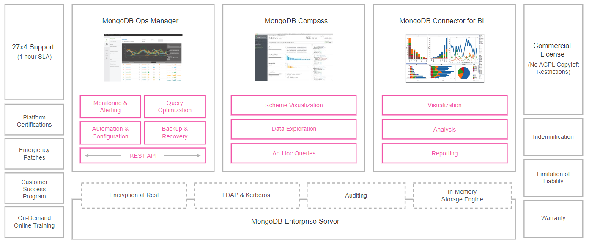

<h1>FASE 5 - Data Universe</h1>
<h2>Capítulo 03: Conhecendo o MongoDB.</h2>

<h2>1. CONHECENDO O MONGODB</h2>

- MongoDB deriva da palavra inglesa humongous, traduzida como “gigantesco”. 
- é um banco orientado a documentos.
- não possui conceito de tabelas, esquemas, transações, joins e chaves estrangeiras.
- desenvolvido em C++, tem como filosofia facilitar o desenvolvimento de aplicações. 
- `é desprovido de esquema (schema free ou schemaless)` e `seus dados são armazenados no formato BSON (Binary JSON)`. 
- um único servidor MongoDB pode armazenar vários bancos sem perder performance graças a sua arquitetura de escala horizontal.

## 1.1 Características e funcionalidades

- é um produto de servidor de banco de dados de ***software livre***.
- usado para armazenamento orientado a documentos.
- melhorou o desempenho, porque torna o armazenamento de dados mais rápido e fácil usando esquemas de bancos de dados dinâmicos semelhantes ao JSON, em vez de sistemas de bancos de dados relacionais tradicionais de tabelas e SQL, sendo categorizado como ***servidor de banco de dados NoSQL***. 
- o esquema do banco de dados dinâmico usado no MongoDB é chamado de ***BSON***.
- nesse tipo de banco (`document-based` ou `document-oriented`), temos coleções de documentos, nas quais cada documento é autossuficiente, contém todos os dados que possa precisar, em vez do conceito de não repetição + chaves estrangeiras do modelo relacional.
- ***a ideia é que não tenhamos de fazer JOINs***, pois prejudicam a performance em suas queries: você modela a sua base de forma que a cada query vai uma vez ao banco e com apenas uma chave primária pega tudo o que precisa.
- o `escalonamento horizontal` com `Sharding` é muito bem implementado no MongoDB:
  - `Sharding` é utilizado quando temos muitos dados e estamos no limite do disco, e dessa forma, dividimos esses dados entre várias máquinas e temos mais rendimento e maior capacidade de armazenamento em disco. 
  - quanto mais Shards, maior será o armazenamento e o desempenho, e o MongoDB disponibiliza essa opção. 
  - para mais detalhes sobre Sharding, consultar a documentação oficial na [página oficial do MongoDB](https://www.mongodb.com/pt-br). 
  - banco de dados relacionais muito utilizados como o MySQL não suportam esse tipo de solução por padrão, para isso teríamos que manipular os dados em uma camada acima da base de dados, sendo muito mais trabalhoso.

## 1.2 Chave-valor e formato BSON

- dados desestruturados são um problema para a maioria dos bancos de dados relacionais, mas não tanto para o MongoDB. 
- quando o schema é variável/livre, usar MongoDB vem a calhar. 
- os documentos BSON (JSON binário) do Mongo são schemaless e aceitam quase qualquer coisa que você quiser armazenar, sendo um mecanismo de persistência perfeito para uso com tecnologias que trabalham com JSON nativamente, como ***JavaScript*** (e, consequentemente, ***Node.js***).
- `BSON Document`: 
  - cenários altamente recomendados e utilizados atualmente são os catálogos de produtos de e-commerces. 
  - telas de detalhes de produto em ecommerces são extremamente complicadas devido à diversidade de informações, aliadas a milhares de variações de características entre os produtos, que acabam resultando em dezenas de tabelas se aplicado sobre o modelo relacional. 
  - em MongoDB, essa problemática é tratada de uma maneira mais simples.
- além do formato de documentos utilizado pelo MongoDB ser ***perfeitamente intercambiável com o JSON serializado do JS***, MongoDB ***opera basicamente de maneira assíncrona em suas operações, assim como o próprio Node.js***, permitindo uma persistência veloz, aliado a uma plataforma de programação rápida.
- os bancos de dados orientados a documentos são uma das principais categorias de bancos de dados NoSQL. 
  - bancos de dados de gráficos são semelhantes, mas adicionam outra camada, o relacionamento, o que lhes permite vincular documentos para uma passagem rápida.
  - `bancos de dados orientados a documentos são inerentes aos bancos de dados chave-valor`: ***a diferença reside na forma como os dados são processados***; em um banco de dados chave-valor, os dados são considerados inerentemente para o banco de dados, enquanto um sistema orientado a documentos depende da estrutura interna no documento para extrair metadados que o mecanismo de banco de dados usa para otimização adicional.
- `bancos de dados de documentos armazenam todas as informações para um determinado objeto em uma única instância`, fazendo com que o mapeamento de objetos no banco de dados seja uma tarefa simples, eliminando o mapeamento objeto-relacional, tornando-os atraentes para aplicativos web, que estão sujeitos a mudanças contínuas, sendo a velocidade uma questão importante.

## 1.3 Vantagens e considerações

### a) `Simplicidade`:
  - o MongoDB, sendo um sistema de gerenciamento de banco de dados não sql, é muito mais simples, e as complexidades que vêm com bancos de dados relacionais são removidas no MongoDB. 
  - como JSON, o armazenamento orientado a documentos simplifica os sistemas de banco de dados.
  
### b) `Replicação e Confiabilidade de Dados`:
  - permite que os usuários repliquem dados em vários servidores espelhados, o que garante a confiabilidade dos dados. 
  - no caso de um servidor travar, seu espelho ainda estará disponível e o processamento do banco de dados permanecerá inalterado.
  
### c) `Consultas NoSQL`:
  - o MongoDB possui um mecanismo de consulta não sql que resulta em funcionalidades de armazenamento e recuperação de dados extremamente rápidas. 
  - consultas orientadas a documentos com base em JSON são extremamente rápidas em comparação com as consultas sql tradicionais.

### d) `Migrações Gratuitas de Esquema`:
  - no MongoDB, o esquema é definido pelo código. 
  - portanto, no caso de migrações de banco de dados, não ocorre nenhum problema de compatibilidade de esquema.

### e) `Escalabilidade Horizontal Eficiente`: 
  - como o MongoDB é um banco de dados não relacional, ele é mais adequado para os cenários em que a escalabilidade horizontal é importante.

### f) `Código aberto`:
  - o MongoDB é um servidor de banco de dados que é de código aberto e personalizável de acordo com os requisitos da organização.

### Considerações:
- o MongoDB é altamente recomendado em cenários em que o processamento rápido e a simplicidade são a chave. 
- devido ao seu mecanismo de consulta baseado no NoSQL, ele é robusto, escalável e altamente eficiente. 
- uma `desvantagem`: quando queremos alterar todos os registros relacionados a uma unidade semântica, nesse caso é preciso tratar um a um.
- muitas empresas de grande porte têm utilizado em projetos de complexidade média.

### Limitações:
- seu documento pode ter no máximo 16 Mb de tamanho.
- o nível máximo de profundidade de um documento é 100.

## 1.4 Visão geral da arquitetura

- a arquitetura do MongoDB Enterprise Server possui várias camadas e componentes.

 
<em>Arquitetura MongoDB.</em>

- as camadas centrais e mais importantes são: ***Ops Manager***, ***Compass*** e ***Connector for BI***.
  - `MongoDB Ops Manager`: é um módulo para realizar o gerenciamento do banco de dados com funcionalidades como monitoração e alertas, otimização de consultas, automação, configuração e backup e recovery.
  - `MongoDB Compass`: interface gráfica client para acessar o banco de dados, permitindo a visualização do schema de dados, a exploração dos dados armazenados e consultas ad-hoc. 
  - `MongoDB Connector for BI`: tem diversos dispositivos para conexão com as mais diferentes ferramentas de visualização analíticas do mercado, como Tableau, Microstrateg e Looker.
  - `camada do Enterprise Server`: tem recursos como engine para gravação em memória, auditoria, autenticação e criptografia. 

- os ***administradores*** podem usar o log de auditoria nativo do MongoDB para registrar todas as atividades e alterações realizadas no banco de dados.
- a ***autenticação***é usada para simplificar o controle de acesso ao banco de dados, incluindo LDAP, Windows Active Directory, Kerberos, certificados x.509 e AWS IAM. 
- a ***criptografia dos dados*** está presente no MongoDB enquanto os dados estiverem circulando pela rede, no uso do banco de dados e nos dados armazenados, seja no disco ou em backups.

- uma ***camada à esquerda*** destaca `suporte 24x7 ` composta por plataforma para certificações, patches emergenciais, trocas de experiências entre clientes e treinamentos.
- uma ***camada à direita*** para `licenciamento comercial` com aspectos relacionados a indenizações, limitação de responsabilidades e garantias.

--- 

[Voltar ao início!](https://github.com/monicaquintal/smart_cities)