

<h1>FASE 6 - DevOps</h1>
<h2>Capítulo 06: Application Lifecycle Management.</h2>

<h2>1. APPLICATION LIFECYCLE MANAGEMENT</h2>

## 1.1 Introdução ao ciclo de vida de software

- o ciclo de vida de software é compreendido pelas fases pelas quais o software passa em sua vida: ele passa por diversas fases evolutivas antes do seu lançamento e após o seu lançamento, até a sua aposentadoria de uso.
- serão estudados nesse capítulo, os ciclos de vida do software em duas situações, portanto:
  - Ciclo de vida de desenvolvimento do software.
  - Ciclo de vida do software em uso.
- a cada fase do ciclo de vida, existe uma expectativa de acontecimentos, para os quais são planejadas ações, esperando-se um resultado; o software demandará mais ou menos atenção e dedicação à sua construção e manutenção e trará maior ou menor retorno financeiro, dependendo do momento do seu ciclo de vida.
- obrigatoriamente, todo software que um dia foi inovador e desejado, chegará ao ponto da sua aposentadoria de uso, em função de fatores como:
  - ***Obsolescência tecnológica***: não é mais possível adaptar o software aos novos cenários e infraestrutura e integração com outras aplicações do mercado.
  - ***Obsolescência de negócio***: a modificação do sistema teria que ser muito profunda, longa e dispendiosa para adequar a solução as novas realidades dos negócios com novas relações entre clientes, fornecedores, governo, consumidores e sociedade.
  - ***Elevados custos de manutenção***: a forma como o software foi projetado e construído já não atende princípios de manutenção enxuta na sua atualização.
- explorar o ciclo de vida do software é, portanto, construir conhecimento que leve a um aproveitamento inteligente da solução tecnológica e a exploração do seu ponto ótimo de aplicação.

## 1.2 Ciclo de vida de projeto de software

- o projeto de um software passa por etapas ou fases que permitem conceber, amadurecer e concretizar a solução final. 
- em geral essas etapas objetivam: primeiramente, entender o que se deseja (compreender requisitos); depois desenhar a solução, criando uma arquitetura, um projeto de engenharia e um plano de execução do projeto para construir a solução; por fim, desenvolver e entregar o produto final.
- existem vários modelos de referência sobre como conduzir essas etapas, os quais são chamados ***modelos de ciclo de vida de desenvolvimento de software***.
- a escolha do modelo implicará na dinâmica da equipe de desenvolvimento, na forma como ela interage e na velocidade com a qual entrega a solução final.
- os modelos para desenvolver softwares são: ***Cascata (Waterfall)***, ***Incremental***, ***Evolutivo*** e ***Espiral***.
- esses modelos são paradigmas e retratam formas de pensar e realizar o projeto do software. 
- eles definem etapas ou fases a serem cumpridas para que o desenvolvimento de software ocorra de forma disciplinada, organizada, progressiva, compreensível, gerenciável e que alcance as expectativas de seus idealizadores.
- escolher um modelo de ciclo de vida traz, portanto, implicações no ritmo de projeto, na interação da equipe e na forma das entregas dos trabalhos, separando esses modelos em preditivos ou adaptativos, conforme tabela a seguir:

Modelos | Descrição
----------|-----------------
- Modelo de processo ***Cascata*** - Modelo de processo ***Incremental*** | Modelos preditivos, que se baseiam em um escopo bem determinado e procuram eliminar ou minimizar mudanças no curso do projeto.
- Modelo de ***Prototipação*** - Modelo de processo ***Espiral*** | Modelos adaptativos, que se baseiam no aprimoramento de conhecimentos e da compreensão de necessidades conforme o projeto evolui, sendo abertos à aceitação de mudanças.

- existe a possibilidade de, em grandes projetos, adotar-se ***abordagem híbrida***, mesclando mais de um dos paradigmas apresentados. 
- a abordagem híbrida é empregada geralmente em um programa que engloba vários projetos dentro de um mesmo assunto/objetivo de negócio, adotando-se dinâmica preditiva em alguns momentos ou parte das entregas, e modelo adaptativo em outras.
- dependendo do modelo adotado, o projeto do software é realizado em uma sequência de grandes ciclos de atividades que produzem o software como um todo ou grandes blocos de solução que formam o software final; ou, em outros casos, as tarefas de desenvolvimento ocorrem em ciclos curtos com entregas frequentes de componentes que vão se somando para completar o software na sua versão final, como ilustra a tabela abaixo.

Modelos | Descrição
----------|-----------------
- Modelo de processo ***Cascata*** - Modelo de processo ***Incremental*** | Criam "ondas" de projetos e suas complementações, procurando assim eliminar a acomodação de mudanças que venham impactar planos.
- Modelo de ***Prototipação*** - Modelo de processo ***Espiral*** | Trabalham com ciclos curtos de entendimentos de demandas e entregas, ajustando expectativas e planos sempre que necessário.

- a escolha do ciclo de vida implicará nas características do plano de projeto, influenciando atividades, cronogramas e a alocação de recursos para produzir e entregar o software.

### 1.2.1 Cascata

- o ciclo de vida Cascata de projeto foi o primeiro modelo de condução de projetos criado para o universo do desenvolvimento de software.
- surgiu para disciplinar as atividades de desenvolvimento, esclarecendo as etapas pelas quais o projeto como um todo deve passar.
- o conceito da cascata de projeto é de conduzir todo o desenvolvimento como uma sequência de fases que acontecem em sequência, sendo que, uma vez superada uma fase não se volta para trás, assim como, em uma cascata de água, a água não volta para um ponto da queda pelo qual passou.

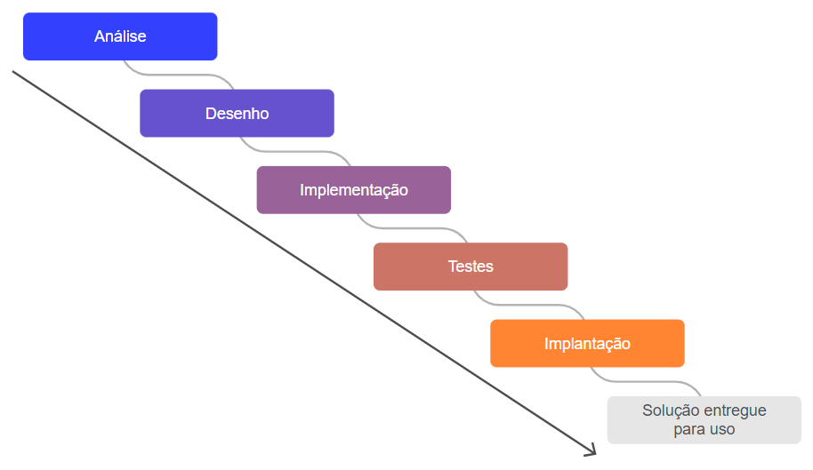 
<em>Fases do ciclo de vida Cascata.</em> 

- as fases de Análise, Desenho, Implementação, Testes e Implantação ocorrem uma após a outra, sem possibilidade de retornar à fase anterior. 
- fases: 
  - 1. `Análise`:
    - contempla tarefas de identificação das necessidades a serem atendidas e investigação do quanto é possível aproveitar da tecnologia já disponível.
    - essas tarefas incluem a aplicação de diversas técnicas de levantamento de requisitos junto aos stakeholders (partes interessadas) do projeto, e estudo dos sistemas em uso na empresa, de forma a confirmar o escopo do desenvolvimento a ser feito.
    - entrevistas individuais, reuniões de trabalho (workshops), observações de campo, são empregadas e são gerados documentos que registram os levantamentos feitos.
    - uma vez registrado o escopo inicial identificado, atividades de análise de viabilidade técnica, financeira, normativa, de recursos e de tempo, e priorização de iniciativas devem ser realizadas, confirmando a proposta inicial da abrangência do projeto, deixando claro o que o sistema contemplará e não contemplará quando concluída sua construção.
  - 2. `Desenho`:
    - contempla a especificação da arquitetura e da engenharia do software, gerando desenhos que orientam a construção do software, assim como acontece com projetos de arquitetura e engenharia da construção civil.
    - é nessa fase que ocorre, por exemplo, o desenho de arquitetura de componentes de solução com TOGAF e SOA, a modelagem de bancos de dados relacional ou não relacional, modelagem de sistema com UML (Unified Modeling Language).
  - 3. `Implementação`:
    - trata da construção do software, gerando o código de aplicação e do seu banco de dados. 
    - nessa fase, é providenciado o ambiente para a equipe de programadores desenvolver a aplicação e seus bancos de dados e nela são empregadas linguagens de programação para computador para que seja construído um ou mais código fonte, respeitando as especificações feitas na fase de Desenho. 
    - na fase de Implementação também acontece o teste unitário (individual e isolado) dos códigos produzidos e o teste do código construído pelo programador com outros programas com os quais o código se comunica (teste integrando componentes de reuso).
  - 4. `Testes`:
    - são realizadas a preparação de um ambiente (infraestrutura) de testes, com cópias dos programas produzidos e seus bancos de dados, e na mesma fase são feitas as avaliações finais do produto construído que incluem testes de sistema e testes de aceitação/homologação. 
    - os testes de sistemas são realizados pela equipe técnica (área de TI) para confirmar o funcionamento completo da solução, já os testes de aceitação são realizados pelos usuários finais da solução para confirmar o alcance das expectativas de uso do sistema (user experience), simulando operações de rotina.
  - 5. `Implantação`:
    - envolve atividades de preparação do ambiente definitivo para que a aplicação e seu banco de dados sejam usados no dia a dia da empresa, treinamento de usuários finais, instalação do software no ambiente definitivo, migração de dados de sistemas legados para o no sistema de informação, se for o caso.
  - 6. `Manutenção`: 
    - após a implantação, o sistema entra em manutenção, ou seja, deverá ser operado e mantido até a sua aposentadoria. 
    - no momento da manutenção ocorrem atividades como backups de rotina, limpeza periódica de dados desnecessários, reorganização de tabelas de bancos de dados, suporte técnico ao usuário final.
    - durante a manutenção do software, acontecem manutenções que constituem de curtos projetos com escopo pequeno para adaptar o software a uma nova realidade de negócio (atender novas regras de uso e operação), evoluir trazendo novidades aos usuários através do embarque de novos recursos (novas tecnologias embarcadas), corrigir problemas do produto em uso (remover bugs), ou ainda, aprimorar a experiência do usuário com o visual, o desempenho e a segurança da aplicação (levar a experiência do usuário à perfeição).
- importante:
  - todas as pessoas que compõem a equipe de desenvolvedores devem trabalhar atividades da fase na qual o projeto se encontra, ou seja, não é possível ter pessoas implementando (construindo código) software e outras analisando requisitos que o software precisa atender.
  - o modelo Cascata é muito interessante de ser aplicado em situações em que exista uma sequência rígida de produção a ser seguida e onde o escopo do projeto não possa ser mudado. 
  - exemplo: em um projeto de redes de computadores para uma sala de data center é necessário primeiro providenciar a estrutura física da sala com suas paredes, piso e teto apropriados, depois providenciar a rede elétrica, em seguida a refrigeração de ambiente, mais tarde o cabeamento de rede lógica e por fim, acomodar os computadores, sendo que cada fase é encerrada antes do início da próxima.
  - percebe-se que pode ocorrer uma longa espera, sem a possibilidade de aproveitar nenhuma funcionalidade que no meio do projeto fique pronta, por conta do regime de entrega somente ao final, com a solução completamente produzida.
  - esse paradigma traz o benefício do gerenciamento rigoroso, mas reduz o benefício de aproveitar o investimento o quando antes.

### 1.2.2 Incremental

- o modelo Incremental foi criado como uma evolução do pensamento do modelo Cascata para atender grandes projetos, de longa duração.
- a ideia do modelo Incremental é proporcionar o desenvolvimento e a entrega da solução de forma modular, disponibilizando pacotes funcionais para os usuários, reduzindo o tempo de espera para se iniciar o aproveitamento do sistema.
- o paralelismo de atividades proporcionado pelo modelo Incremental não significa que o projeto será concluído mais rapidamente que quando conduzido com o modelo Cascata, pois o tempo total do projeto será tão longo quanto for o tempo de desenvolvimento e integração do módulo que demande mais tempo.
- o foco não é o encurtamento do prazo total para o sistema completo ficar pronto, e sim entregar partes do sistema (módulos) que permitam que o patrocinador e usuários do projeto usufruam de benefícios que a solução promete trazer, sem ter que aguardar o final completo da produção do software.

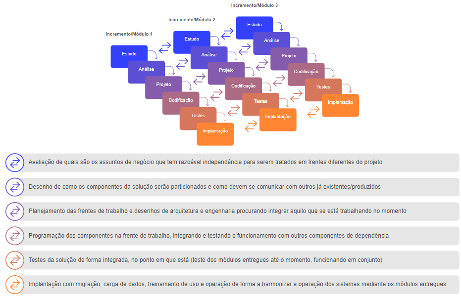 
<em>Fases do ciclo de vida Incremental.</em> 

- nesse modelo, o projeto é gerenciado como várias frentes de desenvolvimento, cada uma respeitando os princípios do modelo Cascata, criando cascatas em paralelo que entregarão cada uma, parte das funções do sistema completo, partes essas que precisam ser pensadas, produzidas e testadas de forma integrada, de forma a garantir que o sistema final seja complementado aos poucos, formando a solução final desejada.P
- exemplo: em um projeto ERP (sistema de gestão integrada de operações de uma empresa) na abordagem Incremental, seria explorada a possibilidade de abrir frentes de trabalho distintas para atender áreas e assuntos de negócio diferentes.
  - serão criadas frentes de trabalho diferentes para os módulos (incrementos) de RH, Estoques e Vendas e cada frente de trabalho será conduzida com sua cascata de fases.
  - isso permite que funções de movimentação, inventário de estoques e localização de materiais sejam construídas em paralelo com funções de registro de admissão, desligamento, mudança de cargo de funcionários, cálculo de horas trabalhadas, horas extras do módulo de RH, dada a independência dos assuntos. 
  - por outro lado, cada um desses módulos funcionais tem também certa dependência com outros, por exemplo: o módulo de estoques precisa ter comunicação com o de vendas pois, a cada venda feita é necessário baixar o saldo em estoque e o estoque disponível precisa ser consultado para que se realize uma venda. 
  - portanto, os módulos poderão ter muitas funções construídas sem esperar pela produção dos outros módulos, porém existirão pontos de integração que implicarão em um esforço adicional de validação quando cada módulo novo for disponibilizado.
- em resumo: ganha-se em agilização de entregas e complica-se o gerenciamento do projeto como um todo, agora que tem várias frentes de trabalho com pontos de integração que não se pode perder de vista.

### 1.2.3.Evolutivo

- um conceito que se popularizou muito no desenvolvimento de projeto é o de Design Thinking (pensamento desenhado), que cumpre com etapas de compreensão e desenho dos requisitos de projeto empregando protótipos.
- protótipos são esboços que facilitam a compreensão de como será o formato e os recursos do produto final; como maquetes estruturais e versões em miniaturas de equipamentos. N
- no caso de software, os protótipos envolvem a criação de provas de conceito que podem acontecer por meio de desenhos de telas de um sistema, desenhos de fluxogramas de processamento, por exemplo.
- considerando o conceito do emprego de protótipos para validar a proposta inicial do escopo de um projeto de sistema, surge o modelo de ciclo de vida Evolutivo, também conhecido como Prototipação evolucionária. 
- nesse modelo, o projeto evolui conforme os protótipos são aprovados pelos usuários, patrocinadores e outras partes interessadas do projeto, como o corpo técnico de TI.

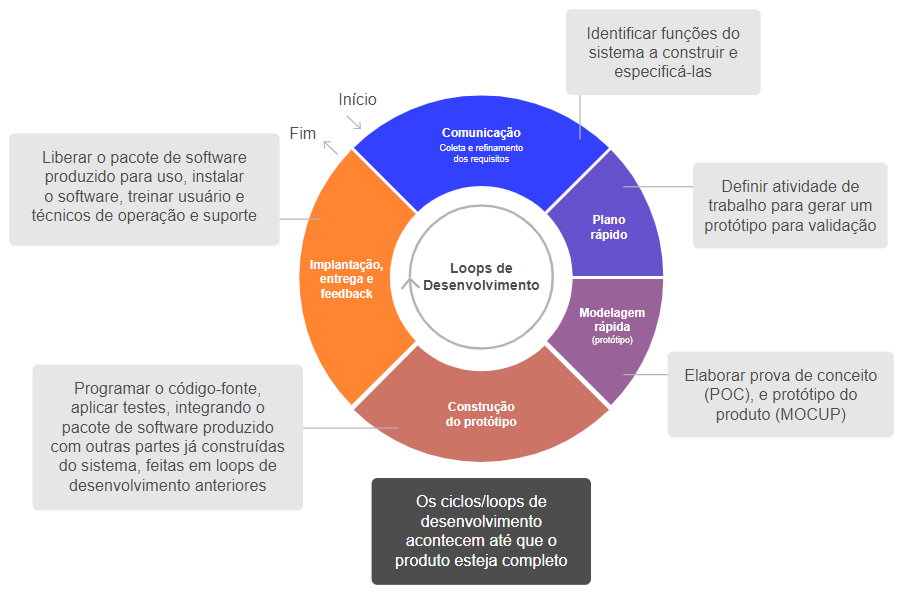 
<em>Fases do ciclo de vida Evolutivo.</em> 

- exemplo: considere que um módulo do sistema ERP como o de RH contenha diversas transações, dentre elas o registro de um novo funcionário, o registro de mudança de função/cargo e o registro de desligamento. 
- considere que cada uma dessas funções requeira um front-end (aplicação com tela de interação do usuário), e cada transação será prototipada, sendo criado um esboço da tela de interação do usuário. 
- se o protótipo da tela de registro de funcionário for aprovado, o desenvolvimento da transação de registro de funcionário pode ser realizado executando-se as etapas de desenho de engenharia, implementação, testes e entrega, sem precisar esperar pela aprovação dos demais protótipos.
- isso cria uma independência entre diversas frentes de trabalho, cada uma desenvolvendo um dos protótipos já aprovados.
- o emprego do ciclo de vida Evolutivo traz mais agilidade de entregas do que se consegue com o modelo Incremental ou Cascata, mas, por outro lado, cria mais complexidade administrativa uma vez que podem existir dezenas de desenvolvedores na equipe de projeto, cada um realizando uma tarefa de etapa diferente.
- o que se ganha com esse modelo é a redução da ansiedade do usuário na espera por usar a solução, reduzindo pressões sobre a equipe quanto ao seu ritmo de trabalho e entrega, além de permitir a aferição de benefícios obtidos com as partes entregues da solução ainda no curso do projeto, melhorando o retorno sobre o investimento.
- além disso, permite a incorporação de aprendizados a cada loop de produção, claro que, com isso, acabando por vezes por exigir alguns retrabalhos sobre o que já foi produzido e entregue.

### 1.2.4 Espiral

- com o advento do desenvolvimento de software orientado-a-objetos que elevou o patamar do reuso de software e facilitou a realização de projetos adaptáveis e fáceis de manter, o foco do desenvolvedor passou a ser a modelagem extremamente componentizada e a construção de software com um conjunto de programas que entregam serviços específicos e estabelecem uma relação de produtor e consumidor entre eles, gerando o efeito final esperado no sistema integrado de informação ou automação.
- o modelo Espiral incorpora o conceito de desenvolvimento e entrega de componentes em frentes de trabalho paralelas, quase como uma extrapolação da proposta do modelo Evolutivo.
- esse desmembramento do projeto em muitas frentes de trabalho com ritmo diferente traz riscos, então o modelo espiral apresenta uma proposta de planejamento, análise de riscos, execução e avaliação de resultados contínua.

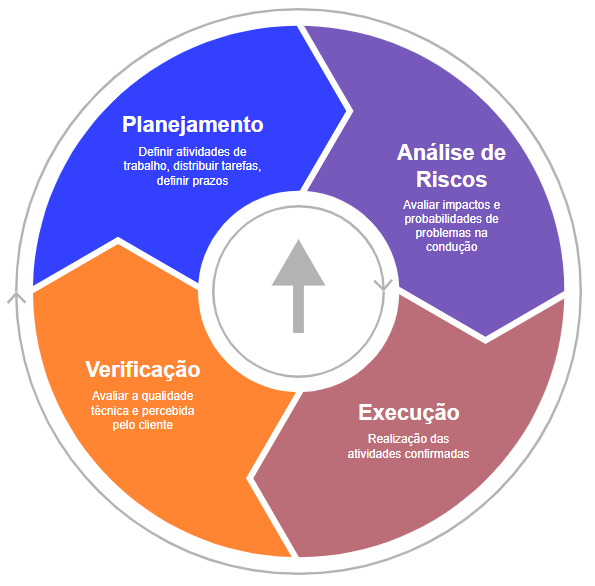 
<em>Disciplina de acompanhamento e revisão periódica de projeto do modelo Espiral.</em> 

- o acompanhamento e revisão periódica, impostos pelo modelo Espiral, ajudam a avaliar e mitigar riscos e promover mudanças no curso do projeto, ajustando o escopo conforme o projeto evolui e o aprendizado com o sistema que está sendo entregue se aprimora.
- essa dinâmica incorpora o princípio de melhoria contínua onde se emprega a prática de planejar o que se deseja fazer, avaliar riscos do que se quer fazer, fazer aquilo que foi confirmado para ser feito e aprender com o trabalho e o resultado obtido.
- tratando agora do ciclo de vida de condução do projeto como um todo, a solução sistêmica será produzida componente a componente, entendendo-se por componente cada unidade de código produzida que entregue um serviço específico.

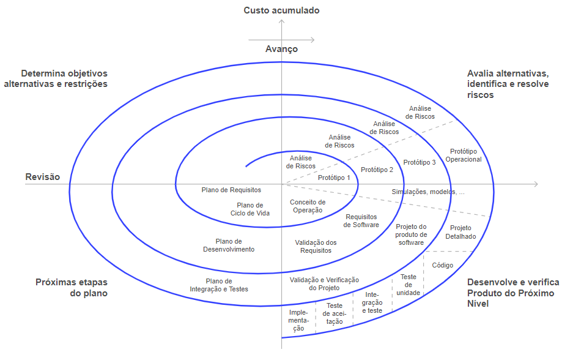 
<em>Modelo Espiral de projeto.</em> 

- nesse modelo, cada componente eleito para produção passa por todas as etapas fundamentais de modelagem (desenho), implementação, testes e entrega (implantação).
- nesse tipo de abordagem, a qualidade do estudo de integração de componentes e a modelagem do software são fundamentais para garantir integridade de projeto e para permitir que, a partir das especificações do que se pretende fazer, os desenvolvedores consigam construir partes do software mesmo sem outras partes estarem prontas, conseguindo integrar essas partes quando estiverem concluídas.
- como benefício da aplicação desse modelo tem-se máxima flexibilidade e adaptabilidade, com o custo de maior complexidade de gerenciamento sobre mudanças e sobre o ritmo do projeto.

## 1.3 Ciclo de vida do software disponibilizado

- o software disponibilizado para uso tem um ciclo de existência e utilidade – o ciclo de vida após a realização do seu projeto.
- esse ciclo de vida respeita fases específicas das quais podem ser esperadas que determinadas situações ocorram e que essas situações demandem ações específicas por parte do fabricante e do comprador e consumidor do software.
- o ciclo de vida no qual o software se encontra produtivo é chamado de ***fase de Manutenção***, que segue após o projeto ser completamente concluído (em documentações de Engenharia de Software, a fase de manutenção é representada como a última fase do modelo Cascata, uma vez que nesse modelo, o sistema completo é entregue de uma só vez, entrando com todos seus componentes na fase de uso).
- nesse período útil do sistema é necessário promover a sua sustentação que envolve garantir as rotinas de monitoração de uso, manutenção do desempenho e segurança, com ações de: limpeza e reorganização de bases de dados; provimento, revogação e monitoração proativa de acessos; backups, ajuste de infraestrutura e configurações de parâmetros de ambiente da aplicação.

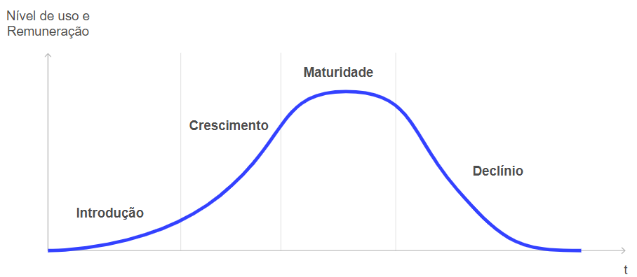 
<em>Ciclo de vida do software em uso e operação.</em> 

- durante o período de uso, as regras de negócio que o sistema atende devem mudar em função de novos comportamentos de clientes, parceiros, fornecedores, consumidores, governos, legislação, economia, sociedade em geral. 
- com isso, para manter o sistema vivo e competitivo diante de soluções concorrentes emergentes, o sistema precisa passar por manutenções.

### 1.3.1 Introdução
- nessa fase, surgem os primeiros interesses pelo software, ainda podem existir problemas com a aplicação (bugs) e a equipe de desenvolvedores de software está ainda bastante focada à liberação para uso (imediate after-go-live).
- para o fabricante do software isso significa que sua equipe de desenvolvimento está sendo remunerada e ocupada.
- para o cliente e consumidor, ainda existe incerteza na qualidade do software. 
- gradualmente, conforme a confiança aumenta, recomendações surgem e novos compradores e consumidores são adicionados.
- as ações a serem tomadas são: promover correções rápidas de bugs que possam surgir, prestar rápida assistência de suporte aos clientes iniciais, promover forte divulgação do produto.

### 1.3.2 Crescimento
- nessa fase, os clientes atuais satisfeitos ajudam a impulsionar o aumento da clientela do sistema.
- a equipe de desenvolvedores passa a ser liberada para outras atividades dada a estabilização do software e da sua qualidade.
- a empresa desenvolvedora deve iniciar um novo projeto para a nova geração/versão do seu produto, dado que a totalidade ou grande parte da sua equipe de desenvolvedores está liberada de trabalhos de manutenção do sistema em uso/operação.
- os serviços de suporte técnico e serviços de operação estão em pleno exercício.
- os esforços de divulgação podem ser gradualmente reduzidos.

### 1.3.3 Maturidade
- nessa fase, a comunidade confia no produto e ele alcança sua quantidade máxima de usuários e licenciamento. 
- no ápice da maturidade, a comercialização do software não cresce mais (quando um novo licenciamento entra, outro é perdido, mantendo equilíbrio).
- a partir desse momento, a expectativa é que o interesse dos clientes caia e novos potenciais clientes percam interesse em adquirir o software.
- é hora de a empresa desenvolvedora do sistema liberar para o mercado uma nova geração de produto para ocupar o espaço que começa a ser deixado pelo produto que alcançou sua maturidade de emprego.

### 1.3.4 Declínio
- após a maturidade, o sistema entra na sua fase de Declínio de uso e operação, quando a quantidade de clientes que aderem ao produto se torna menor do que a que abandona seu emprego, até alcançar um momento no qual ninguém mais se interessa pelo software, ocorrendo a sua aposentadoria.
- essa curva de declínio de utilização pode ser atenuada e a vida do software prolongada por ações de manutenção feitas pelo fabricante do sistema.
- as ***manutenções*** pelas quais o sistema pode passar são:
  - `Corretivas`: eliminam defeitos do Banco de Dados e programas associados.
  - `Adaptativas`: ajustam o Banco de Dados e programas associados para acomodar mudanças em regras de negócio que exigem novas funções e informações.
  - `Evolutivas`: incluem novas estruturas em Bancos de Dados e funcionalidades em programas associados aos Bancos, para criar novas oportunidades de aplicação prática para os usuários, aumentando a atratividade do produto.
  - `Perfectivas`: buscam ajustes de desempenho (Performance Tunning), otimização de ocupação de espaços de armazenamento de dados e consumo de recursos infraestruturais (processamento, RAM, telecomunicações).
- é importante ressaltar que o ciclo de vida bem administrado permite: 
  - que compradores do software saibam o melhor momento de adquirir uma aplicação, de forma a obter uso pelo maior período possível trazendo excelente relação custo-benefício.
  - que a empresa desenvolvedora do software mantenha os seus desenvolvedores ocupados, ocupe o espaço de mercado e dificulte a entrada de concorrentes que substituam sua solução, garantindo maiores retornos sobre investimentos em pesquisa de desenvolvimento e melhor equalização e custos operacionais.

## 1.4 Ciclo de vida e processo de software

- para que se conduza um projeto de software, os ciclos de vida não são suficientes; eles orientam a escolha e definição de um processo.
- um processo de software inclui:
  - as fases do ciclo de vida de projeto e suas expectativas de produção.
  - definição de artefatos a serem produzidos em cada fase (documentação).
  - perfil dos profissionais a serem alocados e suas responsabilidades.
  - controles a serem aplicados (mecanismos de registro de plano, evolução do projeto e de ajuste de curso).
- os processos para condução tradicional e para condução ágil são diferentes, dentre eles, tem-se o `RUP (Rational Unified Process)`, aplicável as situações de emprego dos modelos de ciclo de vida Cascata e Incremental, e tem-se o `SCRUM`, aplicável aos projetos que seguem ciclo de vida Evolutivo ou Espiral.
- existem diversos outros modelos de processo difundidos no mercado como RAD, DSDM, Extreme Programing (XP), porém serão apresentados alguns detalhes sobre os processos RUP e SCRUM, focando na sua relação com Ciclos de Vida de Software.

### 1.4.1 Processo tradicional clássico (RUP)
- o RUP (Rational Unified Process) mantém as características de condução de projeto por fases sequenciais sem retorno, definição completa e de preferência irrevogável de requisitos antes de iniciar o desenvolvimento, muita divisão de papéis entre os desenvolvedores, alocando perfis profissionais conforme a fase do projeto e, muita documentação administrativa.
- visão geral das fases de uma condução de um projeto com RUP:

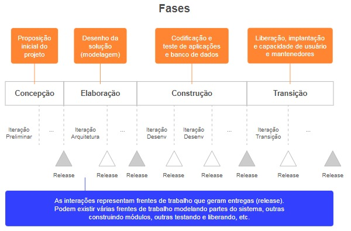 
<em>Fases do RUP.</em> 

- para cada fase, é previsto o tipo de atividade a ser feita (modelagem de negócio, documentação de requisitos, análise e desenho, implementação, teste e implantação).

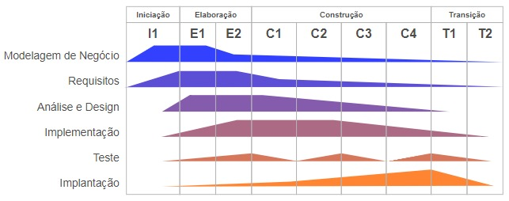 
<em>Atividades previstas por fase de um projeto conduzido com RUP.</em> 

- os profissionais da área de desenvolvimento de sistemas são categorizados pelo RUP em mais de uma dezena de papéis, distribuídos entre analistas, arquitetos, engenheiros, programadores, testadores, revisores, avaliadores e mais.
- as fases são percorridas de forma sequencial, produzindo o sistema como um todo ou módulos que se complementam até formar o sistema.
- o RUP ainda apresenta descrições detalhadas de cada atividade a ser desenvolvida num projeto, com exemplificação de estruturas padrão (templates) de artefatos a serem produzidos a cada atividade realizada.
- o RUP traz bastante formalismo ao processo de desenvolvimento, com gerenciamento preciso e controle absoluto sobre materiais produzidos ao longo do projeto e sobre as ações da equipe de desenvolvimento, com implicações negativas no ritmo de entregas de software para uso, como é de se esperar de um modelo tradicional de projeto.
- com o emprego do RUP, consegue-se construir um plano de projeto detalhado utilizando ferramentas como o MS-Project, Oracle Primavera, Open Project e outras.

### 1.4.2 Processo ágil
- o SCRUM é o modelo de processo ágil de software mais aplicado mundialmente.
- traz fortes conceitos de flexibilização de desenvolvimento, foco em rápidas entregas de software, comunicação intensiva entre membros da equipe e com partes interessadas no produto final, desburocratização do gerenciamento, flexibilização de escopo e adaptação do projeto para adequá-lo as necessidades de negócio vigentes.
- a forma de condução ágil exige disciplinas de planejamento, organização e controle bem diferentes das aplicáveis aos projetos com condução tradicional, dada a grande autonomia de disparos de frentes de trabalho e flexibilidade para mudanças no escopo, durante o curso do projeto.
- o SCRUM traz um conceito forte de trabalho em TIME para concretizar resultados rápidos, tendo clara definição de papéis e responsabilidades, papéis esses que são poucos, exigindo da equipe de desenvolvedores habilidades múltiplas (full stack skills).
- composição das equipes SCRUM:

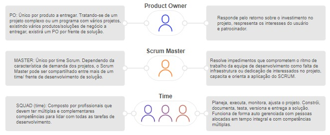 
<em>Formação da equipe SCRUM.</em> 

- é organizado em um processo definido em TIME BOXES, que são caixas de tempo pré-fixado, mantendo assim um ritmo de produção, tendo o compromisso de gerar frequentemente uma entrega útil para o cliente.
- processo SCRUM quanto a suas etapas:

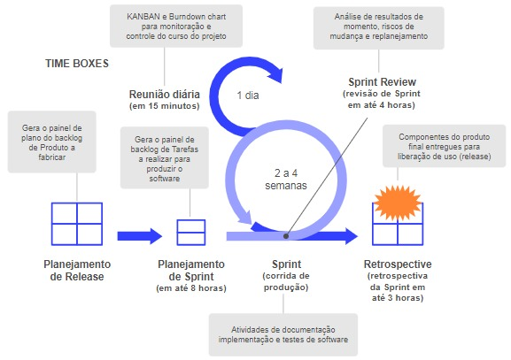 
<em>Visão geral do processo SCRUM.</em> 

- inclui ainda um conjunto de ARTEFATOS de gestão, que são documentações gerenciais padronizadas a serem produzidas ao longo do ciclo de processo produtivo, as quais são poucas para efeito de gerenciamento de projeto.
- a prioridade da documentação e a documentação mais extensa fica por conta da arquitetura e engenharia técnica da solução, as quais são partes integrantes do produto final, acompanhando o código da aplicação.
- o processo SCRUM de condução de projetos que se alinha em especial com o ciclo de vida de projetos em Espiral, apesar de poder ser aplicado com segurança para atender desenvolvimentos sob o modelo Evolutivo.
- os artefatos de planejamento e controle do projeto com SCRUM são:
  - `Backlog de produto`: retrata um plano de entregas dos componentes do software.
  - `Backlog de sprint`: com as tarefas a serem realizadas em uma corrida de produção, sendo planejadas uma sprint por vez.
  - `KANBAN board`: para monitorar status de tarefas de sprints e das entregas de componentes do produto final.
  - `Burndown chart`: representa o esforço de produção previsto e cumprido, e permite comparar o ritmo dos trabalhos com uma referência de ritmo ideal, na execução de uma sprint.

## 1.5 Melhores práticas de gerenciamento do ciclo de vida em DevOps

- segundo o ***modelo FLEKS***, que aplica práticas integradas para gerenciar projetos no universo do desenvolvimento ágil exigido na produção de software contemporânea, o emprego de um ciclo de vida e processo de software bem definido ajudam a definir uma forma de pensar os trabalhos em equipe que facilita o aprendizado, cria foco, reduz o desperdício, orienta o fluxo de trabalho e a responsabilização, possibilita a adaptação e customização que venha a ser exigida ao longo do projeto, levando à excelência.
  - `mindset FLEKS`: excelência, aprendizagem, trabalho em equipe, adaptação, customização, foco, redução de desperdício, fluxo.
- ciclos de vida e processos de software são pilares fundamentais da governança de TI, dando visibilidade de planos e resultados, além de serem instrumentos da qualidade, na medida em que auxiliam no gerenciamento da eficiência, eficácia e na efetividade do projeto e do seu produto final.
- os projetos ágeis são os mais aplicados na atualidade do desenvolvimento do software e recomendam que o ciclo de vida e o processo de software criem orientação para a produção e entrega do produto final, devidamente adequado para as necessidades de uso, reduzindo atividades burocráticas.
  - `Manifesto ágil`:
    - indivíduos e interações mais que processos e ferramentas.
    - responder a mudanças mais que seguir um plano.
    - software funcionando mais que documentação abrangente.
    colaboração com cliente mais que seguir um contrato.
- ciclos de vida de projeto em Espiral e Evolutivo são os mais empregados em situações de desenvolvimento otimizado e integrado de software, porém, em situações em que o escopo do projeto é fechado (não permite modificações), com execução de curto prazo e que dificilmente enfrentará mudança de regra do negócio no curso do projeto, modelos mais tradicionais como a condução Cascata ou Incremental podem ser empregados com sucesso.
- as vantagens dos modelos ágeis estão na flexibilidade de adaptação do projeto às necessidades de negócio e entregas de partes da solução o quanto antes para uso, enquanto os modelos tradicionais procuram rigor administrativo,simplicidade de controle e validação integrada da solução completa; na medida em que se conhece o que a equipe está fazendo a cada fase, não se retorna à discussão de assuntos de uma fase passada e só se pode entregar a solução completa ou módulos completos da solução para uso.
- tratando de melhores práticas da atualidade, DEVOPS é a palavra de ordem. 
  - DEVOPS é a junção de duas palavras: Development e Operations. 
  - traz um paradigma que busca aproximar desenvolvedores de aplicações com os operadores e usuários das soluções, criando uma visão holística sobre os projetos de software.
  - DEVOPS solicita o emprego de mecanismos que dinamizem o processo produtivo, cumprindo com um ciclo de vida ágil de produção de software, o que inclui muita automação na hora de programar, testar e entregar o software e o provimento dinâmico e sob demanda de infraestrutura para construir, validar e usar a solução no dia a dia do negócio.
- a tendência da vida social da humanidade é a agilização de atividades e a mudança constante de comportamentos, impulsionados pelas tecnologias emergentes que ampliam os horizontes da produção, distribuição, armazenagem e consumo de mercadorias, flexibilizam e intensificam comunicações e a prestação de serviços entre as pessoas físicas e jurídicas.
- cada vez mais, os modelos de ciclo de vida e processo ágil ganham espaço no universo dos projetos de soluções tecnológicas.

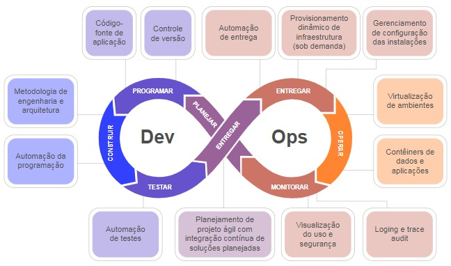 
<em>Princípios do DEVOPS.</em> 

## 1.6 Conclusãosobre as melhores práticas de Ciclo de Vida de Software

- os ciclos de vida orientam as tarefas, responsabilidades e os fluxos de trabalho para executar projetos de software e são a base dos processos de software que, por sua vez, definem papéis para os colaboradores do projeto, estabelecem ferramentas e documentações de planejamento e controle específicas, as quais precisam ser empregadas no gerenciamento dos trabalhos.
- existem várias opções que o desenvolvedor de software pode escolher para se orientar quando ao ciclo de vida de projeto: o modelo Cascata, o modelo Incremental, o Evolutivoe o Espiral. 
  - cada um deles traz características facilitadoras e dificultadoras conforme a caraterística do projeto que se precisa executar.
- enquanto os modelos tradicionais como Cascata e Incremental trazem simplicidade administrativa de trabalhos (por trabalharem com escopo fechado e fases sequenciais bem definidas, embora recheados de documentação administrativa), os modelos Evolutivo e Espiral são mais flexíveis e abertos a adaptação para mudanças necessárias no curso do projeto (características presentes nos turbulentos cenários de negócios da atualidade). 
- modelos tradicionais entregam pacotes de software integrados e completos, enquanto modelos ágeis e flexíveis primam por entregar pequenas porções de software com poucas funcionalidades que pouco a pouco, gradualmente, vão formando a solução esperada pelo usuário final.
- a escolha do ciclo de vida a ser seguido não deve ser uma deliberação estática da empresa, ou seja, não se deve determinar que apenas um modelo seja seguido sempre; o mais apropriado é conhecer e saber empregar os diversos modelos e, por ocasião de um projeto, escolher o que é mais apropriado, avaliando o custo-benefício administrativo e para a produção e entrega do software, atendendo as expectativas das partes interessadas (stakeholders) que inclui oponto de vista dos desenvolvedores, patrocinadores, usuários finais, operadores de sistema, de dados e da infraestrutura, e equipes que prestarão suporte após a entrega do produto.
- soma-se à escolha do ciclo de vida de projeto, a definição da estratégia de manutenção do produto, que envolve a definição do ciclo de vida pós-entrega do produto.
  - quão frequente serão as atualizações de um produto existente e em qual período de tempo se pretende desenvolver e lançar novas versões são decisões que determinarão o quanto uma solução sobreviverá em uso e trará retorno sobre o investimento de quem a desenvolveu e comprou.
- a escolha correta de um ciclo de vida de projeto é um grande passo para que um negócio seja lançado, cresça e se mantenha, empregando tecnologia em suas operações.

--- 

## FAST TEST

### 1. Sobre ciclo de vida de projeto de software, assinale a afirmativa correta.
> O conceito da Cascata de projeto é de conduzir todo o desenvolvimento como uma sequência de fases que acontecem em sequência, sendo que, uma vez superada uma fase não se volta para trás.

### 2. Leia a definição a seguir: "É um modelo de processo ágil de software mais aplicado mundialmente. Esse modelo traz fortes conceitos de flexibilização de desenvolvimento, foco em rápidas entregas, comunicação intensiva, desburocratização do gerenciamento, flexibilização de escopo e adaptação do projeto". Essa definição está se referindo a qual modelo?
> Scrum.

### 3. As manutenções pelas quais o sistema pode passar são:
> Corretivas, Adaptativas, Evolutivas e Perfectivas.

--- 

[Voltar ao início!](https://github.com/monicaquintal/smart_cities)
