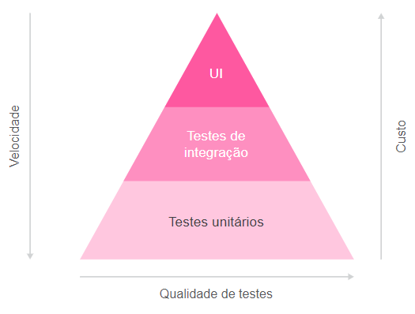
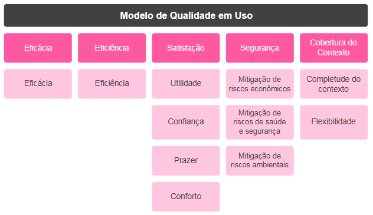
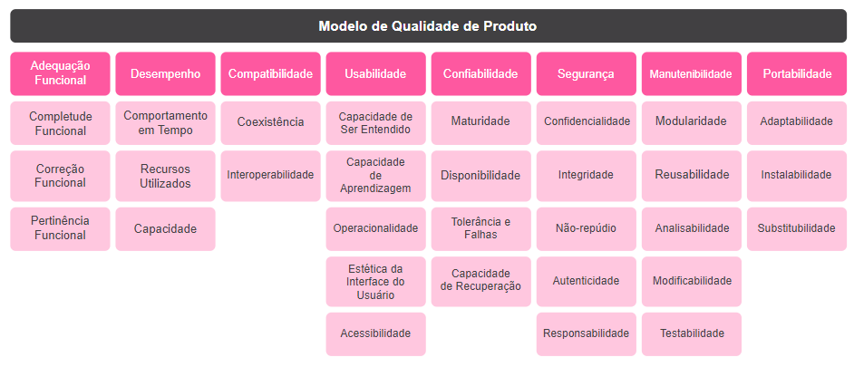

<h1>FASE 6 - DevOps</h1>
<h2>Capítulo 07: Hora do Compliance.</h2>

<h2>1. HORA DO COMPLIANCE</h2>

## 1.1 O que é qualidade de software?

- qualidade de software é essencial para garantir que um produto atenda às necessidades e expectativas dos usuários, proporcionando uma experiência satisfatória e confiável. 
- softwares de alta qualidade oferecem uma série de benefícios, como a redução de bugs, que causam frustração e diminuem a confiança no produto. 
  - um software bem projetado e testado minimiza esses problemas, oferecendo uma experiência de uso mais fluida e agradável.
- além disso, a qualidade de software ajuda a minimizar os custos de manutenção. 
  - quando um software for desenvolvido com boas práticas de engenharia e exaustivamente testado antes do lançamento, os problemas são detectados e corrigidos precocemente, reduzindo a necessidade de constantes atualizações e correções de bugs após o lançamento, economizando tempo e recursos.
- o último ponto, embora não menos relevante, é o aumento da confiança do usuário. 
  - usuários que percebem que um software é confiável e funciona conforme esperado tendem a usá-lo com mais frequência e a recomendá-lo a outros, o que impacta diretamente o sucesso comercial de um produto. 
  - usuários satisfeitos são mais propensos a continuar usando o software, adquirir atualizações ou serviços adicionais e falar positivamente sobre o produto.

### 1.1.1 Exemplos práticos de impacto da qualidade de software

- a qualidade de software deve ser uma preocupação constante, garantindo uma experiência satisfatória e confiável para todos os usuários, independentemente da finalidade do software.

### 1.1.2 Entendendo bugs

- trata-se de um erro ou defeito no código ou na lógica do software que causa um comportamento indesejado ou inesperado. 
- outro ponto importante é o processo de depuração, ou "debugging": quando
estamos debugando um código, estamos nos referindo ao processo de localizar e corrigir erros ou bugs no código-fonte de um software. 
- quando o software não funciona conforme o esperado, os desenvolvedores analisam o código em modo debug para determinar as causas dos erros. 
- debug é uma prática essencial na programação, pois permite identificar, corrigir e prevenir bugs em códigos das mais diferentes naturezas.
- os bugs de software podem ser classificados de algumas maneiras, dependendo de seu impacto, origem ou natureza, sendo alguns dos tipos mais comuns:
  - A. `Bugs funcionais`: relacionados a funcionalidades específicas do software que não funcionam conforme o esperado. Um exemplo clássico seria um botão que deveria salvar dados, mas não realiza essa operação.
  - B. `Bugs de desempenho`: afetam diretamente a velocidade e a eficiência do software. Por exemplo, um aplicativo que demora muito tempo para carregar ou processar dados é um caso típico desse tipo de bug, onde o desempenho inadequado pode comprometer a experiência do usuário e a funcionalidade geral do sistema.
  - C. `Bugs de interface do usuário (UI)`: envolvem problemas na interface gráfica que afetam a usabilidade. Por exemplo, elementos da interface que estão fora de lugar ou botões que não respondem ao clique.
  - D. `Bugs de segurança`: referem-se a vulnerabilidades no software que podem ser exploradas para comprometer sua segurança. Um exemplo clássico desse tipo de bug é uma falha que permite o acesso não autorizado a dados sensíveis, colocando em risco a integridade e a confidencialidade das informações armazenadas no sistema.
  - E. `Bugs de compatibilidade`: ocorrem quando o software não funciona corretamente em diferentes ambientes ou dispositivos. Um exemplo seria um aplicativo que opera bem no iOS, mas apresenta problemas no Android.
  - F. `Bugs de conectividade`: são problemas que surgem na comunicação entre o software e outras aplicações ou redes. Um exemplo comum é a falha na conexão com um servidor ou a dificuldade de integrar corretamente com APIs de terceiros, o que pode interromper o fluxo de dados e impactar a funcionalidade do software.
  - G. `Bugs de dados`: dizem respeito a problemas na manipulação e armazenamento de dados, como quando dados são corrompidos durante a gravação ou informações são lidas incorretamente do banco de dados.
  - H. `Bugs de lógica`: ocorrem quando há falhas na lógica de programação, resultando em resultados incorretos. Um exemplo típico é um cálculo matemático que retorna um resultado errado devido a um erro na fórmula implementada, o que pode levar a comportamentos inesperados e comprometer a funcionalidade do software.
  - I. `Bugs de usabilidade`: afetam a facilidade com que os usuários interagem com o software. Um exemplo é um fluxo de navegação confuso ou difícil de entender, que pode dificultar a experiência do usuário e tornar o software menos intuitivo e acessível.
  - J. `Bugs de instalação`: são problemas que afetam a instalação ou atualização do software. Um exemplo é uma falha durante o processo de instalação que impede que o software seja instalado corretamente, o que pode impedir o usuário de utilizar o produto.
  - K. `Bugs de integração`: surgem quando diferentes módulos ou sistemas são combinados e enfrentam problemas. Um exemplo é quando módulos funcionam bem de forma independente, mas falham ao serem integrados, o que pode comprometer a funcionalidade geral do sistema.

- entender os tipos de bugs e como podem ocorrer em um produto são aspectos cruciais para a qualidade e a eficácia de qualquer software. 
- diferentes tipos de bugs afetam várias dimensões do produto, desde funcionalidades e desempenho até a usabilidade e segurança. 
- a compreensão desses diversos problemas permite uma abordagem mais estruturada na identificação e correção, garantindo que o software atenda aos padrões esperados e ofereça uma experiência satisfatória ao usuário.

### 1.1.3 Entendendo os tipos de testes

- testes de software são essenciais para garantir que um produto atenda aos requisitos de qualidade e funcione conforme esperado. 
- cada tipo de teste desempenha um papel específico no ciclo de desenvolvimento, e entender suas características ajuda a assegurar um software robusto e confiável.

- 1. `testes de unidade`:
  - realizados no nível do código-fonte e focados em métodos e funções individuais.
  -  são conhecidos por sua automação eficiente, rápida execução e facilidade de diagnóstico.
  - exemplo: um teste de unidade pode verificar se uma função que soma dois números retorna o resultado correto, garantindo que a função retorne 8 ao somar 3 e 5.
- 2. `testes de integração`:
  - complementam os testes de unidade ao avaliar como diferentes módulos ou serviços interagem quando combinados. 
  - esses testes identificam problemas nas interfaces entre módulos, como incompatibilidades de dados ou falhas de comunicação. 
  - exemplo: em um aplicativo de lista de tarefas, um teste de integração verificaria se uma nova tarefa adicionada aparece corretamente na lista, garantindo que os módulos de adicionar e exibir tarefas funcionem bem juntos.
- 3. `testes funcionais`:
  - focam nos requisitos de negócios da aplicação. 
  - eles avaliam se a aplicação atende às especificações fornecidas, concentrando-se na saída resultante de uma ação específica, sem considerar os estados intermediários do sistema. 
  - por exemplo, em um aplicativo de reservas de restaurantes, um teste funcional pode verificar se a funcionalidade de reserva de mesa está operando corretamente, garantindo que a confirmação seja enviada ao usuário com as informações corretas.
- 4. `testes de regressão`:
  - verificam se alterações no código introduziram novos defeitos em partes já testadas do software. 
  - garantem a estabilidade das funcionalidades existentes após mudanças, correções ou adições de novas funcionalidades. 
  - exemplo: após implementar uma nova funcionalidade de recomendação em um aplicativo de compras online, os testes de regressão garantiriam que a funcionalidade de pagamento não foi afetada, ajudando a identificar problemas como erros no cálculo do total do carrinho.
- 5. `testes de desempenho`:
  - avaliam como o sistema se comporta sob diferentes cargas de trabalho, medindo a confiabilidade, velocidade, escalabilidade e capacidade de resposta do aplicativo. 
  - exemplo: um teste de desempenho em um aplicativo de streaming de vídeo pode revelar gargalos na capacidade do servidor ao lidar com muitos usuários simultâneos, indicando a necessidade de melhorias na infraestrutura.
- 6. `testes de segurança`:
  - essenciais para garantir que o software esteja protegido contra ameaças e vulnerabilidades.
  - incluem testes de penetração para simular ataques e identificar falhas de segurança, além de análises de vulnerabilidades e verificação de conformidade co m normas de segurança.
  - exemplo: em um aplicativo bancário online, um teste de penetração pode revelar uma vulnerabilidade na autenticação de dois fatores, destacando a necessidade de correção para proteger os dados financeiros dos usuários.
- 7. `testes exploratórios`:	
  - oferecem uma abordagem diferenciada.
  - permitem que os testadores explorem o software de forma criativa e intuitiva, sem seguir um roteiro predefinido. 
  - esse tipo de teste é valioso para descobrir problemas que não são facilmente encontrados em testes formais. 
  - exemplo: em um aplicativo de e-commerce, um teste exploratório pode identificar que a aplicação apresenta lentidão ao aplicar vários filtros de pesquisa rapidamente, um problema que pode passar despercebido em testes automatizados.

> É crucial para o sucesso de qualquer projeto, inicialmente, se concentrar nos `testes de unidade e integração`!

- `testes de unidade` assegurarão que as funções e métodos individuais sejam eficazes, enquanto os `testes de integração` assegurarão que os diferentes módulos do software interajam de acordo com o esperado. 
- a implementação desses testes é crucial para manter um nível mínimo de qualidade e estabilidade, independentemente da linguagem de programação utilizada, uma vez que a maioria das bibliotecas oferece suporte a eles.

### 1.1.4 Entendendo os testes de caixa branca e caixa preta

- `teste de caixa branca`:
  - também conhecido como teste estrutural ou teste de caixa clara.
  - é uma abordagem onde o testador possui acesso ao código-fonte, estrutura interna e design do software. 
  - esta técnica concentra-se na verificação da lógica interna do código, incluindo caminhos de execução, fluxos de controle, condições e loops.
  - características principais incluem:
    -  acesso ao código-fonte, que permitem ao testador identificar pontos críticos para teste;
    - cobertura de caminhos, avaliando todos os caminhos possíveis no código, como decisões e loops;
    - validação da lógica, assegurando que a lógica interna esteja correta e que todas as condições sejam tratadas de maneira apropriada.

- `teste de caixa preta`:
  - se concentra nas funcionalidades do software sem considerar sua estrutura interna. 
  - o testador não possui conhecimento sobre o código-fonte e foca apenas nas entradas e saídas para verificar se o software atende aos requisitos e especificações definidos. 
  - essa abordagem é baseada nos requisitos do sistema e simula a perspectiva do usuário final, assegurando que o software funcione conforme esperado do ponto de vista do usuário.

> esses métodos ilustram a diferença fundamental entre ter visibilidade dos processos internos (caixa branca) e testar com base apenas nas funcionalidades externas e requisitos (caixa preta).

### 1.1.5 Pirâmide de testes
- pirâmide de testes é um conceito que sugere uma proporção ideal de diferentes tipos de testes para garantir uma cobertura eficiente e eficaz. 
- a base da pirâmide é formada por testes de unidade, seguidos por testes de integração no meio, e testes funcionais no topo. 
- esse formato ajuda a garantir que o desenvolvimento do software seja eficiente e que os testes forneçam feedback rápido e relevante. 
- a maioria dos testes deve estar na base devido à sua velocidade e baixo custo; à medida que se sobe na pirâmide, os testes tornam-se mais lentos e caros, por isso devem ser menos numerosos. 
  - essa distribuição ajuda a detectar e corrigir problemas de forma eficiente e econômica.

 
<em>Ilustração da pirâmide de testes.</em> 

- há uma uma norma internacional no mercado, a `ISO/IEC 25010:2011`, indispensável para definir e avaliar a qualidade de um software. 
- esta norma estabelece um padrão para a qualidade de sistemas e produtos de software, garantindo que atendam às necessidades dos usuários e atendam às suas necessidades funcionais e não funcionais. 
- a ISO/IEC 25010:2011 é amplamente reconhecida e utilizada na indústria para assegurar que os produtos de software sejam seguros, eficientes e satisfatórios.
-  ela ***divide a qualidade em duas categorias principais***: qualidade do uso e qualidade do produto. 
  - **qualidade de uso**: se concentra na experiência do usuário final.
  - **qualidade do produto**: abrange as características inerentes ao software. 
- esta divisão tem como objetivo auxiliar as organizações na avaliação e melhoria tanto da experiência do usuário quanto dos aspectos técnicos do software.

## 1.2 Qualidade do produto de software - ISO/IEC 25010:2011

- a qualidade de um software é um objetivo essencial no processo de desenvolvimento; por isso, ao criar um produto digital, é importante definir antecipadamente as características de qualidade que se deseja alcançar.
- a ISO/IEC 25010 é um padrão internacional de qualidade de software, lançado em 2011, substituindo a ISO/IEC 9126. 
- ela apresenta um modelo de qualidade de software atualizado e abrangente.
- esse modelo de qualidade consiste em um conjunto bem definido de características e categorias de atributos de qualidade, além das relações entre elas.
- ele fornece a estrutura necessária para especificar os requisitos de qualidade e avaliá-los de maneira eficaz.
- a importância da ISO/IEC 25010 está em fornecer um padrão reconhecido globalmente, ajudando a garantir que o software desenvolvido atenda às expectativas de qualidade tanto dos desenvolvedores quanto dos usuários finais, o que resulta em produtos mais eficientes, seguros e satisfatórios, promovendo a confiança e a satisfação do cliente.
- a estrutura está organizada em dois modelos: modelo de qualidade em uso (composto por 5 características) e o modelo de qualidade do produto (composto por 8 características).

### 1.2.1 Modelo de qualidade em uso - ISO/IEC 25010:2011
- modelo de qualidade em uso analisa a qualidade de um sistema ou produto de software a partir da perspectiva do usuário final, em um contexto operacional específico. 
- esse modelo vai além das métricas técnicas e avalia como o software é percebido e utilizado na prática, levando em consideração diversos ***fatores essenciais para garantir uma experiência satisfatória e eficaz***; destacam-se:
  - `eficácia`:
    - mede a precisão com que os usuários atingem seus objetivos ao utilizar o software.
    - exemplo positivo: Google Search, que se destaca por fornecer resultados de pesquisa relevantes e precisos de forma rápida. 
    - exemplo de baixa eficácia: lançamento inicial do aplicativo de mapas da Apple em 2012, com direções imprecisas e dados cartográficos incorretos.
  - `eficiência`:
    - avalia o uso de recursos em relação à eficácia alcançada. 
    - exemplo de eficiência positiva: Amazon Prime, oferecendo entregas rápidas com um custo relativamente baixo para os usuários. 
    - exemplo de eficiência menor: sistema de check-out automatizado de algumas redes de supermercados, que frequentemente enfrenta problemas técnicos e atrasos.
  - `satisfação`:
    - avalia o conforto e as atitudes positivas dos usuários em relação ao software. 
    - exemplo de alta satisfação: aplicativo de mensagens e canais corporativo Slack , com sua interface intuitiva e experiência agradável. 
    - exemplo de baixa satisfação dos usuários: Windows Vista, lançado em 2007 e criticado por sua interface confusa e problemas de desempenho.
  - `segurança`:
    - considera o risco de consequências adversas, como problemas físicos ou financeiros. 
    - exemplo positivo: gerenciador e cofre de senhas LastPass, com suas robustas medidas de segurança. 
    - falha significativa em termos de segurança: vazamento de dados do Facebook em 2018, que expôs informações pessoais de milhões de usuários
  - `cobertura do contexto`:
    - refere-se à capacidade do software de funcionar bem em diferentes ambientes e cenários. 
    - exemplo de boa cobertura do contexto: Microsoft Office, que oferece suporte para diversas plataformas e dispositivos. 
    - exemplo negativo: versão inicial do Apple Maps, criticada por sua imprecisão e falta de suporte para diferentes contextos e usos, especialmente quando comparado ao Google Maps da época.

 
<em>Diagrama qualidade em uso.</em> 

### 1.2.2 Modelo de qualidade do produto - ISO/IEC 25010:2011

- o modelo de qualidade do produto avalia as características internas e externas de um software.
- é dividido em oito principais categorias, onde cada uma delas oferece uma visão detalhada de como o software atende às expectativas e necessidades dos usuários, refletindo a sua eficácia geral:
  - 1. `Adequação funcional`: examina sua capacidade de atender às necessidades e expectativas dos usuários através de suas funções e recursos; pode ser analisado sob três principais dimensões:
    - A. Primeiramente, a ***completude funcional*** avalia se o software possui todas as funções necessárias para realizar as tarefas previstas. Exemplo: Microsoft Excel, que disponibiliza uma ampla gama de funções e ferramentas para a criação e análise de planilhas. Essa variedade de funcionalidades atende a diferentes necessidades, tanto empresariais quanto acadêmicas, garantindo que o Excel seja uma solução abrangente e versátil. Em contraste, muitos aplicativos de planilhas mais simples ou gratuitos, como o Google Sheets em sua versão inicial, apresentavam limitações em funcionalidades avançadas. Essas restrições poderiam restringir a capacidade dos usuários de realizar tarefas complexas, evidenciando uma lacuna na completude funcional.
    - B. A ***correção funcional*** refere-se à precisão dos resultados produzidos pelas funções do software. O Google Calculator é um exemplo, amplamente reconhecido por fornecer cálculos precisos e confiáveis, o que reforça a confiança dos usuários no software. Em contraste, algumas versões iniciais de calculadoras de software de código aberto ou menos maduras podem apresentar erros em suas operações matemáticas ou inconsistências, resultando em resultados incorretos e prejudicando a confiança dos usuários.
    - C. A ***pertinência funcional*** avalia se as funções do software são adequadas para as tarefas que se propõem a realizar. O Google Maps, por exemplo, possui uma alta pertinência funcional ao oferecer direções precisas e informações úteis para uma ampla gama de necessidades de navegação. Em contraste, o lançamento inicial do aplicativo de mapas da Apple enfrentou críticas significativas por não fornecer direções precisas e informações úteis, evidenciando uma inadequação na pertinência funcional para a navegação e a necessidade de melhorias substanciais.
  - `Desempenho`: avaliamos a rapidez com que o software responde e o quão eficientemente utiliza recursos; pode ser analisado sob três principais dimensões:
    - A. ***Comportamento em Tempo*** avalia a rapidez com que o software responde às ações dos usuários e executa suas funções. Exemplo positivo: serviço de streaming Netflix, e sua capacidade de carregar e reproduzir vídeos rapidamente, proporcionando uma experiência fluida e contínua para os usuários. Em contraste, muitos serviços de streaming mais antigos, com menos otimização, enfrentam problemas de buffering e atrasos, comprometendo a qualidade da experiência para os usuários.
    - B. ***Recursos Utilizados*** examina a eficiência com que o software utiliza recursos do sistema, como CPU e memória. O navegador Opera GX, projetado para gamers, exemplifica um uso eficiente de recursos ao oferecer ferramentas avançadas para gerenciar o consumo de CPU, memória e largura de banda, permitindo uma navegação mais eficiente e personalizável. Por outro lado, o navegador Google Chrome, apesar de sua popularidade, tem sido criticado por seu alto consumo de memória, o que demonstra uma gestão menos eficiente dos recursos do sistema.
    - C. ***Capacidade*** refere-se à habilidade do software em lidar com grandes volumes de dados e transações esperadas. O sistema de pagamento online PayPal é um exemplo positivo, sendo capaz de gerenciar eficazmente um grande volume de transações sem comprometer o desempenho. Em contraste, o lançamento inicial do jogo SimCity em 2013 apresentou um exemplo negativo, pois os servidores não conseguiram suportar o elevado número de jogadores simultâneos, resultando em uma experiência frustrante e insatisfatória para muitos usuários.
  - `Compatibilidade`: refere-se à capacidade do software de funcionar bem com outros sistemas e produtos. Esse conceito pode ser dividido em duas principais dimensões:
    - A. ***Coexistência***: refere-se à capacidade do software de operar sem conflitos junto a outros produtos no mesmo sistema. O Microsoft Office é um exemplo positivo, pois funciona de maneira eficiente em diversas versões do Windows e pode ser executado simultaneamente com muitos outros programas sem causar problemas. Por outro lado, o antivírus McAfee enfrentou problemas de coexistência no passado, resultando em conflitos e lentidão em sistemas que tinham outros softwares de segurança instalados.
    - B. ***Interoperabilidade***: diz respeito à habilidade do software em se comunicar e operar com outros sistemas ou produtos. O Slack exemplifica uma boa interoperabilidade, integrando-se facilmente com uma variedade de ferramentas de produtividade, como Google Drive, Trello e Zoom, o que permite uma comunicação e operação fluida entre diferentes sistemas. Em contraste, o Microsoft Internet Explorer teve dificuldades significativas de interoperabilidade, especialmente com padrões web modernos, o que levou a problemas de compatibilidade com muitos sites e aplicações web, gerando frustração entre usuários e desenvolvedores.
  - `Usabilidade`: analisamos se o software é fácil de entender e operar. Essa área pode ser dividida em cinco dimensões importantes:
    - A. ***Capacidade de ser entendido***: avalia se os usuários conseguem compreender como usar o software. Um exemplo positivo é o Gmail, que se destaca por sua interface clara e intuitiva, facilitando a navegação e o uso. Em contraste, sistemas de e-mail mais antigos, como o Outlook Express, eram frequentemente criticados por suas interfaces desatualizadas e complexas, o que tornava difícil para novos usuários aprenderem a utilizar o sistema de forma eficaz.
    - B. ***Capacidade de aprendizagem***: se refere à facilidade com que os usuários podem aprender a usar o software. O Canva é um exemplo notável aqui, oferecendo tutoriais interativos e uma interface amigável que permitem aos usuários aprender rapidamente a utilizar as funcionalidades do aplicativo. Por outro lado, softwares de design gráfico mais complexos, como o Adobe Photoshop, embora poderosos, podem apresentar uma curva de aprendizado acentuada devido à sua interface rica em recursos e à falta de tutoriais integrados.
    - C. ***Operacionalidade***: mede a facilidade com que os usuários podem operar e controlar o software. O Spotify ilustra bem essa característica, permitindo aos usuários navegar, buscar músicas e criar playlists de forma simples e direta. Em contraste, softwares de gerenciamento de mídia mais antigos, como o Winamp, tinham interfaces que, embora funcionais, poderiam ser menos intuitivas e mais difíceis de usar para alguns usuários.
    - D. ***Estética da interface do usuário***: considera se o software é visualmente atraente. O Apple iOS é um exemplo positivo, conhecido por seu design limpo e esteticamente agradável. Em contraste, alguns sistemas operacionais mais antigos, como o Windows XP, foram criticados por sua interface visualmente datada e menos elegante.
    - E. ***Acessibilidade***: analisa se o software é acessível a todos os usuários, incluindo aqueles com deficiências. O Windows 10 é um exemplo de boa prática, oferecendo várias ferramentas de acessibilidade, como o Narrador, opções de alto contraste e suporte a leitores de tela. Em contraste, sistemas operacionais mais antigos, como o Windows 98, ofereciam opções limitadas de acessibilidade, dificultando a interação dos usuários com deficiências com o sistema.
  - `Confiabilidade`: aborda a maturidade do software, a disponibilidade e a capacidade de recuperar-se de falhas; pode ser dividida em quatro dimensões importantes:
    - A. ***Maturidade***: refere-se à estabilidade e ao nível de refinamento do software ao longo do tempo. O sistema operacional macOS é um exemplo de alta maturidade, conhecido por sua estabilidade e contínuo aprimoramento ao longo dos anos. Em contraste, o lançamento inicial do Windows Vista exemplifica baixa maturidade, com inúmeros problemas e defeitos que marcaram seu início, afetando negativamente a confiança dos usuários.
    - B. ***Disponibilidade***: avalia se o software está acessível e operacional quando necessário. O serviço de e-mail Gmail é um exemplo de alta disponibilidade, mantendo uma taxa de uptime elevada e garantindo que os usuários possam acessá-lo quase sempre que precisarem. Em contraste, o serviço de internet da Comcast enfrentou críticas por interrupções frequentes e manutenção não programada, refletindo uma baixa disponibilidade e prejudicando a experiência dos usuários.
    - C. ***Tolerância a falhas***: mede a capacidade do software de lidar com falhas de maneira controlada. O Amazon Web Services (AWS) é um exemplo de boa tolerância a falhas, com mecanismos robustos para gerenciar falhas e assegurar a continuidade dos serviços. Por outro lado, a plataforma de rede social Orkut, desativada em 2014, teve dificuldades em gerenciar falhas e quedas, resultando em uma experiência negativa para os usuários.
    - D. ***Capacidade de recuperação***: considera a eficácia do software em se recuperar rapidamente de falhas. O sistema de banco de dados Oracle ilustra uma boa capacidade de recuperação, com funcionalidades avançadas que permitem uma rápida restauração após falhas. Em contraste, o serviço de streaming HBO Max enfrentou críticas devido à lentidão na recuperação de falhas durante picos de uso, como o lançamento de novos episódios de séries populares, o que resultou em uma experiência frustrante para os usuários.
  - e. `Segurança`: é crucial para proteger dados e informações contra acessos não autorizados; pode ser dividida em cinco dimensões importantes: 
    - A. ***Confidencialidade***: refere-se à proteção de informações contra acesso não autorizado. Um exemplo positivo é o LastPass, um gerenciador de senhas que emprega criptografia forte para assegurar que apenas o usuário autorizado possa acessar suas informações. Em contraste, o vazamento de dados do Equifax em 2017 revelou falhas significativas na proteção de informações confidenciais, permitindo o acesso não autorizado a dados sensíveis de milhões de pessoas.
    - B. ***Integridade***: capacidade do software de prevenir modificações não autorizadas nos dados. O sistema de gerenciamento de banco de dados PostgreSQL é um bom exemplo de integridade robusta, com controles de acesso e verificações de consistência que garantem a integridade dos dados. Por outro lado, o software de compartilhamento de arquivos Dropbox enfrentou preocupações sobre a integridade dos dados após incidentes de sincronização errônea que poderiam levar à perda ou corrupção de arquivos.
    - C. ***Não-repúdio***: envolve a capacidade do software de fornecer provas de ações realizadas. O blockchain do Bitcoin é um exemplo de sistema que oferece um registro imutável e verificável de todas as transações, garantindo que as partes envolvidas não possam negar as ações realizadas. Em contraste, muitos sistemas antigos de e-mail não forneciam logs detalhados ou mecanismos adequados de rastreamento, tornando difícil provar ações realizadas e gerando desafios em auditorias e investigações.
    - D. ***Autenticidade***: é a verificação da identidade dos usuários pelo software. O sistema de autenticação multifator (MFA), utilizado por serviços como Google e Microsoft, exige múltiplos métodos de verificação para garantir que o usuário seja quem afirma ser. Em contraste, o serviço de e-mail Yahoo enfrentou críticas por falhas na autenticação que permitiram a invasão de contas de usuários, comprometendo a segurança da identidade.
    - E. ***Responsabilidade***: refere-se à capacidade do software de rastrear ações dos usuários. O sistema de gestão de projetos JIRA é um exemplo positivo, fornecendo um histórico detalhado de ações e alterações feitas pelos usuários, o que permite a auditoria e rastreamento de atividades. Em contraste, muitos sistemas legados de gestão de conteúdo careciam de mecanismos adequados de rastreamento, dificultando a identificação de quem fez o quê em caso de problemas ou alterações inesperadas.
  - `Manutenibilidade`: característica crucial para garantir que o software possa ser facilmente ajustado e melhorado ao longo do tempo; pode ser avaliada em cinco dimensões:
    - A. ***Modularidade***: refere-se à estrutura do software em partes independentes, facilitando a manutenção e atualização. Um exemplo positivo é o sistema de gerenciamento de conteúdo WordPress, que é construído com uma arquitetura modular que permite a adição e remoção de plugins de forma independente, sem afetar o núcleo do sistema. Em contraste, softwares monolíticos dificultam a separação e manutenção de partes específicas do sistema, tornando as atualizações e correções mais complexas.
    - B. ***Reusabilidade***: capacidade de reutilizar componentes do software em diferentes contextos. A biblioteca Python NumPy é um exemplo, fornecendo ampla gama de funções matemáticas e operações em arrays que podem ser reutilizadas em diversos projetos de ciência de dados e cálculos numéricos. Em contraste, muitos sistemas antigos de CRM, com código altamente específico e não modular, apresentavam dificuldades para a reutilização, resultando em maior esforço e custo para adaptar o software a novas necessidades.
    - C. ***Analisabilidade***: refere-se à facilidade com que o software pode ser diagnosticado e corrigido. O serviço de monitoramento Datadog é um bom exemplo, oferecendo uma visão abrangente e detalhada do desempenho do software, permitindo a coleta de métricas, logs e rastreamentos. Isso facilita a identificação e resolução de falhas, bem como análise de problemas complexos. Por outro lado, sistemas legados que não utilizam ferramentas avançadas de monitoramento ou possuem documentação insuficiente podem ser difíceis de analisar e corrigir, aumentando o tempo e custo de manutenção.
    - D. ***Modificabilidade***: é a facilidade com que o software pode ser alterado. O framework de desenvolvimento ágil Scrum exemplifica essa característica ao permitir a adaptação contínua do software para atender a novas necessidades e mudanças de forma ágil e flexível. Em contraste, softwares desenvolvidos sem considerar boas práticas de engenharia, como o uso excessivo de código hard-coded, podem ser difíceis de modificar e atualizar, resultando em problemas adicionais durante as alterações.
    - E. ***Testabilidade***: refere-se à capacidade de testar o software de forma eficaz. O uso do BDD (Behavior-Driven Development) com Java é um exemplo positivo, utilizando ferramentas como Cucumber para criar testes baseados em comportamentos esperados do software, escritos em Gherkin, facilmente compreendidos por todas as partes interessadas. Isso facilita a validação das funcionalidades do software de forma colaborativa e acessível. Em contraste, sistemas legados com baixa cobertura de testes e alta complexidade podem ser difíceis de testar eficazmente, aumentando o risco de defeitos não detectados.
  - `Portabilidade`: avalia a facilidade de adaptação do software; pode ser avaliada em três dimensões:
    - A. ***Adaptabilidade***: descreve a habilidade do software de se ajustar a diferentes ambientes e plataformas. Um exemplo é o framework Flutter, desenvolvido pelo Google, que permite criar aplicações para web e mobile com um único código-base. Isso proporciona uma adaptação eficiente a diferentes plataformas e dispositivos. Em contraste, muitos aplicativos legados desenvolvidos com tecnologias desatualizadas enfrentam dificuldades significativas para se adaptar a novos ambientes ou plataformas. Esses aplicativos frequentemente requerem grandes esforços para ajustes e modificações, tornando o processo de adaptação mais oneroso e complexo.
    - B. ***Instalabilidade***: refere-se à capacidade do software de ser instalado em diferentes ambientes. O uso de Java, combinado com ferramentas como Maven ou Gradle, é um exemplo de boa prática. Essas ferramentas ajudam no gerenciamento de dependências e na construção de projetos, facilitando a instalação e configuração de aplicações Java em uma variedade de ambientes, desde servidores até ambientes de desenvolvimento e produção. Por outro lado, softwares antigos que exigem configurações complexas ou dependem de versões específicas de bibliotecas podem enfrentar desafios ao serem instalados em ambientes modernos. Esses desafios frequentemente resultam em problemas de compatibilidade e instalação, complicando o processo e gerando frustrações.
    - C. ***Substitutibilidade***: é a capacidade do software de substituir outro produto de software em um determinado ambiente. O navegador Firefox é um exemplo de software que pode substituir outros navegadores, como Internet Explorer ou Safari, oferecendo compatibilidade e funcionalidade semelhantes. Isso demonstra uma alta capacidade de substituição em vários ambientes de uso. Em contraste, sistemas de gerenciamento de banco de dados altamente específicos e proprietários podem ter dificuldades para substituir soluções concorrentes. Isso se deve às diferenças nas características e compatibilidades dos dados e funcionalidades, o que pode limitar a eficácia da substituição e exigir adaptações adicionais.

 
<em>Diagrama qualidade do produto.</em> 

> A combinação desses dois modelos permite uma análise completa da qualidade do software, incluindo tanto a perspectiva do usuário final quanto os aspectos técnicos internos do produto.

## 1.3 Testes de Software - ISO/IEC 29119

- a ISO/IEC 29119 estabelece uma série de normas internacionais que uniformizam os processos de teste de software. 
- essas normas foram criadas para fornecer uma base de dados uniforme e consistente, com o objetivo de assegurar a qualidade e a eficiência dos processos de teste em diversos setores e contextos. A
- a série ISO/IEC 29119 abrange diversas áreas fundamentais do teste de software, tais como processos, documentação e técnicas de teste, contribuindo para a melhoria das práticas e facilitando a comunicação entre as partes interessadas.

              
--- 

[Voltar ao início!](https://github.com/monicaquintal/smart_cities)
