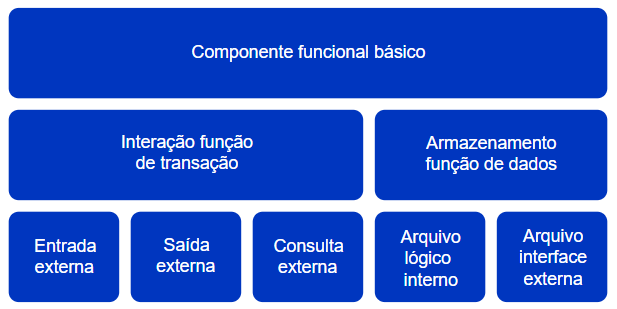

<h1>FASE 7 - Emerging Technologies</h1>
<h2>Capítulo 03: Pode trazer a conta!</h2>

<h2>1. PODE TRAZER A CONTA!</h2>

## 1.1 Introdução às estimativas de projetos de software

- quando falamos em definir esforço, prazo e custo de um projeto de software, devemos considerar os fatores: 
  - fornecimento de equipamentos e softwares de prateleira (commodities que são cotadas e compradas com facilidade no mercado) e 
  - mão de obra que será empregada no desenvolvimento (aspecto mais desafiador de ser calculado).
- a complexidade que surgiu no desenvolvimento, com evolução dos computadores, linguagens e técnicas de arquitetura, e a natureza imaterial do software, tornou difícil a tarefa de estimar o esforço (número de horas de trabalho de projeto) e o custo e prazo equivalentes. 
  - com isso, a contratação de projetos de software e a liberação de orçamento para projetos se tornaram atividades arriscadas, onde o empirismo imperava e as margens de erro nas previsões de gasto e tempo passaram a ser grandes.
- diversas métricas de estimativa de software foram desenvolvidas, buscando tornar mais precisos as previsões orçamentárias e os cronogramas de projeto dos sistemas de computação. Exemplos: FPA, COCOMO, COCOMOII, NESMA, UCP, MARK II, SLIM, PUTNAM, HASTEAD, MONTE CARLO, entre outros.
  - ***FPA***: Function Point Analysis (ou APF – Análise de Pontos de Função).
  - ***COCOMO***: Constructive Cost Model.
  - ***UCP***: Use Case Point (Pontos de Caso de Uso).

## 1.2 Objetivos e dinâmica das técnicas de estimativa

- os modelos de estimativa possuem características em comum: todos objetivam auxiliar o cálculo de esforço e custo de um projeto de software quanto à mão de obra (perspectiva mais difícil de ser dimensionada).
- na produção de software, falamos de coisas como a linguagem de programação que será usada, a metodologia de engenharia e arquitetura de software, a técnica de gerenciamento de projetos, da experiência da equipe com esse processo de software, a experiência do usuário e a sua facilidade de aprendizado, a dedicação da equipe aos trabalhos, fechando a avaliação sobre o ambientede execução do projeto.
- cada método de estimativa aprofunda em maior ou menor grau cada um dos aspectos envolvidos da avaliação do esforço dedicado a um projeto de software (número de horas de trabalho), que, por sua vez, tem um custo de mão de obra associado.
- serão apresentados três modelos de estimativas, conhecidos como paramétricos, porque inserem questões de julgamento e avaliação de opiniões combinadas com matemática e estatística.

## 1.3 O método de estimativa de pontuação por julgamento simples (Planning Poker ou Poker Planning)
 - é uma técnica de estimativa totalmente sustentada no julgamento de pessoas.
- dos modelos apresentados, é o único que não aplica nenhuma equação matemática ou estocástica na apuração, sendo totalmente baseado em opiniões que são convertidas em um sistema de pontuação.
- a técnica surgiu dentro dos métodos ágeis de produção de software (como SCRUM ou XP – Extreme Programming), mas pode ser aplicada para qualquer modelo de processo de produção, incluindo modelos clássicos baseados em cascata de fases, RUP (Rational Unified Process).
- passos:
  - 1. Tenha em mãos a lista de requisitos ou backlog de produto equivalente (lista de itens a entregar no seu projeto).
  - 2. Componha uma equipe de avaliação que fará o julgamento da complexidade de realizar o desenvolvimento de cada uma dessas funções que o sistema deve atender; deve ser composta por aqueles que realizarão o projeto e não por especialistas que não colocarão a “mão na massa”. O julgamento de dificuldade a ser realizado deve ser condizente com a competência da equipe que o executará (suas habilidades, conhecimentos e atitudes).
  - 3. Começando pela primeira linha da lista de coisas a fazer (lista de requisitos ou backlog de produto), cada um dos avaliadores dará uma pontuação, baseando-se em um baralho de cartas numeradas. 
    - o número escolhido de cada um deve ser escondido dos demais nesse momento.
    - pode ser usado um software para essa finalidade; há vários gratuitos e que podem ser instalados em celulares. Existem ainda sites que permitem esse jogo com colaboração entre os participantes de forma online.
    - se for usar software, é recomendável configurá-lo para a sequência de Fibonacci (0, 1, 2, 3, 5, 8, 13, 21, 34, 55, 89, 144) , fazendo com que as cartas tenham saltos significativos entre um número e o número subsequente.
    - em geral, temos também uma carta marcada como “?” (pode ser o curinga de um baralho de cartas tradicional), e representa que o avaliador não se sente competente para julgar o item de desenvolvimento.
    - cada um dos votantes pode contribuir com sua experiência para levantar aspectos do item que está sendo votado, mesmo que não atue diretamente com a tecnologia que está no contexto da situação.
  - 4. Após cada avaliador ter escolhido a sua carta secretamente, cada um mostra a sua carta para todos os demais, todos juntos, ao mesmo tempo (para garantir que a opinião de ninguém seja influenciada por outra pessoa em um primeiro momento).
    - se houver consenso na pontuação (por exemplo, todos deram a nota 13 para o item), um peso é atribuído ao item de desenvolvimento com o valor da nota acordada. Esse peso é anotado na lista de itens de desenvolvimento.
    - se não houver acordo, ocorre uma sessão de explicações pelo avaliador que deu a maior e o que deu a menor nota. Depois, uma nova rodada de estimativa é feita, re-executando a avaliação individual.Isso se repete até ocorrer um acordo.
  - 5. Os passos se repetem para todos os itens da lista.
    - quanto maior a pontuação, maior o esforço para fazer o desenvolvimento.
    - na hora de julgar os pontos, o avaliador deve considerar que o desenvolvimento do item em backlog envolve modelar, construir, testar e entregar o componente de software.
    - a soma desses pontos dos diversos itens de entrega define o esforço total do projeto (exemplo: 13 + 8 + 21 + 8 + 13 = 63).

### 1.3.1 Como fazer agora para definir o custo?
- primeiramente, a equipe de projeto deve ***avaliar qual a duração (prazo) do projeto***. 
  - exemplificando para o caso de um projeto que aplica SCRUM como processo de software, distribuiríamos os itens a fazer por Sprints(corridas de desenvolvimento de duração fixa), tentando balancear o número dos pontos a serem resolvidos por Sprint. 
  - a experiência da equipe dirá quais itens consegue fazer em cada corrida, considerando quem participará de cada etapa do projeto.
  - exemplo: 
    - considerar que a equipe chegou concluiu que consegue executar 21 pontos por Sprint de 15 dias de trabalho (“capacity”, capacidade do time). 
    - sendo assim, o projeto terá duração de 3 Sprints para dar conta dos 63 pontos, ficando os itens Cadastrar cliente da loja (13 pontos) mais o Consultar cliente cadastrado (8 pontos) na primeira corrida de desenvolvimento; o Exportar cliente cadastrado (21 pontos) na segunda Sprinte os demais itens do backlog na terceira Sprint (mais 21 pontos). 
    - se cada Sprint tem 15 dias de duração e o projeto requer 3 Sprints, o projeto tem prazo total de 45 dias (3 x 15 dias).
- e o ***custo do projeto***, como calcular?
  - seguindo o exemplo, considerando que, em 45 dias, conseguimos executar 63 pontos, precisamos calcular quantas horas demoramos a fazer 1 ponto de esforço.
  - a conta é simples: 45 / 63 = 0,71 dia.
  - se considerarmos que uma pessoa da equipe de desenvolvimento trabalha efetivamente 6 horas por dia (depende de cada empresa), 0,71 dia corresponde a 4,3 horas, aproximadamente (6 x 0,71 = 4,3). 
  - se o custo médio por hora de um profissional da área de Informática é R$ 40,00, 1 ponto, que corresponde a 4,3 horas, custa R$ 172,00 (4,3 x 40).
  - para fazer um projeto de 63 pontos, o custo total do projeto é de 63 x R$ 172,00 = R$ 10.836,00.

> A estimativa por Planning Poker é simples, mas contaminada de impressões pessoais e dificilmente duas equipes de projetos chegarão à conclusão do mesmo número dos pontos para um mesmo escopo de projeto.

- o Planning Poker auxilia em um dos aspectos mais críticos das estimativas em relação ao software: a `falácia de planejamento`. 
  - é a tendência de pessoas e organizações em subestimar o tempo necessário para a conclusão de uma tarefa, mesmo quando os envolvidos possuem as habilidades e experiências necessárias para tal.
  - o Planning Poker promove uma estimativa de esforço independente e orientada ao consenso dos participantes, amenizando qualquer “viés” de interesse particular.

## 1.4 Métrica de estimativa – Function Point Analysis

- a Análise de Pontos de Função é um modelo das estimativas que acrescenta maior sofisticação e precisão na previsão de esforço e, consequentemente, de custo de projeto.
- o modelo APF (Análise de Pontos de Função) ou FPA (Function Point Analysis) parte, assim como o modelo de estimativa por julgamento simples, da lista dos requisitos do sistema ou backlog de produto a desenvolver.
- esta métrica, além de fornecer resultados sobre o custo e o prazo do projeto, auxilia nos seguintes aspectos:
  - estimar Casos de Teste.
  - compreender os impactos de um aumento de escopo.
  - auxiliar em negociações contratuais envolvendo software.
  - fornecer subsídios para estimativas futuras (base histórica).
  - apoiar atividades de melhoria contínua de qualidade de software.
- a grande diferença do APF é que ***os cálculos serão baseados em tabelas de referência de pontuação e cálculos matemáticos com fórmulas predeterminadas***. 
  - essas tabelas e fórmulas foram desenvolvidas por meio da observação dos planos e execuções das centenas de projetos que formaram a base de referência oferecida pela comunidade de instituições desenvolvedoras do método (o IFPUG – International Function Points Users Group).
- a APF avaliará tanto os requisitos funcionais quanto os não funcionais do projeto de software. 
  - os **requisitos funcionais** serão usados para dimensionar o tamanho do projeto, formando uma pontuação chamada de `Pontos de Função não ajustados`. 
  - os **requisitos não funcionais** serão usados para corrigir ou melhorar as estimativas, considerando os aspectos não funcionais que afetam o projeto como um todo, gerando `Pontos de Função Ajustados`.

### 1.4.1 Iniciando a Análise de Pontos de Função
- para iniciar a Análise de Pontos de Função, precisamos decompor o projeto em `Componentes Funcionais Básicos (CFB)`; para isso, classificaremos os requisitos funcionais do projeto nas seguintes categorias:

 
<em>Classificação dos Componentes Funcionais do Software pela APF.</em> 

- `componente funcional básico`:
  - ***a) interação função de transição***:
    - **i. entrada externa** (EE): quando um requisito for relacionado com uma entrada de dados que serão armazenados no sistema, independentemente desse input ser feito por uma pessoa (usuário), outro software ou hardware, o requisito será classificado como Entrada Externa. Essa entrada dos dados pode ter o objetivo de incluir, alterar ou excluir dados do sistema.
    - **ii. saída externa** (SE): quando um requisito for relacionado com uma extração dos dados armazenados no sistema, criando novos dados complementares, seja com o objetivo de gerar uma consulta com agregação de informação ou uma exportação de dados para outro sistema, o requisito é classificado como Saída Externa. Saída Externa envolve consulta com transformação dos dados antes de entregar a informação ao destino.
    - **iii. consulta externa** (CE): quando um requisito for relacionado com uma consulta de dados que estão armazenados no sistema, independentemente desse output ser feito para atender uma pessoa (usuário), outro software ou hardware, o requisito será classificado como Consulta Externa.
  - ***b) armazenamento função de dados*** (ALR – Arquivos Lógicos Referenciados - estruturas de arquivamento serão demandadas para cumprir a funcionalidade):
    - **i. arquivo lógico interno** (ALI): aqueles que somente o sistema que será construído.
    - **ii. arquivo interface externa** (AIE): estruturas de dados que serão acessadas por sistemas externos (arquivos de importação ou exportação de dados, por exemplo).
  - ***c) Dados Elementares Referenciados (DER)***: usados nos Arquivos e nas Transações (campos de dados guardados em cada registro do arquivo ou operados em telas, relatórios e processamentos). Devem ser considerados somente os dados realmente usados nas transações.

- de posse dos CFBs devidamente identificados e associados, devem ser consultadas as tabelas-padrão do modelo APF para definir o nível de complexidade de cada Transação e Arquivo. 
  - esse critério substitui o julgamento subjetivo pela equipe, de forma empírica, sobre aquilo que é simples ou complexo – agora, no APF, é aplicada uma regra objetiva seguida por todo.
  - cada classe de CFB possui uma tabela de ponderação de complexidade.

> A multiplicação do número dos componentes por tipo/complexidade pelo peso determinará o que a Análise de Pontos de Função chama de PONTOS DE FUNÇÃO NÃO AJUSTADOS (termo usado para deixar claro que não foram consideradas ainda as questões sobre o ambiente de produção e os requisitos não funcionais do produto.)

- algumas empresas criam suas próprias matrizes de ponderação dos pontos de função, mas a qualidade desse trabalho depende de criar uma base histórica de projetos que seja suficiente para testar a credibilidade dos cálculos - http://www.ariscommunity.com/process-mapping.

- para concluir as estimativas de esforço em número de pontos por função, é preciso ainda ajustar as expectativas, considerando aspectos não funcionais do projeto.
- a APF considera 14 fatores de influência não funcionais que geram ajuste de estimativas:
  - 1. ***TELEPROCESSAMENTO***: A aplicação necessita de comunicação remota por rede?
  - 2. ***PROCESSAMENTO DISTRIBUÍDO***: Existirá multiprocessamento ou distribuição dos bancos de dados (mais de um computador processando e/ou armazenando as transações do sistema)?
  - 3. ***PERFORMANCE***: O tempo de resposta da transação é crítico (exemplo de sistemas de tempo real, como telemedicina e telemetria automotiva, ou sistemas de atendimento direto ao cliente que exigem rápida resposta)?
  - 4. ***CARGA DE MÁQUINA***: O uso de memória e processador será intenso?
  - 5. ***VOLUME DE TRANSAÇÕES***: A quantidade de usuários e operações simultâneas será grande?
  - 6. ***ENTRADA DE DADOS ON-LINE***: Haverá necessidade de tratamento design de front-end para garantir usabilidade e produtividade?
  - 7. ***ATUALIZAÇÕES ON-LINE***: As atualizações dos dados precisam ocorrer de forma online e síncrona?
  - 8. ***EFICIÊNCIA DO USUÁRIO FINAL***: O usuário requer treinamento especial para usar o sistema e não possui a formação adequada?
  - 9. ***COMPLEXIDADE DE PROCESSAMENTO***: As lógicas e cálculos envolvidos são muitos e complexos?
  - 10. ***REUTILIZAÇÃO DE CÓDIGO***: O código deve ser modelado, escrito e testado visando ao reuso?
  - 11. ***FACILIDADE DE IMPLANTAÇÃO***: Exige algum recurso especial para instalação a distância ou inteligência de upgrade?
  - 12. ***FACILIDADE DE OPERAÇÃO***: O fluxo de execução dos programas em lote (batch) deve ser predeterminado e possuir recuperação de falhas automática?
  - 13. ***FACILIDADE DE MANUTENÇÃO / ALTERAÇÕES***: Flexibilidade da aplicação para atender às mudanças das regras de negócio, tais como parametrizações de configurações, é requerida?
  - 14. ***OPERAÇÃO EM MÚLTIPLOS LOCAIS***: O software rodará em mais de um datacenter/localidade com infraestrutura própria?
- esses fatores devem receber notas de 0 a 5, sendo:
  - 5 para um fator que influencia e está presente em todas as partes do sistema (influencia todo o sistema e operações),
  - 4 para fatores que influenciam quase todo o sistema,
  - 3 para fatores que influenciam as principais operações do sistema (as mais importantes),
  - 2 para fatores que influenciam algumas operações do sistema que não são core (não são as mais importantes),
  - 1 quando a influência do fator ocorre sobre uma operação e 
  - 0 quando o fator não está presente no projeto que está sendo planejado (não se aplica). 
- as atribuições de notas consideram as características do projeto em planejamento.
- no documento original do FPA, escrito por Dreger, existem várias páginas das explicações com exemplos e considerações sobre o que levar em conta na hora de apontar o peso de influência de cada um dos 14 fatores do modelo.
- quanto maior a pontuação, mais o fator avaliado dificulta o projeto.
- a soma dos pontos determina o Fator de Influência Total (FIT).
- para calcular o esforço em horas, custo e prazo do projeto, devem ser aplicadas as mesmas técnicas apresentadas na parte 2, a qual trata de estimativas por julgamento simples.

### 1.4.2 Relembrando os passos:
- se estiver usando Scrum como processo de software, distribua os CFBs entre as Sprints, balanceando os pontos (a equipe decide quais CFBs consegue fazer em uma Sprintde prazo fixo). Como cada Sprint tem um prazo fixo, o prazo de projeto é dado pelo número de Sprints que serão feitas, multiplicado pelo tempo-padrão de uma Sprint.
- divide-se o tempo de uma Sprint pelo número máximo dos pontos de função que serão feitos numa das Sprints do projeto, calculando, assim, o tempo em horas de um ponto de função.
- levanta-se o custo por hora de trabalho de um profissional da área de Informática/Projeto e multiplica-se esse custo hora pelo número de horas de um ponto de função para saber quanto custa cada novo ponto de função adicionado ao projeto. O total dos pontosde função multiplicado pelo número de horas por ponto de função e pelo custo de uma hora de trabalho determina o custo total do projeto.
- para finalizar, aconsiderações importantes para realizar uma boa métrica com base na Análise de Pontos de Função:
  - **Tenha uma definição precisa das fronteiras da aplicação** - sob a ótica do usuário nem sempre é perceptível onde um sistema começa e outro sistema termina (visto a quantidade de sistemas integrados que temos atualmente); é necessário termos detalhes suficientes para darmos clareza sobre o sistema que está sendo metrificado e alinharmos com as partes interessadas.
  - **Senioridade do profissional que realiza a avaliação** - como esta técnica carrega um componente de subjetividade, é fundamental a senioridade do profissional que aplica esta técnica para metrificar (a bagagem profissional conta nesta situação).
  - **Tenha uma base histórica** - quanto mais dispormos de informações de projetos anteriores metrificados com esta técnica, mais precisos seremos com o indicador de produtividade (e cada vez mais serão assertivas nossas metrificações com APF).
  - **Qualidade mínima para os requisitos** - metrificar a partir de requisitos ruins é apostar num quantitativo de pontos de função irreal... Necessitamos de requisitos bem apurados e na granularidade correta para que os pontos de função sejam bem dimensionados.
  - **Alinhamento sobre itens não-mensuráveis** - como algumas funcionalidades não são passíveis de serem mensuradas por pontos de função (exemplo: alguns requisitos não-funcionais), é necessário que sejam identificadas e alinhadas junto ao cliente.

## 1.5 Métrica de estimativa – Use Case Points (estimativa por Pontos de Caso de Uso) UCP

- criada após o início da aplicação das práticas de desenvolvimento de software Orientado a Objetos e do uso comercial da UML (Unified Modeling Language) para desenho de solução técnica.
- requer que os Casos de Uso do projeto de software tenham sido descritos (com diagramas e documentos de descrição de Casos de Uso da UML).
  - o primeiro passo para a estimativa por UCP é determinar a complexidade de cada Caso de Uso modelado estabelecida devido à quantidade das transações que o Caso de Uso executa e às Entidades de objetos que manipulará (transação = um Cenário de Uso dentro de um Caso de Uso).
  - devemos observar o número das transações de cada UC (Use Case), analisando as descrições de Caso de Uso (o Diagrama de Casos de Uso não entra na avaliação). 
    - cada fluxo possível de execução dos passos do UC retrata um Cenário de Uso. 
    - o número de transações de um Caso de Uso que vamos considerar na estimativa por UCP corresponde ao número dos Cenários de Uso identificados no Documento de Caso de Uso, incluindo os passos dos Fluxos Principal, Alternativos e de Exceção.
  - em seguida, devem ser avaliadas quantas são as Entidades envolvidas em cada UC.
  - de posse desses dados, deve ser calculado o `UUCW` (Unadjusted Use Case Weight – Peso não ajustado do Caso de Uso), aplicando a tabela de avaliação.
  - para concluir a pontuação, é necessário agora avaliar as características do Ator que interage com o Caso de Uso - pontuação de `UAW` (Unadjusted Actor Weight–Peso não ajustado de Atores).
    - quando o Ator é uma API (um componente de aplicação de reuso empregado em diversos sistemas, sendo estável), a complexidade é baixa na interação; quando o Ator é um outro sistema ou software, que não uma API, em que a estabilidade não é tão conhecida, a complexidade de desenvolvimento aumenta; por fim, quando o Ator é um ser humano, os cuidados quanto a segurança, teste, tolerância à falha na interação com a aplicação que será desenvolvida aumentam mais.

> A soma do UUCW com o UAW de cada Caso de Uso determina o UUCP – Unadjusted Use Case Point (Pontos de Caso de Uso não ajustados).

- esses pontos definem a complexidade funcional do softwar.
- o ajuste de complexidade técnica envolve a identificação de dois fatores de complexidade: o ***fator TCF*** (Technical Complexity Factor), que aponta o quão difícil é atender a alguns requisitos não funcionais específicos do produto do software; e o ***ECF*** (Environmental Complexity Factor), que mostra quanto é difícil atender alguns requisitos não funcionais relacionados ao processo de produção do software.
  - esses dois fatores serão aplicados corrigindo os pontos não ajustados pela equação: UCP = UUCP x TCF x ECF = Pontos de Função Ajustados.
  - para calcular o TCF, é empregada uma tabela com 13 fatores que precisam ser ponderados com notas de 0 a 5, conforme quanto cada um influencia (está presente) no projeto. 
  - recebendo nota 5 aquilo que influenciar todo o projeto; 4 o que influenciar quase todo o projeto; 3 aquilo que influenciar as partes mais importantes do projeto; 2 aquilo que influenciar algumas partes do projeto, mas não as mais importantes; 1 aquilo que influenciar somente uma operação específica; e 0 aquilo que não está presente como característica do projeto.
  - os 13 fatores de influência são acompanhados de um peso fixado pelo modelo UCP. Esse peso será multiplicado pela nota que a equipe de projeto atribuirá como influência de cada tópico.
    - ***Sistema distribuído*** diz respeito à necessidade de o software trabalhar com bancos de dados ou processamento em mais de um computador.
    - ***Tempo de resposta*** é relativo aos segundos que uma aplicação demora para responder a uma interação.
    - ***Eficiência*** está relacionado ao esforço que o usuário tem que fazer navegando em telas, por exemplo, para realizar a sua atividade no sistema (relação com design de aplicação).
    - ***Processamento complexo*** refere-se à quantidade e complexidade lógica da aplicação (cálculos, desvios lógicos e pontos de decisão).
    - ***Reuso*** aponta se o software deve ser projetado para ser consumido/chamado por outras aplicações.
    - ***Facilidade de instalação*** considera ou exige algum recurso especial para instalação a distância ou inteligência de upgrade.
    - ***Facilidade de uso*** indica se a aplicação deve ser autocompreensível ou deve conter auxílios online.
    - ***Portabilidade*** é a necessidade de rodar em diferentes plataformas de sistema operacional e bancos de dados.
    - ***Facilidade de mudança*** considera a flexibilidade da aplicação para atender às mudanças das regras de negócio, tais como parametrizações de configurações.
    - ***Concorrência*** avalia a possibilidade de uso paralelo por diversos atores, gerando competição por recursos e exigindo proteção contra bloqueios por espera sem fim (dead lock).
    - ***Recursos de segurança*** analisa se são necessários mecanismos de embaralhamento dos dados e proteção especial de acesso (tunelamento, criptografia, recuperação contra desastres e falhas etc.).
    - ***Acessível a terceiros*** leva em conta necessidades de comunicação remota (redes).
    - ***Requer treinamento especial*** mostra se o uso da aplicação será desafiador para o usuário final devido a questões de capacitação desse público usuário, o que exige mais cuidado na confecção de telas e na preparação do material de apoio e treinamento, partes integrantes do produto final.
- Os pontos ponderados são somados, totalizando o Tfactor, que é aplicado na seguinte equação de determinação do TCF.
- o ECF é calculado de forma semelhante ao TCF, que agora os fatores de influência consideram características do processo e expertise da equipe com o tipo de projeto que está em avaliação.

---

## FAST TEST

### 1. Em relação às Estimativas de Projetos de Software, assinale a alternativa incorreta:
> A complexidade que surgiu no desenvolvimento e a natureza imaterial do software em nada influenciam a tarefa de estimar software.

### 2. No contexto da técnica de Análise de Pontos de Função (para estimarmos software), temos fatores de influência não-funcionais que geram ajustes de estimativas. Assinale a alternativa que não corresponde a um destes fatores:
> Sequência de Fibonacci.

### 3. Em relação à técnica de estimativa de software conhecida como Análise de Pontos de Função, assinale a alternativa que NÃO corresponde a um dos aspectos que ela auxilia:
> Decomposição de componentes funcionais básicos.

### 4. Por meio deste modelo de estimativa, é necessário que os Casos de Uso do projeto de software tenham sido descritos com diagramas de Casos de Uso UML e as respectivas documentações; a estimativa deve ocorrer simultaneamente com o levantamento dos requisitos e a modelagem. De qual técnica de estimativa de software o texto se refere?
> Use Case Points.

### 5. No processo de estimativas de software, uma das técnicas mais utilizadas é o Planning Poker. Em relação a esta técnica, assinale a alternativa correta:
> É uma técnica sustentada totalmente no julgamento das pessoas, sendo totalmente baseada em opiniões.

--- 

[Voltar ao início!](https://github.com/monicaquintal/smart_cities)