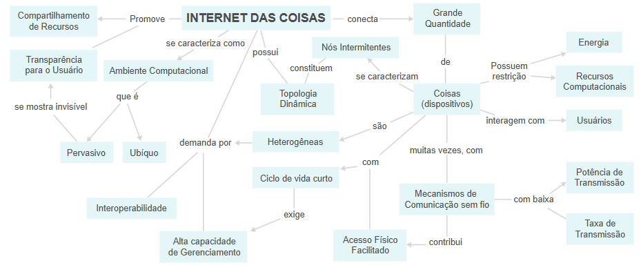
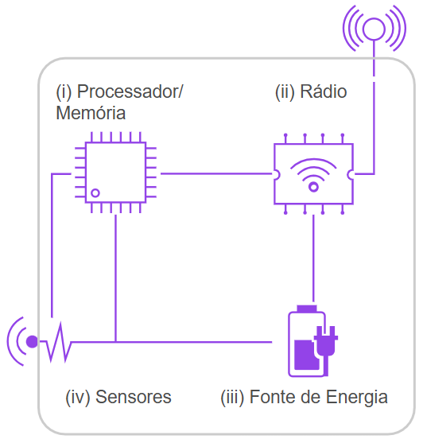

<h1>FASE 7 - Emerging Technologies</h1>
<h2>Capítulo 04: A arquitetura das... Coisas!</h2>

<h2>1. A ARQUITETURA DAS... COISAS!!</h2>

- a `IoT` é a mola propulsora do ecossistema da Internet de Todas as Coisas (IoE), a qual integra pessoas, dados, processos e coisas. 
- a Figura a seguir representa de uma forma mais estruturada todos os blocos e as interligações que compõem a IoT.

 
<em>Mapa Mental da IoT.</em> 

- um dos principais desafios é o fator de interoperabilidade, haja vista a infinidade de dispositivos interconectados, tanto em termos de hardware quanto em termos de software, protocolos (muitos deles proprietários) e formatos de dados.
- o termo padronização faz uma diferença significativa para escalonar e dimensionar todo esse crescimento exponencial de geração de dados nesse arcabouço tecnológico.

## 1.1 Arquitetura dos dispositivos inteligente

- de uma forma minimalista, os dispositivos inteligentes (smart things) são compostos de: processamento/memória, comunicação, energia e sensores/atuadores.

 
<em>Arquitetura de um dispositivo inteligente.</em> 

- sendo: 
  - ***Unidade de processamento/memória***: composta de uma memória interna para armazenamento de dados e programas, um microcontrolador (arduino, por exemplo) e um conversor analógico-digital para receber sinais dos sensores. Geralmente não apresenta alto poder computacional, sendo bastante desejável que haja baixo consumo de energia e ocupe o menor espaço possível.
  - ***Rádio***: consiste em pelo menos uma tecnologia de comunicação com ou sem fio (normalmente rádio de baixo custo e potência).
  - ***Fonte de energia***: responsável por fornecer energia aos componentes do dispositivo inteligente (bateria, conversor AC/DC ou painel fotovoltaico).
  - ***Sensor/Atuador***: responsável pelo monitoramento do ambiente no qual o dispositivo se encontra. Os sensores capturam valores de grandezas físicas,como temperatura, umidade, pressão e presença. Já os atuadores produzem alguma ação, atendendo a comandos que podem ser manuais, elétricos ou mecânicos. 

## 1.2 Tecnologias de comunicação

- para um objeto inteligente existir na Internet, é necessário que a ele seja atribuído um endereçamento IP (Internet Protocol), o que é possível graças aos meios pelos quais as mensagens trafegam (por exemplo, ar, cobre, luz) e utilizando-se um conjunto de regras conhecidas como protocolos.
- independente dos protocolos, é preciso justificar qual(is) meio(s) seria(m) mais adequado(s) para as transmissões de dados vindos dos objetos inteligentes.
- embora a combinação entre tecnologia sem fio e IPv6 (Internet Protocol versão 6) seja uma solução para vários dos objetos inteligentes, não é aplicável para todos os casos.
  - as conexões no padrão WiFi(padrões 802.11b/g/n), comuns em smartphones e smart TVs, são custosas do ponto de vista energético. 
- a aplicação prática do conceito de IoT no mundo real é possível por meio do uso e da integração de várias tecnologias essencialmente sem fio. 
- dentre as existentes, temos: RFID (Radio-Frequency Identification),Near Field Communication (NFC), Bluetooth e iBeacons.

### 1.2.1 RFID: identificação por radiofrequência
- apesar do surgimento de tecnologias inovadoras como o Bluetooth, a resposta para o problema de interoperabilidade das coisas em longa distância e com baixo consumo de energia se encontra em uma tecnologia inventada no fim do século XIX: o rádio.
- a comunicação por radiofrequência emprega radiação eletromagnética para transmissão de informação, sendo essa radiação uma consequência da oscilação do campo eletromagnético. 
  - a própria luz visível é uma radiação eletromagnética, assim como as ondas de rádio emitidas pelas emissoras de rádio e TV ou as ondas que um aparelho de micro-ondas usa para aquecer um alimento. 
  - a diferença entre elas está em suas frequências, ou seja, a rapidez com que as ondas “vibram”.
- para o uso específico de transmissão de informações a sensores de IoT,existe a tecnologia RFID (Radio-Frequency Identification, ou identificação por radiofrequência).
- a identificação por radiofrequência surgiu durante a Segunda Guerra Mundial, quando aviões britânicos foram equipados para devolver um sinal específico que osidentificava como aeronaves aliadas, diferenciando-os dos aviões alemães, em um sistemaque ficou conhecido como IFF (Identification Friend-or-Foe).
- o RFID moderno funciona de acordo como mesmo princípio: um transceptor emite um sinal eletromagnético para um transponder (ou também para a conhecida etiqueta RFID), que recebe o sinal, processa, eventualmente grava alguma informação e o retorna para o mesmo transceptor (ou leitora), equipado com uma antena.
- existem três tipos de etiqueta RFID: as passivas, as semipassivas e as ativas.

#### 1.2.1.1 Etiquetas passivas
- trata-se do tipo mais comum de etiqueta, especialmente pelo seu baixo custo de produção, na ordem de centavos a poucos dólares. 
- a parte mais interessante é o fato de essa etiqueta não precisar de uma bateria, pois seus circuitos utilizam a energia emitida pela própria leitora e, por essa razão, tem baixa capacidade de armazenamento (até 4KB), permitindo apenas a leitura de informações, além de possuir um alcance de leitura mais baixo.

#### 1.2.1.2 Etiquetas semipassivas
- compatíveis com as leitoras de etiquetas passivas, esse tipo de etiqueta conta com uma bateria, o que amplia sua capacidade de memória, o alcance do sinal de retorno e a redução da latência; por essas razões, sua produção se torna mais cara.

### 1.2.1.3 Etiquetas ativas
- alimentadas por bateria, possuem uma maior capacidade de memória (512KB) e um maior alcance de leitura. 
- são chamadas assim porque, diferentemente das outras duas versões que apenas reagem ao transceptor, esse tipo de equipamento também pode enviar um sinal. 
- são menos comuns, especialmente pelo elevado custo de produção, a partir de 50 dólares.

### 1.2.2 Near Field Communication (NFC) ou Comunicação por Campo de Proximidade
- é uma tecnologia interoperável com o RFID, que permite a troca de informações sem fio e de forma segura entre dispositivos compatíveis que estejam próximos um do outro, de maneira automática. 
- esses dispositivos pedem cartões inteligentes (smartcards), crachás ou smartphones e tablets, basicamente qualquer dispositivo que possua um chip NFC.
- a tecnologia permite a troca de informações em distâncias de menos de 4 centímetros, com uma velocidade de transmissão máxima de 424kpbs.
  - em modo passivo, apenas um dos dispositivos gera o sinal de conexão,enquanto o segundo apenas recebe, tornando possível colocar chips NFC em dispositivos que não recebem alimentação elétrica direta, como cartões inteligentes (smartcards), embalagens e cartazes. 
  - em modo ativo, no entanto, ambos os dispositivos geram o sinal, por exemplo, um smartphone e um receptor no caixa de uma loja. Os dispositivos podem trocar dados no padrão ISO/IEC 18092, conhecido como ponto a ponto (ou Pier-to-pier, P2P). 
- cartões inteligentes sem contato (contactless smart cards) podem ser lidos por meio de um leitor de cartões no padrão RFID, estabelecido pela ISO/IEC 14443 e FeliCa, permitindo sua leitura em distâncias de até 10 centímetros.

### 1.2.3 Bluetooth
- criada pela Ericsson em 1994, seu objetivo era padronizar a comunicação entre celulares e computadores. 
- pelo seu caráter de união desses dois tipos de dispositivos, o nome da tecnologia foi inspirado no rei Harald Bluetooth, que unificou a Dinamarca e a Noruega no século X. 
- a tecnologia é muito utilizada no conceito de PAN (Personal Area Network), usando dispositivos pessoais de um indivíduo. 
  - esses dispositivos formam uma topologia de rede em formato de estrela conhecida como “piconet”, em que um dispositivo central (conhecido como mestre) é responsável pelos parâmetros da comunicação e se conecta a, no máximo, sete dispositivos periféricos (escravos). 
- a tecnologia tornou-se popular ao formar PAN entre os computadores pessoais (computadores e laptops), que são os dispositivos mestres, com os periféricos (como teclados, mouses e impressoras), que são os dispositivos escravos. 
- há abundantes dispositivos no mercado empregando a versão 2.1 da tecnologia Bluetooth, conhecida como Basic Rate/Enhanced Data Rate (BR/EDR).
  - nesse formato, os dispositivos são apresentados um para o outro (um procedimento conhecido como pareamento) de maneira segura por meio de um PIN, uma senha numérica de 4 dígitos.
  - no padrão BR, a comunicação pode acontecer em uma velocidade de até 1Mbps, dobrando a taxa de transmissão em EDR, mantendo um baixo consumo de energia em dispositivos que apenas transmitem dados, sendo ideal para periféricos como teclado e mouse.
- a partir de sua versão 4.0, um novo protocolo de transmissão foi introduzido, conhecido como GATT (Generic Attribute), cujo objetivo era permitir a transmissão de pequenos pacotes de dados contendo o valor de atributos. 
  - aplicações que utilizam GATT são conhecidas no mercado como Bluetooth Low Energy(BLE), tecnologia que permite baixo consumo de energia e que o rádio transmissor fique latente na maior parte do tempo. 
- na recente versão 5.0, o alcance e a capacidade de transmissão de dados por dispositivos BLE aumentaram consideravelmente. Na potência máxima, o alcance de uma transmissão Bluetooth pode chegar a até 100 metros, atingindo uma taxa de transmissão de até 50Mbps.

### 1.2.4 iBeacons
- é um serviço de notificação sem fio proposto pela Apple em 2013.
- permite que smartphones captem sinais de beacons, utilizando Bluetooth Low Energy (BLE), e reajam a esses sinais.
- iBeacons são baseados em Bluetooth low energy proximity sensing, que permite determinar a distância de um smartphone e um beacon usando apenas BLE.
- têm sido muito utilizados em indoor positioning system, um sistema de posicionamentos em áreas cobertas, nas quais o GPS não atua. 
  - apenas três deles são necessários para localizar precisamente um smartphone em um shopping.
  - já vêm sendo utilizados em shopping centers, permitindo que uma loja saiba o local exato em que o cliente está, o que possibilitao envio de mensagens de anúncios com base nessa localização e até mesmo conversão efetiva dessa ação em tempo real. 
  - iBeacons espalhados em estádios americanos auxiliam os frequentadores desses lugares a localizarem seus assentos com mais comodidade.

### 1.2.5 Outras formas de transmissão de informações
- há outras formas de transmissão operando em diferentes frequências com potências variadas.
- a especificação Zigbee, por exemplo:
  - utiliza padrão IEEE802.15.4 e possui uma transmissão de radiofrequência semelhante ao Bluetooth, com menor consumo de energia. 
  - opera em uma banda de transmissão estreita, de até 250kbps, com alcancede até 100 metros, e seu protocolo é muito limitado ao uso de voz e imagem. 
  - outra grande vantagem da tecnologia é funcionar em uma redeMesh, permitindo muito mais nós que a redepiconet na qual opera o Bluetooth: enquanto a rede piconet opera com 8 nós, existem redes mesh operacionais com 500 nós.

## 1.3 Arquiteturas para aplicações web e mobile

- o arcabouço tecnológico em que o mundo da IoT está inserido tem como base modelos de referência, tanto para as arquiteturas de implementação quanto para os conjuntos de protocolos utilizados.
- no tocante à utilização de padrões, é fundamental que a evolução tecnológica aconteça, além de tornar possível a interoperabilidade de componentes heterogêneos existentes no mercado. 
- arquiteturas de referência são de grande valia para a padronização, pois determinam diretrizes que podem ser usadas quando se planeja a implementação de uma solução envolvendo IoT.
15

--- 

[Voltar ao início!](https://github.com/monicaquintal/smart_cities)