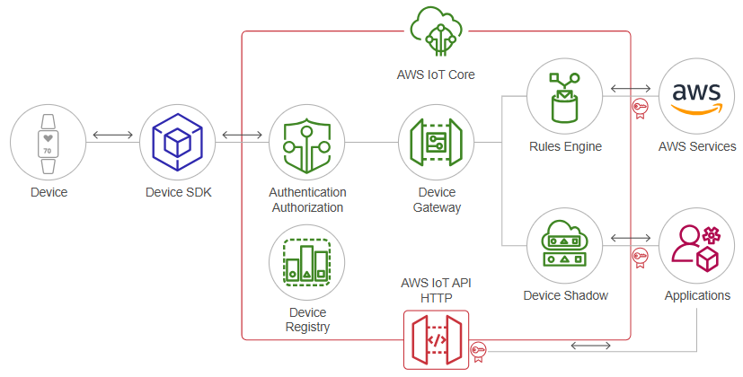

<h1>FASE 7 - Emerging Technologies</h1>
<h2>Capítulo 04: A arquitetura das... Coisas!</h2>

<h2>1. A ARQUITETURA DAS... COISAS!!</h2>

- a `IoT` é a mola propulsora do ecossistema da Internet de Todas as Coisas (IoE), a qual integra pessoas, dados, processos e coisas. 
- a Figura a seguir representa de uma forma mais estruturada todos os blocos e as interligações que compõem a IoT.

 
<em>Mapa Mental da IoT.</em> 

- um dos principais desafios é o fator de interoperabilidade, haja vista a infinidade de dispositivos interconectados, tanto em termos de hardware quanto em termos de software, protocolos (muitos deles proprietários) e formatos de dados.
- o termo padronização faz uma diferença significativa para escalonar e dimensionar todo esse crescimento exponencial de geração de dados nesse arcabouço tecnológico.

## 1.1 Arquitetura dos dispositivos inteligente

- de uma forma minimalista, os dispositivos inteligentes (smart things) são compostos de: processamento/memória, comunicação, energia e sensores/atuadores.

 
<em>Arquitetura de um dispositivo inteligente.</em> 

- sendo: 
  - ***Unidade de processamento/memória***: composta de uma memória interna para armazenamento de dados e programas, um microcontrolador (arduino, por exemplo) e um conversor analógico-digital para receber sinais dos sensores. Geralmente não apresenta alto poder computacional, sendo bastante desejável que haja baixo consumo de energia e ocupe o menor espaço possível.
  - ***Rádio***: consiste em pelo menos uma tecnologia de comunicação com ou sem fio (normalmente rádio de baixo custo e potência).
  - ***Fonte de energia***: responsável por fornecer energia aos componentes do dispositivo inteligente (bateria, conversor AC/DC ou painel fotovoltaico).
  - ***Sensor/Atuador***: responsável pelo monitoramento do ambiente no qual o dispositivo se encontra. Os sensores capturam valores de grandezas físicas,como temperatura, umidade, pressão e presença. Já os atuadores produzem alguma ação, atendendo a comandos que podem ser manuais, elétricos ou mecânicos. 

## 1.2 Tecnologias de comunicação

- para um objeto inteligente existir na Internet, é necessário que a ele seja atribuído um endereçamento IP (Internet Protocol), o que é possível graças aos meios pelos quais as mensagens trafegam (por exemplo, ar, cobre, luz) e utilizando-se um conjunto de regras conhecidas como protocolos.
- independente dos protocolos, é preciso justificar qual(is) meio(s) seria(m) mais adequado(s) para as transmissões de dados vindos dos objetos inteligentes.
- embora a combinação entre tecnologia sem fio e IPv6 (Internet Protocol versão 6) seja uma solução para vários dos objetos inteligentes, não é aplicável para todos os casos.
  - as conexões no padrão WiFi(padrões 802.11b/g/n), comuns em smartphones e smart TVs, são custosas do ponto de vista energético. 
- a aplicação prática do conceito de IoT no mundo real é possível por meio do uso e da integração de várias tecnologias essencialmente sem fio. 
- dentre as existentes, temos: RFID (Radio-Frequency Identification),Near Field Communication (NFC), Bluetooth e iBeacons.

### 1.2.1 RFID: identificação por radiofrequência
- apesar do surgimento de tecnologias inovadoras como o Bluetooth, a resposta para o problema de interoperabilidade das coisas em longa distância e com baixo consumo de energia se encontra em uma tecnologia inventada no fim do século XIX: o rádio.
- a comunicação por radiofrequência emprega radiação eletromagnética para transmissão de informação, sendo essa radiação uma consequência da oscilação do campo eletromagnético. 
  - a própria luz visível é uma radiação eletromagnética, assim como as ondas de rádio emitidas pelas emissoras de rádio e TV ou as ondas que um aparelho de micro-ondas usa para aquecer um alimento. 
  - a diferença entre elas está em suas frequências, ou seja, a rapidez com que as ondas “vibram”.
- para o uso específico de transmissão de informações a sensores de IoT,existe a tecnologia RFID (Radio-Frequency Identification, ou identificação por radiofrequência).
- a identificação por radiofrequência surgiu durante a Segunda Guerra Mundial, quando aviões britânicos foram equipados para devolver um sinal específico que osidentificava como aeronaves aliadas, diferenciando-os dos aviões alemães, em um sistemaque ficou conhecido como IFF (Identification Friend-or-Foe).
- o RFID moderno funciona de acordo como mesmo princípio: um transceptor emite um sinal eletromagnético para um transponder (ou também para a conhecida etiqueta RFID), que recebe o sinal, processa, eventualmente grava alguma informação e o retorna para o mesmo transceptor (ou leitora), equipado com uma antena.
- existem três tipos de etiqueta RFID: as passivas, as semipassivas e as ativas.

#### 1.2.1.1 Etiquetas passivas
- trata-se do tipo mais comum de etiqueta, especialmente pelo seu baixo custo de produção, na ordem de centavos a poucos dólares. 
- a parte mais interessante é o fato de essa etiqueta não precisar de uma bateria, pois seus circuitos utilizam a energia emitida pela própria leitora e, por essa razão, tem baixa capacidade de armazenamento (até 4KB), permitindo apenas a leitura de informações, além de possuir um alcance de leitura mais baixo.

#### 1.2.1.2 Etiquetas semipassivas
- compatíveis com as leitoras de etiquetas passivas, esse tipo de etiqueta conta com uma bateria, o que amplia sua capacidade de memória, o alcance do sinal de retorno e a redução da latência; por essas razões, sua produção se torna mais cara.

### 1.2.1.3 Etiquetas ativas
- alimentadas por bateria, possuem uma maior capacidade de memória (512KB) e um maior alcance de leitura. 
- são chamadas assim porque, diferentemente das outras duas versões que apenas reagem ao transceptor, esse tipo de equipamento também pode enviar um sinal. 
- são menos comuns, especialmente pelo elevado custo de produção, a partir de 50 dólares.

### 1.2.2 Near Field Communication (NFC) ou Comunicação por Campo de Proximidade
- é uma tecnologia interoperável com o RFID, que permite a troca de informações sem fio e de forma segura entre dispositivos compatíveis que estejam próximos um do outro, de maneira automática. 
- esses dispositivos pedem cartões inteligentes (smartcards), crachás ou smartphones e tablets, basicamente qualquer dispositivo que possua um chip NFC.
- a tecnologia permite a troca de informações em distâncias de menos de 4 centímetros, com uma velocidade de transmissão máxima de 424kpbs.
  - em modo passivo, apenas um dos dispositivos gera o sinal de conexão,enquanto o segundo apenas recebe, tornando possível colocar chips NFC em dispositivos que não recebem alimentação elétrica direta, como cartões inteligentes (smartcards), embalagens e cartazes. 
  - em modo ativo, no entanto, ambos os dispositivos geram o sinal, por exemplo, um smartphone e um receptor no caixa de uma loja. Os dispositivos podem trocar dados no padrão ISO/IEC 18092, conhecido como ponto a ponto (ou Pier-to-pier, P2P). 
- cartões inteligentes sem contato (contactless smart cards) podem ser lidos por meio de um leitor de cartões no padrão RFID, estabelecido pela ISO/IEC 14443 e FeliCa, permitindo sua leitura em distâncias de até 10 centímetros.

### 1.2.3 Bluetooth
- criada pela Ericsson em 1994, seu objetivo era padronizar a comunicação entre celulares e computadores. 
- pelo seu caráter de união desses dois tipos de dispositivos, o nome da tecnologia foi inspirado no rei Harald Bluetooth, que unificou a Dinamarca e a Noruega no século X. 
- a tecnologia é muito utilizada no conceito de PAN (Personal Area Network), usando dispositivos pessoais de um indivíduo. 
  - esses dispositivos formam uma topologia de rede em formato de estrela conhecida como “piconet”, em que um dispositivo central (conhecido como mestre) é responsável pelos parâmetros da comunicação e se conecta a, no máximo, sete dispositivos periféricos (escravos). 
- a tecnologia tornou-se popular ao formar PAN entre os computadores pessoais (computadores e laptops), que são os dispositivos mestres, com os periféricos (como teclados, mouses e impressoras), que são os dispositivos escravos. 
- há abundantes dispositivos no mercado empregando a versão 2.1 da tecnologia Bluetooth, conhecida como Basic Rate/Enhanced Data Rate (BR/EDR).
  - nesse formato, os dispositivos são apresentados um para o outro (um procedimento conhecido como pareamento) de maneira segura por meio de um PIN, uma senha numérica de 4 dígitos.
  - no padrão BR, a comunicação pode acontecer em uma velocidade de até 1Mbps, dobrando a taxa de transmissão em EDR, mantendo um baixo consumo de energia em dispositivos que apenas transmitem dados, sendo ideal para periféricos como teclado e mouse.
- a partir de sua versão 4.0, um novo protocolo de transmissão foi introduzido, conhecido como GATT (Generic Attribute), cujo objetivo era permitir a transmissão de pequenos pacotes de dados contendo o valor de atributos. 
  - aplicações que utilizam GATT são conhecidas no mercado como Bluetooth Low Energy(BLE), tecnologia que permite baixo consumo de energia e que o rádio transmissor fique latente na maior parte do tempo. 
- na recente versão 5.0, o alcance e a capacidade de transmissão de dados por dispositivos BLE aumentaram consideravelmente. Na potência máxima, o alcance de uma transmissão Bluetooth pode chegar a até 100 metros, atingindo uma taxa de transmissão de até 50Mbps.

### 1.2.4 iBeacons
- é um serviço de notificação sem fio proposto pela Apple em 2013.
- permite que smartphones captem sinais de beacons, utilizando Bluetooth Low Energy (BLE), e reajam a esses sinais.
- iBeacons são baseados em Bluetooth low energy proximity sensing, que permite determinar a distância de um smartphone e um beacon usando apenas BLE.
- têm sido muito utilizados em indoor positioning system, um sistema de posicionamentos em áreas cobertas, nas quais o GPS não atua. 
  - apenas três deles são necessários para localizar precisamente um smartphone em um shopping.
  - já vêm sendo utilizados em shopping centers, permitindo que uma loja saiba o local exato em que o cliente está, o que possibilitao envio de mensagens de anúncios com base nessa localização e até mesmo conversão efetiva dessa ação em tempo real. 
  - iBeacons espalhados em estádios americanos auxiliam os frequentadores desses lugares a localizarem seus assentos com mais comodidade.

### 1.2.5 Outras formas de transmissão de informações
- há outras formas de transmissão operando em diferentes frequências com potências variadas.
- a especificação Zigbee, por exemplo:
  - utiliza padrão IEEE802.15.4 e possui uma transmissão de radiofrequência semelhante ao Bluetooth, com menor consumo de energia. 
  - opera em uma banda de transmissão estreita, de até 250kbps, com alcancede até 100 metros, e seu protocolo é muito limitado ao uso de voz e imagem. 
  - outra grande vantagem da tecnologia é funcionar em uma redeMesh, permitindo muito mais nós que a redepiconet na qual opera o Bluetooth: enquanto a rede piconet opera com 8 nós, existem redes mesh operacionais com 500 nós.

## 1.3 Arquiteturas para aplicações web e mobile

- o arcabouço tecnológico em que o mundo da IoT está inserido tem como base modelos de referência, tanto para as arquiteturas de implementação quanto para os conjuntos de protocolos utilizados.
- no tocante à utilização de padrões, é fundamental que a evolução tecnológica aconteça, além de tornar possível a interoperabilidade de componentes heterogêneos existentes no mercado. 
- arquiteturas de referência são de grande valia para a padronização, pois determinam diretrizes que podem ser usadas quando se planeja a implementação de uma solução envolvendo IoT.
- a solução do negócio é o objeto principal de interesse de toda e qualquer empresa, porém, para alcançá-la, as empresas precisam transpor algumas barreias e desafios; dentre eles, o desenvolvimento de aplicações e a alta heterogeneidade decorrente da diversidade de tecnologias de hardware e software são os mais críticos.
- outro grande desafio está relacionado com a escalabilidade desses ambientes, pois elevado número de dispositivos conectados exige uma capacidade de gerenciamento e armazenamento de grandes volumes de dados, que aumentam de forma exponencial.

 
<em>Modelo ideal de solução IoT.</em> 

- a Figura acima revela de forma minimalista os macrocomponentes de uma solução ideal de IoT, desde os atuadores e sensores (dispositivos presentes nas “coisas”) até a camada de aplicação, que será traduzida como plataforma de middleware. 
- `Middleware`: pode ser considerada uma plataforma inserida entre a camada de aplicação e a camada de infraestrutura (de comunicação, processamento e sensoriamento). 
  - proporciona um meio padronizado para o acesso aos dados e serviços fornecidos pelos objetos inteligentes por meio de uma interface de alto nível.
  - pode ser representada como a “NUVEM”.
  - voltando a um dos desafios a serem transpostos, a ***heterogeneidade dos ambientes*** demanda soluções que permitem a interoperabilidade e integração dos seus diversos componentes; as plataformas de middleware têm surgido como soluções promissoras, pois além de fornecer interoperabilidade, gerencia a infinidade de dispositivos associados às soluções.
  - plataformas de middleware têm seus ***desafios***:
    - **falta de padronização**, fazendo com que adotem diferentes modelos de programação que, em geral, não são compatíveis entre si, gerando lacunas verticais que são um obstáculo à plena interoperabilidade dos componentes.
    - **escalabilidade**: em tais plataformas, os dados devem ser manipulados de forma eficiente em termos do consumo de recursos dos dispositivos, além de atender as demandas de aplicações, muitas delas em tempo real.
  - ***segurança***: uma plataforma de middleware em IoT deve fornecer mecanismos de segurança, a fim de manter a integridade, privacidade e disponibilidade dos dados, além de proteger tanto os dispositivos envolvidos quanto os demais recursos presentes na rede.

### 1.3.1 Protocolos de rede para IoT
- o termo protocolo envolve um conjunto de regras que devem ser seguidas no processo de comunicação, e que não devem ser descumpridas, correndo-se o risco de problemas acontecerem, desde simples a questões vitais para as pessoas.E
- essas regras (protocolos) devem ser seguidas para que a mensagem seja transmitida e entendida adequadamente. 
- os protocolos precisam dos seguintes requisitos:
  - Língua e gramática comuns.
  - Velocidade e ritmo de transmissão.
  - Requisitos de confirmação ou recepção.
  - Um emissor e um receptor identificados.
- no contexto de comunicação de dispositivos, uma suíte de protocolos de rede deve descrever exigências, interações precisas, e definir um formato e um conjunto de regras comuns para a troca de mensagens entre dispositivos.
  - `suíte de protocolos`: é um grupo de protocolos inter-relacionados e necessários para desempenhar uma função de comunicação, sendo implementados por hosts e dispositivos de rede em software, hardware ou em ambos.
- uma das melhores maneiras de visualizar como os protocolos em uma suíte interagem é ***observar a interação como uma pilha***, que mostra de que maneira os protocolos individuais dentro de uma suíte são implementados. 
  - os protocolos são visualizados em camadas, com cada serviço de nível superior dependendo da funcionalidade definida pelos protocolos mostrados nos níveis inferiores. 
  - essa forma de organização por pilhas tem justamente o papel de manter a interoperabilidade entre os protocolos e dispositivos entre as camadas, de impedir que mudanças de tecnologia ou capacidade em uma camada afetem outras camadas acima e abaixo, de fornecer um idioma comum para descrever funções e capacidades de rede, além de estimular a competição porque os produtos de diferentes fornecedores podem trabalhar em conjunto. 
- os dois modelos de referência utilizados para representar as camadas são: ***TCP/IP*** e ***OSI***. 
- o `modelo TCP/IP` foi desenvolvido pelo Departamento de Defesa norte-americano em 1969, já o `modelo OSI` (Open System Interconnection) surgiu em 1983, por meio da organização ISO (International Organization for Standardization, ou Organização Internacional de Normalização).

 
<em>Modelos TCP/IP e OSI.</em> 

- as ***camadas inferiores*** da pilha estão relacionadas com a movimentação de dados pela rede e o fornecimento de serviços às camadas superiores, que se concentram no conteúdo da mensagem que está sendo enviada.
- os protocolos que compõem a suíte de protocolos TCP/IP também podem ser descritos em termos do modelo de referência OSI. No modelo OSI, as camadas de acesso à rede e de aplicação do modelo TCP/IP são divididas para descrever funções discretas que devem ocorrer nelas.
  - na `camada de Acesso à Rede`, a suíte de protocolos TCP/IP não especifica que protocolos usar ao transmitir por um meio físico, ele descreve somente a transmissão da camada de Internet até os protocolos da rede física.
    - ***Camadas 1 e 2 do modelo OSI*** discutem os procedimentos necessários para acessar o meio físico a fim de enviar dados por uma rede.
  - a ***Camada 3 do modelo OSI***, a camada de Rede, é mapeada diretamente para a `camada da Internet TCP/IP`; essa camada é usada para descrever os protocolos que endereçam e encaminham mensagens em uma rede.
  - a ***Camada 4 do modelo OSI***, a camada de transporte, é mapeada diretamente para a `camada de transporte TCP/IP`. Descreve os serviços e as funções gerais que fornecem uma entrega ordenada e confiável de dados entre os hosts de origem e destino.
  - a `camada de aplicação TCP/IP` inclui uma série de protocolos que fornecem uma funcionalidade específica a uma variedade de aplicações de usuário final. As ***Camadas 5, 6 e 7 do modelo OSI*** são usadas como referências. 
- ambos os modelos são usados para referenciar protocolos em várias camadas. Como o modelo OSI separa a camada de enlace de dados da camada física, geralmente é usado para referenciar as camadas inferiores.
- a figura abaixo exibe um mapeamento entre alguns protocolos bastante utilizados no ecossistema de IoT.
  - importante avaliar na figura que alguns protocolos pertencem ou estão associados a múltiplas camadas do tradicional modelo TCP/IP.

 
<em>Protocolos utilizados na IoT.</em> 

- o quadro abaixo mostra de forma simplificada o mapeamento dos protocolos de Internet conhecidos com os protocolos de IoT.

Protocolos de Internet | Modelo TCP/IP | Protocolos IoT
---------------------|----------------|--------------
HTTP, FTP, SMTP, POP, IMAP | APLICAÇÃO | MQTT, CoAP, AMQP, SOAP, XMPP, WEBSOCKETS
TCP, UDP | TRANSPORTE | UDP, QUIC,DTLS
IPV4, IPV6 | INTERNET | IPV4, IPV6, 6LowPAN, RPL, uIP
ETHERNET, WI-FI, GSM | ACESSO À REDE | 6LowPAN, mDNS, WI-FI, GSM, LORA, SIGFOX

### 1.3.2. Protocolos da camada de acesso à rede
- `mDNS (Sistema de Nomes de Domínio multicast)`: resolve nomes de host para endereços IP em pequenas redes que não incluem um servidor de nomes local.
- `6LoWPAN`: é um acrônimo de “IPv6 over Low power Wireless Personal Area Networks” ou IPv6 sobre redes de área pessoal sem fio de baixa potência. É uma camada de adaptação para IPv6 em relação ao padrão IEEE802.15.4. Esse protocolo opera apenas na faixa de frequência de 2,4 GHz,com taxa de transferência de 250 Kbps.

### 1.3.2 Protocolos da camada de Internet
- `IPv6`: é um protocolo de camada de Internet para interconexão com comutação de pacotes e fornece transmissão de datagrama de ponta a ponta em várias redes de IP.
- `uIP`: é uma pilha TCP/IP de código aberto capaz de ser usada com pequenos microcontroladores de 8 e 16 bits. Inicialmente, foi desenvolvido por Adam Dunkels, do grupo Networked Embedded Systems, no Swedish Institute of Computer Science.
- `ROLL / RPL`: roteamento IPv6 para redes de baixa potência/perda.
- `NanoIP`: representa o nano Internet Protocol, é um conceito que foi criado para trazer serviços de rede como dispositivos de rede e dispositivos de sensor, sem a sobrecarga de TCP/IP. O NanoIP foi projetado com despesas gerais mínimas, redes sem fio e endereço local.

### 1.3.3.Protocolos da camada de transporte
- `UDP (User Datagram Protocol)`: protocolo simples para aplicativos de rede cliente/servidor com base em Internet Protocol (IP). UDP é a principal alternativa ao TCP e é usado com frequência em aplicativos especialmente ajustados para desempenho em tempo real.
- `QUIC (Quick UDP Internet Connections)` ou Conexões Rápidas da Internet UDP, pronuncia-se quick: suporta um conjunto de conexões multiplexadas entre dois pontos finais sobre o Protocolo de Datagrama de Usuário (UDP) e foi projetado para fornecer proteção de segurança equivalente a TLS/ SSL, além de baixa conexão e latência de transporte e estimativa da largura de banda em cada direção para evitar congestionamentos.
- `DTS (Datagram Transport Layer)`: fornece privacidade de comunicação para protocolos de datagrama. O protocolo permite que os aplicativos cliente/servidor se comuniquem de forma a evitar invasões, falsificações e/ou falsificações de mensagens. O protocolo DTLS é baseado no protocolo de segurança de camada de transporte (TLS) e fornece garantias de segurança equivalentes.

### 1.3.4 Protocolos da camada de aplicação
- `MQTT (Transporte de Telemetria de Colocação de Mensagens em Fila)`: permite um modelo de mensagens de publicação/assinatura de uma maneira extremamente leve.
- `MQTT-SN (MQTT para redes de sensores)`: protocolo de publicação/assinatura aberto e leve, projetado especificamente para aplicativos de máquina para máquina e móveis.
- `CoAP`: protocolo de camada de aplicação que se destina a ser usado em dispositivos de internet com recursos limitados. O CoAP foi projetado para converter facilmente para HTTP para integração simplificada com a web, ao mesmo tempo que atende requisitos especializados, como o suporte à multicast, à sobrecarga muito baixa e à simplicidade.
- `XMPP (Extensible Messaging and Presence Protocol)`: tecnologia aberta para comunicação em tempo real, que alimenta uma ampla gama de aplicações, incluindo mensagens instantâneas, presença, bate-papo, chamadas de voz e vídeo.•
- `AMQP (Advanced Message Queuing Protocol)`: protocolo de camada de aplicação padrão aberto para middleware orientado a mensagens. Os recursos definidores do AMQP são orientação de mensagens, filas, roteamento (incluindo ponto a ponto e publicação e inscrição), confiabilidade e segurança.
- `Websocket`: a especificação do WebSocket foi desenvolvida como parte da iniciativa HTML5, introduziu a interface JavaScript do WebSocket, que define uma conexão de soquete único full-duplex sobre a qual as mensagens podem ser enviadas entre o cliente e o servidor. O padrão WebSocket simplifica grande parte da complexidade em torno da comunicação bidirecional e do gerenciamento de conexões.

## 1.4 Sensores e atuadores

- sensores são elementos-chave na IoT, pois são responsáveis pelas medidas do estado/condição de uma determinada variável de um objeto (tais como: temperatura, pressão, vazão ou outra variável qualquer), além de promover o acionamento de dispositivos, como motores e todos os demais atuadores. 
- o sensor é um dispositivo que faz a detecção e responde com eficiência a algumas entradas provenientes de um ambiente físico, como: luz, calor, movimento, umidade, pressão ou qualquer variável detectável em um ambiente.
- quando um sensor recebe uma entrada específica proveniente do ambiente, ele emite uma saída, que geralmente é um sinal capaz de ser convertido e interpretado por outros dispositivos, e ao ser convertido, o sinal pode ser lido por um processador ou transmitido eletronicamente por uma rede de dados. 
- quando os sensores operam diretamente, convertendo uma forma de energia em outra, são chamados ***transdutores***, sendo que a operação indireta altera suas propriedades, como a resistência, a capacitância ou a indutância, sob ação de uma grandeza, de forma mais ou menos proporcional.
- o sinal de um sensor pode ser usado para detectar e corrigir desvios em sistemas de controle, e nos instrumentos de medição, orientando o usuário. É usualmente qualquer quantidade que pode ser representada como uma função do tempo. Mais estritamente, funções do tempo, como entrada e saídas, são chamadas ***sinais*** na teoria de sistemas.
- em termos de classificação, os sinais podem ser:
  - **De tempo contínuo**: o tempo é uma variável contínua.
  - **De tempo discreto**: o tempo é uma variável discreta, normalmente assumindo valores periódicos.
  - **Analógicos**: a amplitude não é restrita, podendo assumir quaisquer valores.
  - **Digitais**: a amplitude é restrita a uma classe de valores.
- exemplos: 
  - um computador só aceita sinais digitais, geralmente codificados na forma binária. Por esse motivo, para utilizar o computador é necessário mudar o formato dos sinais de analógico discreto para digital discreto, o que é feito por meio de conversores de sinais. 
  - no caso de um termômetro à base de mercúrio, por exemplo, a entrada é a temperatura, sendo que o líquido expande-se ou contrai-se devido à variação da temperatura no ambiente, fazendo com que o sinal seja maior ou menor no manômetro (instrumento de medição) que, por sua vez, realiza a leitura da saída do sinal. Neste caso, o manômetro é o dispositivo que processa a informação da coluna de mercúrio e torna a medição legível para o ser humano.
  - detectores de movimento possuem várias aplicações, como as portas automáticas ou ligar ou desligar luzes. Esses dispositivos recebem, por sua vez, algum tipo de energia, como micro-ondas, ondas de ultrassom ou feixes de luz, e conseguem detectar quando esse fluxo de energia é interrompido por algo entrando em seu caminho.
- `atuadores`: 
  - são um componente muitas vezes esquecido e mal compreendido, pois, ao contrário dos sensores, eles recebem informações ou comandos e atuam no contexto em que também estão inseridos. 
  - exemplos comuns: um display para exibir a temperatura de um motor, uma lâmpada de LED para alertar uma falha em uma esteira na linha de montagem, um componente microeletrônico para desligar um robô, e até mesmo alto-falantes para transmitir voz.
- alguns sensores e atuadores mais comumente utilizados:

Grandeza a ser Medida | Dispositivo de Entrada (Sensor) | Dispositivo de Saída (Atuador) 
---------------------|-----------------------------|--------------------
**Intensidade da Luz** | - Fotoresistor (LDR)  - Fotodiodo  - Fototransistor - Célula Solar | - Luzes e lâmpadas  - LEDs & Display  - FIbra Óptica
**Temperatura** | - Par Termoelétrico  - Termistor  - Termostato  - Detector de Temperatura Resistivo | - Aquecedor  - Ventilador
**Força/Pressão** | - Extensômetro  - Interruptor de Pressão  - Células de Carga | - Eletroímã  - Dispositivo de Vibração  - Elevadores
**Posição** | - Potenciômetro  - Codificadores  - Interruptor Óptico  - LVDT | - Motor  - Solenoide  - Medidor de Painel
**Velocidade** | - Acoplador Óptico  - Tacogerador - Sensores de Efeito Doppler | - Motores AC/DC  - Motor de Passo  - Freio
**Som** | - Microfone de Carvão  - Cristal Piezoelétrico | - Alto-falante  - Buzzer 

 
<em>Usos de sensores e atuadores.</em> 

## 1.5 Plataformas para aplicações IoT

### 1.5.1 Google Cloud IoT Platform
- a Google, com o projeto Google Cloud IoT, disponibiliza um grande arranjo de ferramentas voltadas para a Internet das Coisas, na borda e em nuvem, que vai muito além de gerenciar dadosde sensores/atuares e permitir a visualização de dados históricos.
- a plataforma IoT da Google integra serviços de IoT com outras ferramentas da empresa, permitindo a análise com o BigQuery, análises avançadas e Machine Learning com a Vertex AI, visualização de resultados no Google Data Studio e localização de dados com Google Maps.
- o diagrama a seguir mostra os vários estágios do gerenciamento de dados de IoT no Google Cloud: à esquerda estão os devices IoT com sensores e atuadores, e à direita, os serviços disponibilizados para a gestão e a inteligência de dados voltadas para a tomada de decisão.

 
<em>Plataforma Google Cloud IoT.</em> 

- por ser uma plataforma baseada em nuvem, trabalha com os protocolos padrão MQTT e HTTP, o primeiro com publish e subscribe para troca de mensagens, e o segundo com a utilização do protocolo SSL/TLS, a fim de prover autenticação e criptografia dos dados. Em ambos os casos, a integração com devices gera o mínimo de alteração de firmware.
- em 2018, a Google comprou a plataforma Xively, que era uma das mais utilizadas na época, e a integrou ao Google Cloud IoT Platform.

> Para conhecer mais, acesse [este link](https://cloud.google.com/architecture/iot-overview).

### 1.5.2 AWS IoT
- a Amazon, por meio dos serviços da AWS, disponibiliza uma infraestrutura completa para Internet das Coisas. A Amazon foi pioneira no uso e na distribuição de serviços Cloud para IoT.
- a plataforma AWS IoT Core está arquitetada para realizar a gestão dos dados de fim a fim, desde a requisição dos dados registro e autenticação dos dispositivos na rede, gestão dos dados e integração com outros serviços AWS, como: armazenamento (Amazon DynamoDB), machine learning (Amazon SageMaker), site de monitoramento (AWS IoT SiteWise Monitor), serviço de mensageria e notificação (Amazon Simple Notification Service),dentre outros. 
- os protocolos de interface seguemos princípios do padrão Web, como HTTP, REST API e MQTT para troca de mensagens por meio de Publisher e Subscriber. 
- exemplo de um modelode aplicação IoT com plataforma AWS IoT Core, na qual dados de sensores de um device são enviados para AWS IoT Core, que,por sua vez, realiza o registro e a autenticação do device e disponibiliza os dados para serem utilizados por outros serviços AWS,assim como consumidos por aplicações de terceiros.

 
<em>Plataforma AWS IoT Core.</em> 

> Para conhecer mais, acesse [esse site](https://aws.amazon.com/pt/blogs/startups/an-introduction-to-aws-iot-core/).

### 1.5.3 OpenIoT
- é um middleware de código aberto para obter informações de nuvens de sensores, sem ter que se preocupar com a forma como os sensores exatos são usados. 
- tem o objetivo de ser uma camada de suporte para aplicações em IoT usando um modelo baseado em infraestruturade nuvem. 
- os recursos IoT podem ser acessados por serviços sob demanda que seguem o modelo de computação em nuvem, de modo que, por exemplo, sensoriamento pode ser um serviço disponibilizado na nuvem (Sensing as a Service), e através do uso de serviços de nuvem para IoT, usuários podem configurar, implementar e usar. 
- a plataforma conecta sensores com o ambiente de nuvem, de forma que os recursos da nuvem poderão ser usados para processamento e gerenciamento de dados, funções especialmente úteis para processamento intensivo de sinais que, em geral, não podem ser realizadas em infraestrutura de IoT devido aos recursos limitados dos dispositivos.
- para permitir interoperabilidade entre os vários objetos, a OpenIoT usa a ontologia SSN (Semantic Sensor Network), que serve como base para a especificação de solicitações dos serviços combinando sensores, fluxos de dados (data streams) e suas propriedades.

 
<em>Arquitetura da plataforma OpenIoT.</em> 

> Para conhecer mais, acesse [esse site](https://github.com/OpenIotOrg/openiot).

### 1.5.4 WSO2 IoT
- é uma das plataformas IoT de código aberto mais adaptáveis, que fornece recursos de integração e inteligência para os desenvolvedores de sistemas adotarem em seus respectivos projetos.

 
<em>Arquitetura da plataforma WSO2.</em> 

- os dispositivos podem ser de diversos tipos, mas, para que sejam considerados dispositivos de IoT, devem ter alguma comunicação com a Internet, seja de forma direta ou de forma indireta.
- sobre a arquitetura da plataforma:
  - ***camada de Comunicações (Communications)***: suporta a conectividade dos dispositivos. Há muitos protocolos potenciais para a comunicação entre os dispositivos e arquitetura de rede.
  - ***camada de Agregação/Barramento (Aggregation/Bus Layer)***: agrega e gerencia as conexões, é importante pela capacidade de suportar um servidor HTTP e/ou um broker MQTT para comunicação com os dispositivos,além de ter a capacidade de agregar e combinar comunicações de diferentes dispositivos e rotear as comunicações para um dispositivo específico, possivelmente via um gateway, e para finalizar, pela capacidade de realizar mapeamentos e conversões entre diferentes protocolos, a fim de oferecer APIs baseadas em HTTP mediadas por uma mensagem MQTT indo para o dispositivo.
  - ***camada de Processamento de Eventos e Análise (Event Processing and Analytics)***: obtém os eventos do barramento e provê capacidades para processar e agir sobre tais eventos. Uma das capacidades principais dessa camada consiste em armazenar o dado em um banco de dados, o que pode ocorrer de algumas formas, como uma aplicação do lado servidor ou uma aplicação RESTful apoiada por um banco de dados, por meio de uma plataforma analítica de Big Data.
- a arquitetura de referência precisa prover um modo que possibilite ao sistema de IoT comunicar-se com o meio externo e vice-versa. Isso pode incluir três abordagens principais no caso da plataforma WSO2: 
  - capacidade de criar páginas e portais Web (Web portals) que interajam com dispositivos e com a camada de processamento de eventos;
  - capacidade de criar painéis de monitoramento (Dashboards) que ofereçam visões para análise e processamento de eventos; e 
  - capacidade de interagir com sistemas fora dessa rede usando comunicações máquina a máquina (APIs). 
- a abordagem recomendada para construir um front-end Web é utilizar uma arquitetura modular, tal como um portal que permite compor interfaces de usuário de forma rápida e simples. Certamente a arquitetura também suporta tecnologias Web existentes do lado servidor, como Java Servelets/JSP, Php, Python, Ruby etc. 
- a abordagem recomendada tem como base o arcabouço Java e o mais popular servidor web baseado em Java: o Apache Tomcat. O dashboard é um sistema reutilizável focado na criação de gráficos e outras visualizações de dados vindos dos dispositivos e da camada de processamento de eventos.
- o gerenciamento de dispositivos é endereçado por dois componentes: Gerente de Dispositivo (GD) e Agente de Gerenciamento de Dispositivo (AGD):
  - GD é um sistema do lado servidor que se comunica com os dispositivos por meio de vários protocolos e que provê controle tanto individual como em massa de dispositivos; também gerencia remotamente o software e a implantação de aplicações no dispositivo e pode bloquear e/ou limpar o dispositivo, se necessário.

> Para conhecer mais acesse [este site](https://wso2.com/iot)>.

### 1.5.5 Microsoft Azure IoT
- assim como a Google e a Amazon, a Microsoft possui uma plataforma de Internet das Coisas: o Azure IoT, que integra uma coleção de serviços em nuvem aplicados para dispositivos IoT.
- trata-se de uma solução PaaS (Plataform-as-a-Service) em nuvem de fácil integração com devices, por ser compatível com diversos protocolos de comunicação, como HTTPS, MQTT e AMQP.

> Para conhecer mais acesse [este site](https://learn.microsoft.com/en-us/azure/architecture/reference-architectures/iot).

---

## FAST TEST

### 1. Os sensores e atuadores são largamente empregados em aplicações de automação em IoT. Com relação aos elementos de uma IoT, analise o texto a seguir, completando suas lacunas: "Os ____________ são utilizadas em sistemas IoT para fazer a aquisição dos dados, esses dados ficam armazenados localmente na ____________ porém, os dados também estão localizados em um  ____________ que centraliza a informação de todos os sensores atuantes na rede IoT." Assinale a alternativa que preenche corretamente as lacunas.
> Sensores, Memória e Servidor.

### 2. Qual das opções não corresponde a um protocolo IoT da camada de internet?
> TCP.

### 3. Qual das opções não é um componente que pertence a arquitetura dos dispositivos inteligentes?
> Relógio analógico.

### 4. Qual das opções não corresponde a uma tecnologia de comunicação factível para IoT?
> Tecnologia Morse.

### 5. Qual das opções não corresponde a um protocolo IoT da camada de aplicação no modelo TCP/IP?
> GSM.

--- 

[Voltar ao início!](https://github.com/monicaquintal/smart_cities)