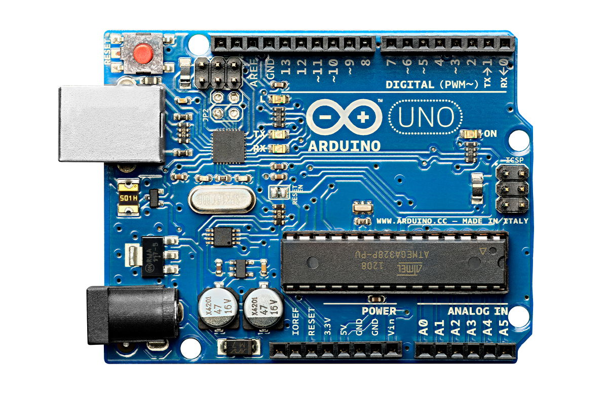
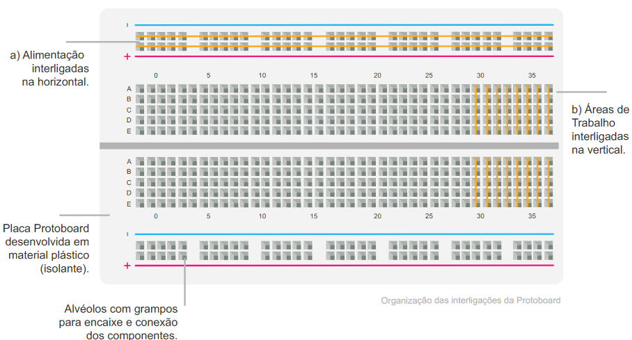

<h1>FASE 7 - Emerging Technologies</h1>
<h2>Capítulo 06: Arduino, o pequeno notável.</h2>

<h2>1. ARDUINO, O PEQUENO NOTÁVEL</h2>

- Arduino foi criado em 2005 por um grupo de pesquisadores italianos do Interaction Design Institute of Ivrea, a partir da necessidade de se obter um microcontrolador acessível aos alunos para utilização em projetos de robótica, dada a dificuldade e o alto custo para trabalhar com as soluções existentes até então. O
- o Arduino UNO a junção de um hardware (a placa-mãe, um microcontrolador MicrochipAVR) com um software IDE (Integrated Development Environment, ou Ambiente de Desenvolvimento Integrado) implementado para ajudar de forma simples na prototipação eletrônica de sistemas interativos. 
- de forma simplificada, seu funcionamento é como o de um computador que armazena entradas e saídas de dados para criar sistemas automatizados. 
- baseadas no conceito open-source, as placas Arduino possuem sensores que são vendidos em módulos, permitindo uma fácil prototipação e a customização da solução para cada tipo de projeto.
- atualmente, o Arduino é uma plataforma completa para construção de um sistema automatizado eletrônico, com hardware e software integrados e fáceis de usar, o que permite a pessoas sem conhecimento técnico criarem suas próprias soluções.

 
<em>Arduino Uno.</em> 

## 1.1 Algumas aplicações com Arduino

- ***Tweet-a-Pot***: um tweet enviado usando uma hashtag específica dá o comando para que uma cafeteira programada faça o seu café.
- ***Garduino*** (junção das palavras Garden e Arduino): circuito que mede a temperatura e o grau de intensidade de luz, usado no setor de irrigação de plantas.
- ***drone*** montado utilizando Arduino: utilizado um Arduino embarcado no drone e outro no controle de velocidade dos motores, além de um no controle da estabilidade do drone no ar. 

> SAIBA MAIS: Para conhecer mais,acesse os sites [Hackaday.io](https://hackaday.io/discover), [Project Hub](https://create.arduino.cc/projecthub), [Adafruit Learning System](https://learn.adafruit.com/) e [Sparkfun](https://learn.sparkfun.com/tutorials).

## 1.2 Arduino versus Raspberry-Pi

- criado em 2012 pela Raspberry-Pi Foundation para estimular o estudo de Ciências da Computação em escolas, o Raspberry-Pi é um microprocessador para auxiliar no desenvolvimento de softwares, protótipos e experimentos.
- sua estrutura é pequena, do tamanho de um cartão de crédito, mas é um computador completo com porta ethernet, Wi-Fi, áudio, vídeo, USB, cartão micro SD e muito mais.
- o caráter aberto da plataforma, também em um conceito de hardware livre, não impõe limites em usos e aplicações.

 
<em>Modelo Raspberry-Pi 4B.</em> 

- ao contrário do Raspberry-Pi, as placas do Arduino são microcontroladores, não computadores completos; eles não executam um sistema operacional, executam códigos interpretados pelo seu firmware.
- você perde o acesso às ferramentas básicas que um sistema operacional fornece, mas a execução direta de código simples é mais fácil e é realizada sem sobrecarga do sistema operacional, uma das vantagens dos microcontroladores.
- o ***principal objetivo das placas Arduino*** é a interface simples com sensores e outros dispositivos, por isso torna-se uma boa opção para projetos de hardware em que seja necessário que as “coisas” respondam a várias leituras de sensores ou outros dispositivos. 
  - é um sistema muito sofisticado, que permite gerenciar melhor seus dispositivos.
  - é também adequado para a interface entre outros dispositivos e atuadores, em que um sistema operacional completo seria algo exagerado para lidar com ações simples de leitura e resposta.

## 1.3 Alguns pré-requisitos
- há boas opções de aprendizagem sem necessidade da aquisição do conjunto de hardware (Arduino + sensores + atuadores).
  - uma plataforma on-line simula um circuito real e incorpora a programação também de acordo com o microcontrolador. 
- uma ferramenta de simulação amplamente utilizada é a [plataforma Tinkercad](https://www.tinkercad.com/), aplicada tanto ao design de modelos 3D em CAD, quanto para a simulação de circuitos elétricos analógicos e digitais, incluindo Arduino, desenvolvida pela empresa Autodesk. 
  - seu uso é gratuito e fácil de usar, sendo uma das opções recomendadas para o aprendizado de Programação Embarcada por meio da linguagem C e do Arduino.
- outros simuladores de Arduino:
  - [SimulIDE](https://www.simulide.com/p/home.html): gratuito, pode ser utilizado off-line e permite a comunicação do Arduino com um emulador de porta COM Virtual, sendo possível realizar a comunicação do simulador com outras aplicações, como outro circuito Arduino, um fluxo em Node-Red ou um script em Python.
  - [Wokwi](https://wokwi.com/): plataforma online de simulação que tem se destacado. Oferece simulação de placas Arduino, além de uma variedade de componentes eletrônicos, desde os mais básicos, como LEDs e resistores, até módulos mais complexos, como displays OLED e módulos de rádio como Wi-fi.
  - [Sparkfun](https://learn.sparkfun.com/tutorials).

## 1.4 Efetuando o cadastro no Tinkercad

- para acessar o Tinkercad, primeiramente você deve criar uma conta. 
  - acesse o site do [Tinkercad](www.tinkercad.com).
  - clique em “Inscrever-se” no canto superior direito da página inicial.
- ao concluir o cadastro, você verá um tutorial de como funciona a ferramenta, facilitando ainda mais a criação de novos projetos.
  - o tutorial está disponível na seção “Aprenda” do website, dividido em duas categorias: 3D Design e Circuitos, com o passo a passo de como fazer os movimentos, projetos para treino e vídeos demonstrativos.
- depois de aprender como usar a ferramenta, você está pronto para começar um projeto.
- ao acessar a página “Desenhos”, você terá a lista dos seus projetos – desenhos e circuitos e o botão para criar um projeto, ou, nesse caso, um novo circuito.

## 1.5 Treinar é preciso

- na área “Aprenda”, existe uma divisão que apresenta aspectos básicos (componentes eletrônicos e uso do simulador), descrição dos circuitos elétricos (noção de circuitos e lei de ohm) e os projetos desenvolvidos utilizando o Arduino.

## 1.6 Circuitos elétricos

- ao trabalhar com o Arduino UNO, é essencial compreender conceitos básicos de eletrônica, como tensão e corrente elétrica. 
- o Arduino UNO opera com uma `lógica de 5 volts`, e suas portas de saída são capazes de fornecer uma `corrente máxima de 40 mA`. 
- a energia elétrica flui através do movimento dos elétrons livres, presentes nos materiais condutores elétricos, e provocada por uma elevação do potencial elétrico em um ponto desse condutor. 
  - a diferença no potencial elétrico de um ponto a outro chamamos `diferença de potencial` ou `tensão elétrica`.
  - a vazão de cargas elétricas, que se movimentam dentro do condutor em um certo ponto, chama-se `corrente elétrica`.
- para que a energia elétrica seja utilizada, é preciso criar uma diferença de potencial, que por sua vez imporá uma corrente elétrica a um material condutor. E a energia elétrica é usada por meio de um circuito elétrico; nele, a corrente elétrica está sempre circulando em razão de um fornecimento ininterrupto de tensão elétrica.

## 1.7 Placa protoboard, matriz de contato ou breadboard

- `Protoboard` consiste em uma placa didática composta de uma matriz de contatos, que permite a construção de circuitos sem a necessidade de efetuar a solda dos componentes; isso permite que seja efetuada uma série de experimentos com os mesmos componentes, como se fosse um quebra-cabeça que pode ser montado e desmontado com rapidez e segurança.
  - cada fileira de 5 orifícios na coluna central forma uma trilha conectada e isolada das demais trilhas, 
  - e cada coluna de orifícios nas trilhas laterais forma uma trilha de alimentação, e está toda conectada.
  - geralmente, elas são ligadas à tensão de alimentação (5V) ou ao terra (GND ou 0V).

 
<em>Exemplo de Protoboard.</em> 

- regras de ouro para montagem de circuitos em protoboard:
  - dois terminais de componentes plugados à mesma trilha estão eletricamente conectados.
  - nunca conectar dois terminais de um mesmo dispositivo na mesma trilha, pois assim eles estarão em curto-circuito.

## 1.8 Os sensores

- `sensores ou transdutores` são elementos que “percebem” o ambiente à sua volta.
- essa percepção ocorre porque os sensores são capazes de converter energia de uma natureza em outra, ou seja, um sensor consegue converter o valor de uma grandeza química, mecânica e biológica, dentre outras, em valores de grandeza elétrica.
- a grandeza física convertida em energia elétrica dos sensores pode ser classificada em ***dois tipos***: sensores analógicos ou sensores digitais.
  - `sensores analógicos`:
    - conseguem capturar um fenômeno físico e transformá-lo em um sinal elétrico (tensão ou corrente), que varia de forma análoga ao fenômeno.
    - em geral, esses sensores não geram sua própria fonte de alimentação, por isso dependem do fornecimento externo de tensão para alimentação da energia do sensor, que varia de acordo com o fenômeno que está sendo medido.
    - exemplo: um microfone é um transdutor eletroacústico, pois transforma a variação da pressão atmosférica em uma corrente elétrica que varia da mesma forma. E, para capturar a medida do sensor, os circuitos digitais como o Arduino precisam medir o valor analógico da amplitude da energia elétrica e processar de forma digital, esse processo se chama conversor analógico para digital ou ADC (Analog to Digital Converter).
  - `sensores digitais`: produzem sinais discretos – ou seja, podem assumir dois valores em seu sinal de saída ao longo do tempo –, que podem ser interpretados como 0 ou 1 pelos circuitos digitais como o Arduino. 
    - sensores simples como um sensor de presença, sensor fim de curso ou botão enviam informações de status 0 ou 1. 
    - outros sensores que convertem informações mais complexas como temperatura, umidade, acelerômetro, giroscópio, medidor de CO e de gás butano, dentre outros, enviam as informações em um protocolo de comunicação, que pode ser serial, I2C, SPI, entre outros.

## 1.9 Desenvolvimento de projetos

- a partir do conhecimento inicial da plataforma Tinkercad e da criação de uma conta de usuário, é chegado o momento de desenvolver alguns projetos.

---

## FAST TEST

### 1. Sobre as especificações técnicas relacionadas ao Arduino UNO, é correto afirmar que:
> “Trabalha com lógica de 5 volts” e cada porta de saída pode fornecer até 40 mA de corrente elétrica.

### 2. Sobre conceitos prévios de tensão e corrente elétrica, o que é correto afirmar?
> A energia elétrica flui através do movimento dos elétrons livres, presentes nos materiais condutores elétricos, e provoca uma elevação do potencial elétrico em um ponto desse conduto.

### 3. Qual das funções não representa corretamente uma função base para implementação de algoritmos em Arduino?
> Função Recursiva.

### 4. Qual das alternativas apresenta um formato de estruturação de mensagem que não é aceito pelo protocolo MQTT?
> .db.

### 5. Sobre Arduino e suas características, assinale a afirmativa incorreta:
> O Arduino é uma série de minicomputador de placa única multiplataforma, de tamanho reduzido com componentes integrados, que se conecta a um monitor de computador ou televisão, e usa um teclado e um mouse padrão. Desenvolvido em 2012, tem o objetivo de promover o ensino em Ciência da Computação básica em escolas, inclusão e empoderamento social.

--- 

[Voltar ao início!](https://github.com/monicaquintal/smart_cities)